# ContextBridge — Memory Methodology Explained v1

> **Purpose:** This is the easy-to-read companion to the formal **ContextBridge Memory Methodology Specification v1**.
>
> Every important term used in a diagram or flowchart is explained in simple words, with a small example and the reason we use it.

---

# 1. The whole idea in one picture

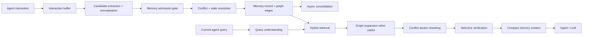

## What each box means

| Term | Simple meaning | Small example | Why we use it |
|---|---|---|---|
| **Agent interaction** | Conversation/action between the user and an AI agent | User tells Agent A: “Use PostgreSQL.” | This is the raw source of possible memory |
| **Interaction buffer** | Cheap temporary storage for recent interactions | Keep the session turns before processing them | Avoid expensive processing after every message |
| **Candidate extraction** | Find information that might deserve long-term memory | Extract “Project uses PostgreSQL” | We should store knowledge, not the whole chat |
| **Normalization** | Make the candidate clear and consistent | Convert “we switched to SQLite yesterday” into a clear statement with time | Easier retrieval and temporal reasoning |
| **Memory admission gate** | Decides whether a candidate should become long-term memory | Ignore “Okay, thanks”; keep “I prefer TypeScript” | Prevent noisy memory |
| **Conflict resolution** | Checks whether new information clashes with old information | PostgreSQL vs SQLite | Prevent contradictory memory from accumulating silently |
| **State resolution** | Decides which version is currently applicable | SQLite is current; PostgreSQL is historical | Current state should be distinguishable from history |
| **Memory record** | The stored unit of durable knowledge | `FACT: Project uses SQLite` | Gives memory a clear structure |
| **Graph edges** | Links between related memory records | SQLite `supersedes` PostgreSQL | Relationships help with history and related retrieval |
| **Async consolidation** | Expensive memory cleanup/merging done in the background | Merge repeated database decisions later | Keeps normal interaction responsive |
| **Current agent query** | What the agent needs to answer now | “What DB are we using for V1?” | Drives retrieval |
| **Query understanding** | Understand what the question is really asking | Detect project = ContextBridge, topic = database | Better than blindly matching words |
| **Hybrid retrieval** | Search memory using several methods | semantic + exact keyword + filters | Different searches catch different kinds of matches |
| **Graph expansion** | Follow useful memory relationships | Find current DB, then follow its `supersedes` link | Helps when one memory points to another useful memory |
| **Conflict-aware reranking** | Reorder results using validity, not only similarity | Prefer current SQLite over old PostgreSQL | “Similar” does not always mean “correct” |
| **Selective verification** | Verify only when something looks uncertain | Check evidence when two memories conflict | Saves cost while adding safety |
| **Compact memory context** | Small set of useful memories sent to the agent | 3 concise memory cards | Large memory dumps create noise |
| **Agent / LLM** | The model that uses the retrieved memory | Agent B answers using the SQLite memory | Final consumer of ContextBridge |

### Why the flow is split into WRITE and READ work

**WRITE side:** turn interactions into reliable long-term memory.

**READ side:** find only the memory needed for the current task.

**Reason:** memory creation and memory retrieval are different problems, and the research repeatedly shows that both can fail independently.

---

# 2. Arrows and shapes used in the diagrams

| Diagram symbol | Meaning | Example |
|---|---|---|
| **Box** | A processing step or data object | `Hybrid retrieval` |
| **Diamond** | A decision/check | `Admit?` |
| **Arrow `-->`** | Data/process moves to the next step | Candidate → admission |
| **Arrow label** | The condition or relationship | `supersedes` |
| **Database shape `( )`** | Persistent storage | `(Structured memory)` |
| **Subgraph** | A logical group of related steps | `Memory formation and evolution` |

---

# 3. Memory scope

```text
Project memory
      ↓
Developer-global memory
```

| Term | Simple meaning | Example | Why |
|---|---|---|---|
| **Developer scope** | Information that can apply across projects | “Prefer TypeScript.” | A developer preference may be useful everywhere |
| **Project scope** | Information specific to one project | “ContextBridge uses PostgreSQL.” | Prevent project-specific facts from leaking into unrelated projects |
| **Global** | Available across projects when relevant | Coding preference | Useful for personal defaults |
| **Scope precedence** | Which scope gets stronger consideration | Project information is checked strongly for a project query | Context should match the current task |

### Important point

Project memory does **not** automatically mean “always correct.”

The system still checks **applicability**.

Example:

> Developer-global: “Usually use PostgreSQL.”

> Project-local: “For Project X, use SQLite.”

For Project X, the local project rule is more relevant.

**Why:** this avoids applying a general preference when a project has a specific exception.

---

# 4. Memory types

These are the six V1 memory categories.

| Type | Simple meaning | Example | Why |
|---|---|---|---|
| **FACT** | Something true/stable | “The project uses PostgreSQL.” | Store stable knowledge |
| **DECISION** | A chosen design or technical choice | “Use MCP for the interface.” | Preserve important project decisions |
| **PREFERENCE** | What the developer prefers | “Prefer TypeScript.” | Personalization across sessions |
| **STATE** | Something that can change | “Migration is pending.” | Track evolving information |
| **EVENT** | An important thing that happened | “Agent A completed migration.” | Useful history and timelines |
| **LESSON** | A reusable learning | “Vector-only search missed exact file names.” | Reuse previous experience |

### Why not use one generic “memory” type?

Because:

> “PostgreSQL is used”

and

> “Migration is pending”

behave differently.

A **FACT** is relatively stable.

A **STATE** can change and needs history.

This distinction is strongly supported by the memory literature, especially work on state tracking and evolving memory.

---

# 5. Atomic memory record

```text
MemoryRecord
├── id
├── type
├── content
├── scope
├── project_id
├── created_at
├── valid_from
├── valid_to
├── status
├── confidence
├── source_agent
├── source_session
├── source_interaction
├── evidence_ref
├── supersedes_id
└── metadata
```

| Term | Simple meaning | Example | Why |
|---|---|---|---|
| **Atomic** | One main piece of information | “Project uses SQLite.” | Easier to retrieve and update |
| **id** | Unique identifier | `M-142` | Lets other memories link to it |
| **type** | Memory category | `DECISION` | Helps different memories be handled correctly |
| **content** | The actual claim | “Use SQLite for V1.” | Main information |
| **scope** | Where the memory applies | `project` | Prevent wrong cross-project use |
| **project_id** | Which project it belongs to | `contextbridge` | Connects memory to project |
| **created_at** | When the record was created | `2026-10-02` | Tracks system history |
| **valid_from** | When the fact became applicable | `2026-10-02` | Supports time-aware retrieval |
| **valid_to** | When the fact stopped being applicable | `2026-10-05` | Supports historical reasoning |
| **status** | Current lifecycle state | `ACTIVE` | Makes current vs old memory explicit |
| **confidence** | How strongly the system trusts the memory | `0.91` | Useful for ranking/verification |
| **source_agent** | Which agent produced the candidate | Agent B | Needed in a multi-agent system |
| **source_session** | Which session it came from | Session 18 | Traceability |
| **source_interaction** | Which interaction produced it | Turn 42 | Fine-grained traceability |
| **evidence_ref** | Where the supporting evidence came from | Turn 42 / tool result | Allows checking the original evidence |
| **supersedes_id** | Which old memory this replaces | `M-101` | Makes updates explicit |
| **metadata** | Extra structured details | file, symbol, tags, conditions | Supports filtering and richer retrieval |

### Why “atomic”?

Suppose the chat says:

> “We use SQLite for V1 and PostgreSQL for production.”

Do not store that as one vague block.

Create separate usable knowledge:

```text
V1 database = SQLite
Production database = PostgreSQL
```

**Why:** smaller units are easier to retrieve, update, conflict-check, and link.

This follows the atomic-memory direction seen in A-MEM and related memory research.

---

# 6. Evidence vs memory

The system does **not** treat the full conversation as the permanent memory object.

```text
Conversation
    ↓
Evidence
    ↓
Durable memory record
```

| Term | Simple meaning | Example | Why |
|---|---|---|---|
| **Evidence** | Original source that supports a memory | User turn 42 | Lets us check where the claim came from |
| **Durable memory** | Clean, reusable knowledge extracted from evidence | “Use SQLite for V1.” | More useful than storing the whole chat |
| **Inference** | Something the model concluded rather than directly saw | “The team probably prefers SQLite.” | Inferences should not automatically become facts |

### Why this design?

Research on hallucination in memory systems shows that wrong information can enter memory during extraction or updating.

So:

**source evidence must remain traceable.**

---

# 7. Interaction capture

```mermaid
flowchart TB
    U[User message] --> B[(Interaction buffer)]
    A[Agent response] --> B
    T[Relevant tool/result event] --> B

    B --> D{Memory trigger?}
    D -->|Explicit "remember this"| E[Immediate processing]
    D -->|Session end / idle / batch trigger| F[Async processing]
    D -->|No| G[Keep in buffer]
```

| Term | Simple meaning | Example | Why |
|---|---|---|---|
| **User message** | What the user said | “Remember I prefer TypeScript.” | Possible memory source |
| **Agent response** | What the AI produced | Agent proposes SQLite | May contain useful outcome, but should not be trusted automatically |
| **Tool/result event** | Important result from a tool | Test suite passed | Some tool outcomes can become useful memory |
| **Interaction buffer** | Temporary collection of current interactions | Current session turns | Cheap first step |
| **Memory trigger** | Event that starts memory processing | Session ends | Avoid processing everything immediately |
| **Explicit remember** | User directly asks to remember something | “Remember this.” | User intent is a strong signal |
| **Immediate processing** | Process explicit memory request now | Save preference immediately | User expects it to persist |
| **Session end** | Conversation has finished | IDE session closes | Natural point for batch processing |
| **Idle** | No activity for some time | User stops working | Opportunity for background processing |
| **Batch trigger** | Process several interactions together | Every N interactions | More efficient than per-message LLM calls |
| **Async processing** | Work happens in background | Build memory after response | Keeps normal interaction fast |
| **Keep in buffer** | Do not create memory yet | “Okay, thanks.” | Avoid meaningless long-term memory |

### Key decision

**Automatic memory creation is asynchronous.**

**Explicit “remember this” can be immediate.**

**Why:** LightMem and RecMem show the cost of eager memory processing; explicit user requests are different because the desired persistence is already clear.

---

# 8. Candidate extraction and normalization


| Term | Simple meaning | Example | Why |
|---|---|---|---|
| **Buffered interaction** | Recent raw conversation | Session turns | Starting material |
| **Durable information** | Information likely to matter later | “Use TypeScript.” | Long-term memory should be selective |
| **Atomic candidates** | Small independent memory items | “Uses TypeScript” | Easier management |
| **Resolve references** | Replace vague words with clear meaning | “We changed it” → “Project X changed DB” | Self-contained memory |
| **Normalize time** | Turn relative time into useful time information | “Yesterday” → actual date/time | Important for evolving state |
| **Scope** | Where the candidate applies | Project X | Avoid scope leakage |
| **Provenance** | Where the memory came from | Agent B, session 18, turn 42 | Trust and auditability |
| **Candidate memory** | Memory that is proposed but not yet accepted | Extracted SQLite decision | Admission comes next |

### Example

Chat:

> “We switched from PostgreSQL to SQLite yesterday for V1.”

Possible normalized candidate:

```text
DECISION
Project: ContextBridge
V1 database: SQLite
valid_from: yesterday
source: Session 18 / Turn 42
```

**Why:** SimpleMem emphasizes structured compression and temporal normalization; A-MEM emphasizes self-contained atomic notes.

---

# 9. Memory admission gate

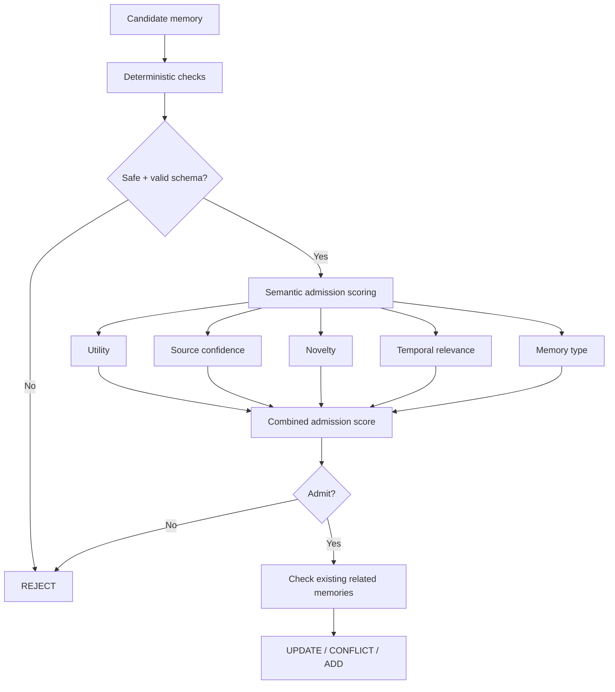

## Terms

| Term | Simple meaning | Example | Why |
|---|---|---|---|
| **Candidate memory** | Possible long-term memory | “Prefer TypeScript.” | Not every extracted item should be stored |
| **Deterministic checks** | Fixed rule-based checks | Valid JSON, no blocked secret | Fast and predictable |
| **Schema** | Required structure of a memory record | type + content + scope | Prevent malformed memory |
| **Safe** | Does not violate storage/security rules | Do not store an API key | Basic protection |
| **Semantic admission scoring** | Judge future value using meaning | Is this likely to matter later? | Some decisions need semantic understanding |
| **Utility** | Likely future usefulness | “Project uses SQLite.” | Useful later |
| **Source confidence** | Strength of supporting evidence | User explicitly said it | Reduces unsupported memory |
| **Novelty** | How new the information is | SQLite is new; SQLite already stored = low novelty | Avoid duplicates |
| **Temporal relevance** | Whether the information matters now in time | Current DB decision | Avoid stale information |
| **Memory type** | Category such as FACT or STATE | PREFERENCE | Different types have different durability |
| **Combined score** | One score made from the signals | Weighted score | Gives one admission decision |
| **Threshold** | Cutoff for accepting memory | Score must exceed a chosen value | Controls precision vs recall |
| **Related memories** | Existing memories about the same topic | Old PostgreSQL record | Needed for update/conflict decisions |

### Why these signals?

A-MAC gives the strongest direct basis:

**utility + confidence + novelty + recency + type**

We adapt these into:

**utility + source confidence + novelty + temporal relevance + memory type**

The exact weights and threshold are deliberately left as **evaluation parameters**, not copied from one paper.

---

# 10. Admission outcomes

```text
ADMIT
UPDATE
CONFLICT
REJECT
DEFER
```

| Term | Simple meaning | Example | Why |
|---|---|---|---|
| **ADMIT** | Create a new long-term memory | First mention of SQLite | Useful new knowledge |
| **UPDATE** | New information changes an existing memory | SQLite replaces an older DB decision | Keep current state correct |
| **CONFLICT** | Two plausible memories disagree | SQLite vs PostgreSQL | Needs explicit resolution |
| **REJECT** | Do not store it | “Thanks!” | Avoid noise |
| **DEFER** | Wait for more evidence | Agent guesses a preference | Avoid premature commitment |

### Why have `DEFER`?

Some information is not clearly wrong but is also not trustworthy enough to store immediately.

Example:

> Agent says: “You probably prefer Rust.”

There is no clear user evidence.

**DEFER** is safer than inventing a fact.

---

# 11. Conflict detection and state resolution

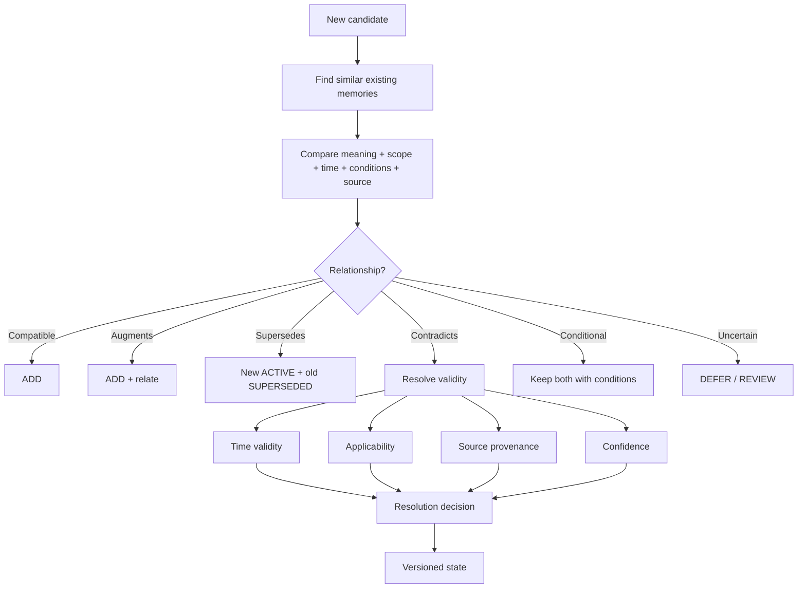

| Term | Simple meaning | Example | Why |
|---|---|---|---|
| **Similar existing memories** | Stored memories about the same topic | Old DB decision | Conflict detection needs comparison |
| **Meaning** | What the memory actually says | SQLite vs PostgreSQL | Similar words can still mean different things |
| **Conditions** | Situations in which a memory applies | SQLite for V1, PostgreSQL for production | Two statements can both be valid |
| **Compatible** | No contradiction | “Uses TypeScript” + “Uses React” | Both can remain |
| **Augments** | Adds useful detail | “Uses SQLite” + “SQLite is only for V1” | Combine/link them |
| **Supersedes** | New memory replaces older current state | SQLite replaces PostgreSQL for V1 | Track state change |
| **Contradicts** | Two claims disagree | “DB = SQLite” vs “DB = PostgreSQL” | Must resolve |
| **Conditional** | Both are valid under different conditions | V1 vs production | Do not incorrectly delete either |
| **Uncertain** | System cannot confidently decide | Two equally plausible updates | Safer to defer |
| **Time validity** | When a claim is true | SQLite valid from Oct 2 | Core to evolving memory |
| **Applicability** | Where/when a memory actually applies | Project X, not Project Y | Prevent wrong reuse |
| **Source provenance** | Where it came from | User statement vs agent inference | Helps trust decisions |
| **Versioned state** | Current state plus historical versions | SQLite current, PostgreSQL old | No destructive overwrite |

### Why no “latest wins”?

Because:

> **Newer does not always mean more correct.**

Example:

```text
Project X:
PostgreSQL for production
SQLite for local tests
```

The newest message might mention SQLite, but PostgreSQL is still valid under another condition.

This follows the time-, condition-, and conflict-aware direction in StateMem, MemConflict, Zep, and TOKI.

---

# 12. Memory versioning

```text
Old memory
ACTIVE
   │
   └── superseded by ──> New memory
                         ACTIVE

Old history remains available
```

| Term | Meaning | Example | Why |
|---|---|---|---|
| **ACTIVE** | Current usable memory | SQLite for V1 | What retrieval normally wants |
| **SUPERSEDED** | Older state replaced by a newer one | PostgreSQL for V1 | Preserve history without treating it as current |
| **History** | Older records kept for traceability | Previous DB decision | Useful for temporal questions and debugging |
| **Non-destructive update** | Do not erase old information silently | Create new version | Safer and auditable |

TOKI strongly motivates this style of write-time history/provenance handling.

---

# 13. Minimal graph layer

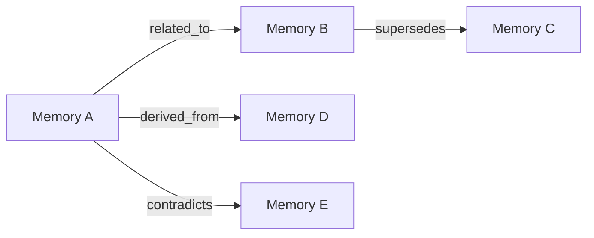

| Term | Simple meaning | Example | Why |
|---|---|---|---|
| **Memory node** | A stored memory record | “SQLite is V1 DB” | Basic graph object |
| **related_to** | These memories are connected | DB decision ↔ migration state | Helps find nearby useful context |
| **supersedes** | One memory replaces an older state | SQLite → PostgreSQL(old) | Explicit history |
| **derived_from** | Memory came from another source/memory | Summary → source memories | Traceability |
| **contradicts** | Two memories make competing claims | SQLite ↔ PostgreSQL | Makes conflict explicit |
| **Graph edge** | Relationship between records | `M1 --supersedes--> M2` | Enables relationship-aware operations |

### Why a graph exists in V1

We are **not** building a full graph database.

We are keeping only a minimal relationship layer because the relationships are already needed for:

**conflict resolution → state/history → related retrieval → consolidation**

### Why a normal relational store can hold the graph

V1 can use:

```text
Memory table
MemoryEdge table
```

**Engineering reason:** simpler deployment, transactions, debugging, and existing relational tooling.

**Research reason:** the relationship model is useful immediately; a heavyweight graph engine is not required just to preserve relationships.

---

# 14. Consolidation

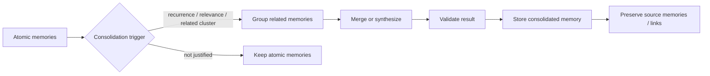

| Term | Simple meaning | Example | Why |
|---|---|---|---|
| **Atomic memories** | Small stored memories | Three separate DB-related memories | Starting material |
| **Consolidation trigger** | Signal that merging is worth the cost | Many related memories | Avoid unnecessary LLM work |
| **Recurrence** | Similar information appears repeatedly | User repeatedly says “use TypeScript” | Often indicates recurring importance |
| **Relevance** | Memory matters to important activity | Central project decision | Not everything needs consolidation |
| **Related cluster** | Group of strongly related memories | All memories about authentication | Gives better structure |
| **Group** | Collect related memories | 5 auth memories | Enables synthesis |
| **Merge** | Combine compatible information | Two duplicate facts | Reduce fragmentation |
| **Synthesize** | Create a clearer higher-level memory | Turn many auth notes into one summary | Improve usability |
| **Validate result** | Check that the consolidated memory is supported | Ensure summary did not invent a fact | Compression can introduce errors |
| **Preserve source memories** | Keep original supporting records | Summary links to source memories | Prevent information loss |

### Why recurrence is not the only trigger

RecMem shows recurrence can save expensive processing, but it also warns that:

> a rare fact can still be important.

Example:

> “Never expose this internal file path.”

It may appear once but still matter a lot.

Therefore V1 combines:

**recurrence + relevance + relatedness + explicit request + background maintenance.**

---

# 15. Retrieval methodology

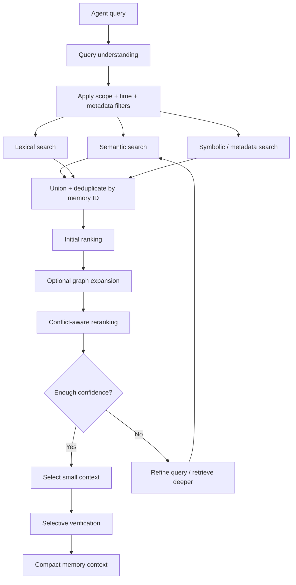

## Terms

| Term | Simple meaning | Example | Why |
|---|---|---|---|
| **Agent query** | Current request | “What DB are we using?” | Retrieval starts here |
| **Query understanding** | Identify intent, scope, time, entities | Project = ContextBridge | Better retrieval |
| **Scope filter** | Keep only relevant memory scope | Project = ContextBridge | Prevent cross-project noise |
| **Time filter** | Consider time constraints | “What was the DB last month?” | Needed for temporal queries |
| **Metadata filter** | Use structured fields | type = DECISION | Cheap filtering |
| **Semantic search** | Search by meaning | “database choice” finds “DB = SQLite” | Handles wording differences |
| **Lexical search** | Search exact terms | `ContextBridge`, `SQLite` | Good for identifiers and exact names |
| **Symbolic search** | Search structured conditions | project = ContextBridge | Precise constraints |
| **Union** | Combine results from different searches | semantic + lexical + symbolic | Different methods cover different misses |
| **Deduplicate** | Remove repeated copies | M-142 appears in two result sets | Avoid duplicate context |
| **Initial ranking** | First ordering of candidates | Most similar first | Narrow down candidates |
| **Graph expansion** | Follow relevant relationships | Follow `supersedes` link | Helps with connected memory |
| **Conflict-aware reranking** | Reorder using validity as well as relevance | Current SQLite above old PostgreSQL | Similarity alone is insufficient |
| **Enough confidence** | Decide whether current evidence is sufficient | Clear current DB memory found | Avoid unnecessary work |
| **Refine query** | Make the search better | Add “for V1” | Helps ambiguous queries |
| **Retrieve deeper** | Search more candidates | 3 → 5 candidates | Useful for difficult queries |
| **Small context** | Only send selected memories | 3–5 memory cards | Avoid long-context noise |
| **Selective verification** | Check uncertain evidence | Verify conflicting memories | Safety without always paying the cost |

### Why hybrid retrieval?

SimpleMem supports:

**semantic + lexical + symbolic**

This is especially useful for developer memory because exact identifiers matter.

Example:

> Query: “What happened to `auth/session.ts`?”

A semantic-only search might miss the exact filename.

Lexical matching can catch it immediately.

---

# 16. Adaptive retrieval depth

```text
Start: ~3 memories
        ↓
Low confidence / complex query?
        ↓
Expand: up to ~5 or refine the query
```

| Term | Meaning | Example | Why |
|---|---|---|---|
| **Small initial set** | Start with few results | 3 | Less noise and lower cost |
| **Complex query** | Needs several connected facts | “Why did we switch DB and what replaced it?” | May need more evidence |
| **Low confidence** | Current results are insufficient/ambiguous | Two conflicting candidates | Need more search |
| **Deeper retrieval** | Retrieve more candidates | 3 → 5 | Increases chance of finding missing evidence |

### Why not always retrieve 20 or 50?

LOCOMO, Lost in the Middle, SimpleMem, and MemConflict all support the broader lesson that **more context is not automatically better**.

Too many memories can add noise and make correct evidence harder to use.

The exact `3` and `5` values are **engineering starting points**, not universal constants.

---

# 17. Conflict-aware reranking

```text
Final relevance
= semantic/lexical relevance
+ scope fit
+ temporal validity
+ applicability
+ provenance quality
+ confidence
- conflict / staleness penalties
```

| Term | Simple meaning | Example | Why |
|---|---|---|---|
| **Relevance** | How closely memory matches the query | DB decision matches DB question | Basic retrieval signal |
| **Scope fit** | Does it belong to this project/developer? | ContextBridge memory for ContextBridge | Prevent wrong-source retrieval |
| **Temporal validity** | Is it valid for the requested time? | Current DB | Avoid stale facts |
| **Applicability** | Does the memory's condition match? | V1 vs production | Prevent conditional misuse |
| **Provenance quality** | How strong is the source? | User statement > unsupported guess | Trust |
| **Confidence** | How strongly the system supports it | 0.91 | Helps choose among candidates |
| **Conflict penalty** | Reduce competing/invalid candidates | Old conflicting memory | Prevent contradiction dominance |
| **Staleness penalty** | Reduce obsolete information | Superseded decision | Prefer current applicable state |

### Why?

MemConflict shows that a correct memory can be present but ranked too low.

So:

> **Retrieval recall alone is not enough.**

The system must also decide which retrieved memory deserves priority.

---

# 18. Retrieval verification

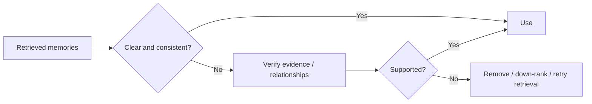

| Term | Simple meaning | Example | Why |
|---|---|---|---|
| **Retrieved memories** | Candidates selected by retrieval | 3 DB memories | Input to verification |
| **Clear and consistent** | No important ambiguity or conflict | One current DB decision | Can use directly |
| **Verify evidence** | Check source support | Read original user turn | Detect unsupported memory |
| **Verify relationships** | Check graph/state links | Follow supersedes edge | Understand current state |
| **Supported** | Evidence actually backs the memory | User explicitly said SQLite | Avoid hallucinated use |
| **Down-rank** | Keep candidate but give it lower priority | Weakly supported memory | Safer than deletion when uncertain |
| **Retry retrieval** | Search again | Add “for V1” | Recover from poor retrieval |

CRAG and SELF-RAG motivate the principle:

> **Do not trust retrieved information only because it was retrieved.**

---

# 19. Context construction

Example:

```text
[M-142] DECISION | Project: ContextBridge
Use SQLite for V1.
Valid since: 2026-10-02
Source: Agent-B / Session-18
Confidence: 0.91
```

| Term | Simple meaning | Example | Why |
|---|---|---|---|
| **Memory card** | Compact representation of one memory | 5–6 lines like the example | Easy for the agent to consume |
| **Most relevant first** | Best evidence comes first | Current DB at top | Helps model use important information |
| **Source shown** | Agent can see origin | Agent B / Session 18 | Helps distinguish competing claims |
| **Confidence shown** | Agent can understand uncertainty | 0.91 | Supports cautious use |

### Why not send the whole memory database?

Because:

**more context ≠ better context.**

Lost in the Middle shows that models can struggle to use relevant information when it is buried inside large contexts.

SWE-agent also supports compact, task-focused external context.

---

# 20. Full cross-agent example

## Session 1 — Agent A

User:

> “Use PostgreSQL for ContextBridge.”

Stored:

```text
M-101
DECISION
Project = ContextBridge
Database = PostgreSQL
Status = ACTIVE
```

## Session 2 — Agent B

User:

> “We changed the database to SQLite for V1.”

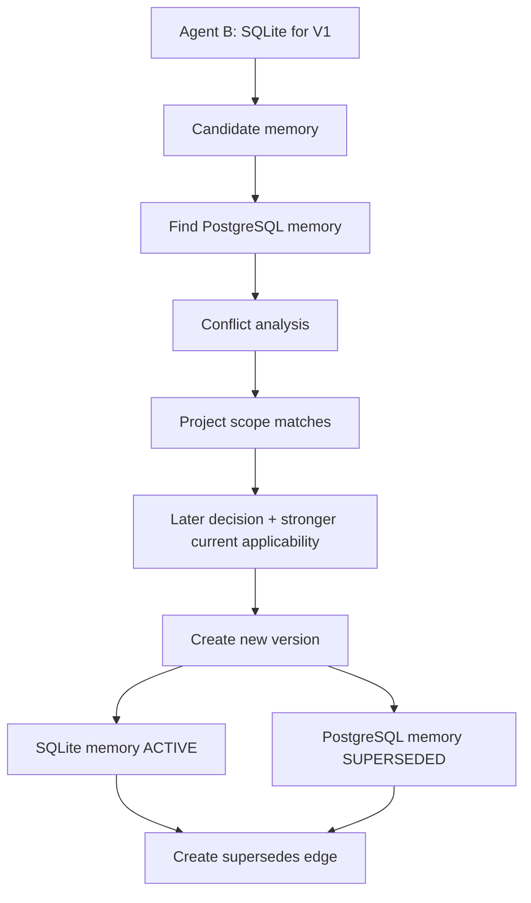

| Step | What it means | Why |
|---|---|---|
| **Candidate memory** | New proposed DB decision | Start of update |
| **Find old memory** | Search existing DB decisions | We should not blindly add a duplicate |
| **Conflict analysis** | Compare both claims | They disagree |
| **Project scope matches** | Both concern the same project | Conflict is relevant |
| **Later decision** | New decision happened later | Important temporal signal |
| **Stronger current applicability** | SQLite is specifically for V1 | Current query may be about V1 |
| **New version** | Create a new memory record | Preserve history |
| **ACTIVE** | SQLite is current | What normal retrieval should return |
| **SUPERSEDED** | PostgreSQL is old for this state | Keep history without treating it as current |
| **supersedes edge** | Explicit relationship between versions | Makes the change traceable |

## Session 3 — Agent C

User:

> “What database are we using for V1?”

Expected useful memory:

```text
SQLite — ACTIVE
```

The PostgreSQL record remains available for historical questions such as:

> “What database did we originally plan to use?”

### Why this example matters

This is the core ContextBridge problem:

**Agent A → memory persists → Agent B changes it → Agent C sees the correct current state.**

The agents do not need to be the same model.

---

# 21. Agent interface

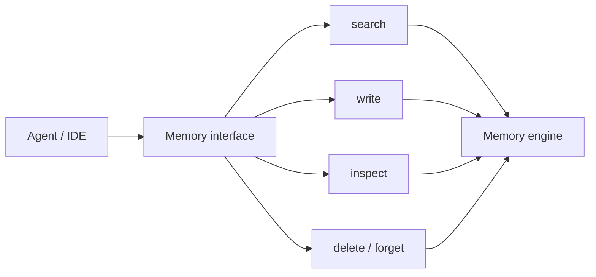

| Term | Simple meaning | Example | Why |
|---|---|---|---|
| **Agent / IDE** | External system using ContextBridge | VS Code agent | ContextBridge should work across agents |
| **Memory interface** | Small boundary between agent and memory service | `search()` | Keeps integration simple |
| **search** | Ask for relevant memory | `search("current DB")` | Main read operation |
| **write** | Store/update memory | `write(memory)` | Explicit memory operation |
| **inspect** | View memory/evidence/history | Inspect M-101 | Debugging and transparency |
| **delete / forget** | Remove memory | Forget old personal preference | User control |
| **Memory engine** | Internal system that implements the methodology | Retrieval + storage + conflict logic | Keeps agents away from database internals |

### Why a small interface?

SWE-agent shows that interface design affects agent behavior and that overly verbose interaction can waste context.

So agents should use **high-level operations**, not manipulate database tables directly.

### Why MCP-compatible, not MCP-dependent?

MCP is a useful interface/transport choice for coding agents.

But the memory methodology should not depend on one protocol.

**Engineering reason:** keeps the core memory engine reusable if integration technology changes.

---

# 22. Online vs asynchronous work

| Stage | Default |
|---|---|
| Interaction capture | Online, cheap |
| Retrieval | Online |
| Context construction | Online |
| Explicit “remember this” | Immediate |
| Automatic extraction | Async |
| Admission scoring | Async |
| Conflict/state update | Async |
| Consolidation | Background |
| Maintenance/re-indexing | Background |

## Terms

| Term | Meaning | Example | Why |
|---|---|---|---|
| **Online** | Happens while the user is waiting | Retrieval before answer | Needed for current response |
| **Async** | Happens separately from the main response | Build memory after session | Reduce interaction latency |
| **Background** | Maintenance work done later | Re-index memories | Not urgent for every request |
| **Critical path** | Work required before the agent can answer | Retrieval | Keep this short |
| **Heavy processing** | Expensive LLM/maintenance work | Consolidating many memories | Move out of critical path |

### Main rule

> **The normal response should not wait for heavy memory construction.**

This is mainly an engineering decision supported by LightMem, RecMem, and the write-cost observations in memory-system research.

---

# 23. Trust, provenance, and safety

Every durable memory should let us answer:

```text
What was remembered?
When was it true?
Where did it come from?
Which agent/session created it?
What replaced it?
Why is it currently selected?
```

| Term | Simple meaning | Example | Why |
|---|---|---|---|
| **Provenance** | Origin of a memory | Agent B, Session 18, Turn 42 | Trust and debugging |
| **Source evidence** | Original supporting material | User statement | Verification |
| **Current selection reason** | Why this memory won | Current + project-specific | Explainability |
| **Secret filtering** | Prevent storing secrets | API key | Security |
| **Scope isolation** | Keep memories separated correctly | Project X vs Project Y | Prevent accidental leakage |
| **Audit history** | Record memory changes | M-101 → M-142 | Debugging and accountability |
| **Delete/forget** | Remove memory when requested | Forget an old preference | User control |

### Important rule

**LLM output is not automatically a fact.**

The system must distinguish:

```text
User/tool evidence
        ↓
Candidate
        ↓
Validation/admission
        ↓
Durable memory
```

This is strongly motivated by HaluMem, TRUSTMEM, RAGTruth, and the trustworthy-memory survey.

---

# 24. Evaluation methodology

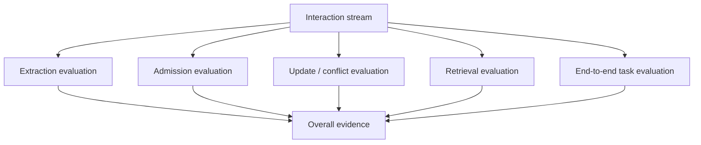

| Term | Simple meaning | Example | Why |
|---|---|---|---|
| **Interaction stream** | Sequence of conversations/events | 20 sessions | Realistic memory growth |
| **Extraction evaluation** | Did we identify important information? | “SQLite” extracted correctly | HaluMem-style operation check |
| **Admission evaluation** | Did we store the right things? | Reject “thanks” | Tests memory quality |
| **Update evaluation** | Did state change correctly? | PostgreSQL → SQLite | StateMem/HaluMem relevance |
| **Conflict evaluation** | Did valid memory beat competing memory? | Current vs stale DB | MemConflict relevance |
| **Retrieval evaluation** | Did we find the right memory? | M-142 returned | Measures retrieval separately |
| **End-to-end evaluation** | Did memory improve actual tasks? | Agent solves task across sessions | MemoryArena-style task utility |
| **Overall evidence** | Combined view of system behavior | Operation + task results | Prevents hiding failures behind one score |

### What we should test

| Scenario | What it checks |
|---|---|
| New fact across sessions | Persistence |
| Same fact across agents | Model/agent independence |
| Fact update over time | State tracking |
| Contradictory agent statements | Conflict resolution |
| Project vs global memory | Scope handling |
| Conditional facts | Applicability |
| Rare but important fact | Admission/consolidation safety |
| Irrelevant distractors | False-memory resistance |
| Long multi-session history | Long-term retrieval |
| Low-confidence retrieval | Verification/retry |

### Why not evaluate only final answer accuracy?

Because a final wrong answer can come from several places:

```text
Bad extraction
      ↓
Bad stored memory
      ↓
Bad retrieval
      ↓
Bad ranking
      ↓
Bad usage by the LLM
      ↓
Wrong answer
```

HaluMem and MemConflict are especially useful here because they separate these failure points.

---

# 25. Why each major V1 decision was made

| Decision | What we chose | Research reason | Engineering reason |
|---|---|---|---|
| **Atomic memory** | One self-contained record per main claim | A-MEM, LOCOMO, structured memory research | Easier update/retrieval |
| **FACT/DECISION/PREFERENCE/STATE/EVENT/LESSON** | Six V1 types | Survey + HaluMem + StateMem + developer-memory use cases | Simple enough for V1 |
| **Developer + Project scopes** | Two logical scopes | Scope-aware persistent memory patterns | Prevent cross-project contamination |
| **Cheap buffer** | Temporary interaction storage | LightMem, RecMem | Low online cost |
| **Selective extraction** | Store useful knowledge, not everything | Survey, SimpleMem, A-MAC | Lower noise |
| **Normalization** | Resolve references and time | SimpleMem, Zep | Better temporal retrieval |
| **Admission gate** | Explicit decision before storage | A-MAC | Prevent memory pollution |
| **Multi-signal admission** | Utility + confidence + novelty + time + type | A-MAC | More explainable than one opaque score |
| **Selective verification** | Heavy checks only for risky cases | ProMem + TRUSTMEM + HaluMem | Controls cost |
| **Save-time conflict detection** | Check conflicts while writing | MOSAIC, TOKI | Prevent contradictions from silently accumulating |
| **Versioned updates** | Keep old memory and create new state | StateMem, TOKI, Zep | History and debugging |
| **No latest-wins** | Use time + scope + applicability + source + confidence | MemConflict, StateMem, TOKI | More reliable than timestamp-only logic |
| **Minimal graph** | Keep memory relationships in V1 | Zep, A-MEM, MOSAIC | Avoid redesign while avoiding full GraphRAG complexity |
| **Relational store + edge table** | No dedicated graph DB in V1 | Not required by the papers | Simpler deployment/operations |
| **Hybrid retrieval** | Semantic + lexical + symbolic + optional graph | SimpleMem, Zep, Mem0 | Good for semantic + exact developer queries |
| **Conflict-aware reranking** | Relevance + validity signals | MemConflict | Prevent stale/conflicting memory from winning |
| **Small retrieval set** | Start around 3, expand when needed | LOCOMO, Lost in the Middle, SimpleMem | Less context noise |
| **Adaptive retrieval** | Retrieve deeper only when needed | SimpleMem, SELF-RAG, RepoCoder ideas | Spend compute where useful |
| **Selective retrieval verification** | Verify uncertain results | CRAG, SELF-RAG | Avoid trusting bad retrieval |
| **Compact memory cards** | Small structured context | Lost in the Middle, SWE-agent | Easier for models to use |
| **Async consolidation** | Background maintenance | LightMem, RecMem | Lower response latency |
| **Recurrence + relevance trigger** | Not recurrence alone | RecMem + general memory importance logic | Protect rare important facts |
| **Provenance on every durable memory** | Required | TRUSTMEM, TOKI, trustworthy-memory research | Debugging/auditability |
| **Small agent API** | search/write/inspect/forget | SWE-agent | Simpler agent interaction |
| **MCP-compatible boundary** | MCP can be used at interface level | Current agent integration patterns | Keep engine protocol-independent |
| **Model-agnostic design** | No dependency on one model's hidden memory | ContextBridge problem definition | Works across agents/models |
| **Local-first V1** | Start on one machine | Project scope/initial constraints | Simpler development and privacy |
| **Operation-level evaluation** | Measure extraction/admission/update/retrieval separately | HaluMem, MemConflict | Shows where failures actually occur |

---

# 26. Things we deliberately did NOT put into V1

| Not in V1 | Reason |
|---|---|
| Store every conversation permanently | Too much noise |
| Trust every LLM output | Can create persistent false memory |
| “Latest wins” | Newer information may have different scope/conditions |
| Vector-only retrieval | Misses exact and structured matches |
| Huge top-K context | More context can reduce useful information |
| Full GraphRAG stack | Too much complexity for the first implementation |
| Dedicated graph database | Not necessary for the minimal relationship model |
| Expensive consolidation after every message | High cost/latency |
| Recurrence as the only importance signal | Rare facts can still matter |
| Procedural/workflow memory | Important extension, but not required for the V1 core |
| One giant summary of the whole project | Can lose atomic details and update boundaries |
| Model-specific hidden memory | Conflicts with the cross-agent goal |

---

# 27. The simplest mental model

Think of ContextBridge as a **shared notebook with rules**.

### Normal notebook

```text
Person A writes:
"We use PostgreSQL."

Person B later writes:
"We use SQLite."

Now the notebook contains both.
```

### ContextBridge

```text
Person A
   ↓
Memory candidate
   ↓
Store PostgreSQL

Person B
   ↓
Memory candidate
   ↓
Find old PostgreSQL memory
   ↓
Detect change
   ↓
Store SQLite as current
   ↓
Mark PostgreSQL as superseded
   ↓
Keep the history
```

Then:

```text
Person C asks:
"What database do we use now?"

        ↓

ContextBridge retrieves:
SQLite — ACTIVE
```

That is the core behavior we are building.

---

# 28. Final methodology in simple words

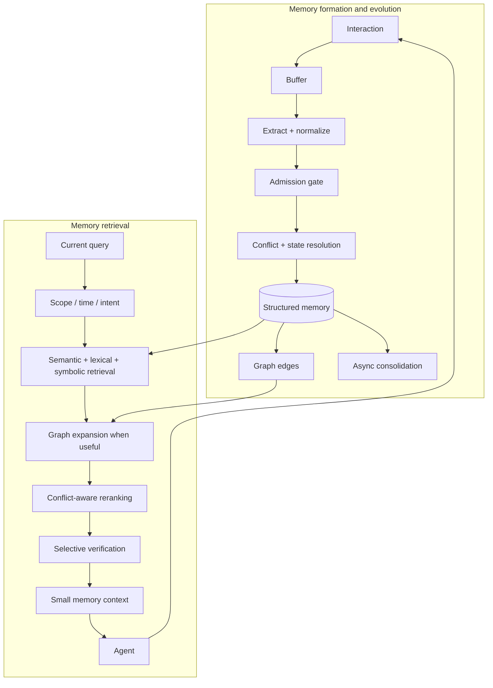

| Step | Plain-English meaning | Main reason |
|---|---|---|
| **Interaction** | People and agents do work | Source information |
| **Buffer** | Keep it cheaply for a while | Reduce immediate cost |
| **Extract + normalize** | Turn conversation into clear possible memories | Better storage |
| **Admission gate** | Decide what deserves long-term memory | Reduce noise |
| **Conflict + state resolution** | Decide how new information changes old information | Maintain correct current state |
| **Structured memory** | Store clean records with metadata | Retrieval and updates |
| **Graph edges** | Store relationships | History, conflicts, related information |
| **Async consolidation** | Improve memory in background | Efficiency |
| **Scope / time / intent** | Understand where/when/why memory is needed | Better candidate selection |
| **Hybrid retrieval** | Search in multiple ways | Better recall |
| **Graph expansion** | Follow useful links | Multi-step relationships |
| **Conflict-aware reranking** | Prefer valid memories, not just similar ones | Correct selection |
| **Selective verification** | Check uncertain evidence | Reliability |
| **Small memory context** | Give the agent only what it needs | Less context noise |
| **Agent** | Uses the memory to continue the task | Cross-session continuity |

---

# 29. The eight rules to remember

> **1. Do not remember everything.**  
> Store useful durable information.

> **2. One memory should be understandable by itself.**  
> Keep memories atomic and self-contained.

> **3. A new fact does not automatically replace an old fact.**  
> Check scope, time, conditions, provenance, and confidence.

> **4. Keep history.**  
> Current state and historical state are different things.

> **5. Similarity is not validity.**  
> A highly similar memory can still be stale or wrong.

> **6. Retrieve a small amount.**  
> More context can create more noise.

> **7. Expensive work should usually happen in the background.**  
> The user should not wait for memory maintenance.

> **8. Every durable memory should be traceable.**  
> We should know where it came from and what changed it.

---

# 30. Source-to-decision map

| Research | Main idea used |
|---|---|
| **Memory in the Age of AI Agents** | Memory lifecycle and memory types |
| **Mem0** | Persistent memory layer and hybrid/scope-aware retrieval ideas |
| **Zep** | Temporal memory and relationships |
| **SimpleMem** | Structured compression, multi-view retrieval, adaptive retrieval |
| **A-MAC** | Admission gate and multiple memory-value signals |
| **TRUSTMEM** | Trust at memory-transition level |
| **StateMem** | Evolving state and dependency-aware updates |
| **MemConflict** | Query-conditioned validity and conflict-aware ranking |
| **CRAG / SELF-RAG** | Retrieval checking and selective correction |
| **LOCOMO** | Long-term, temporal, controlled retrieval evaluation |
| **HaluMem** | Operation-level memory evaluation |
| **LightMem** | Cheap buffering and deferred processing |
| **RecMem** | Recurrence/relevance-triggered consolidation |
| **ProMem** | Stronger multi-stage extraction/verification when needed |
| **A-MEM** | Atomic notes and relationship-based organization |
| **MOSAIC** | Save-time conflict checking and structured graph organization |
| **TOKI** | Non-destructive write-time history/provenance |
| **SWE-agent** | Small agent-facing interface and compact context |
| **Lost in the Middle** | Avoid oversized retrieved context |
| **LongMemEval** | Temporal and long-term retrieval evaluation |
| **MemoryAgentBench / MemoryArena** | Broader memory capability and task-level evaluation |

---

# 31. What this document is for

Use this document when a team member asks:

> “What does this box mean?”

or:

> “Why did we choose this?”

or:

> “Can you give me a simple example?”

The formal specification remains the **technical source of truth**. This document is the **easy explanation of that specification**.
