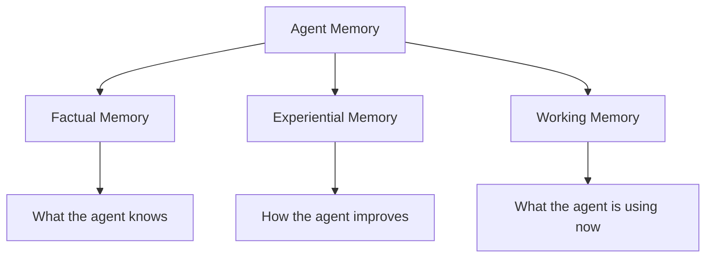
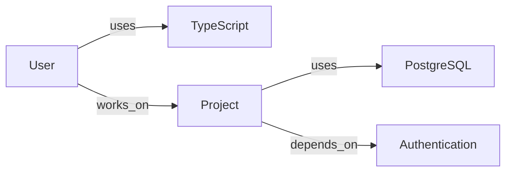
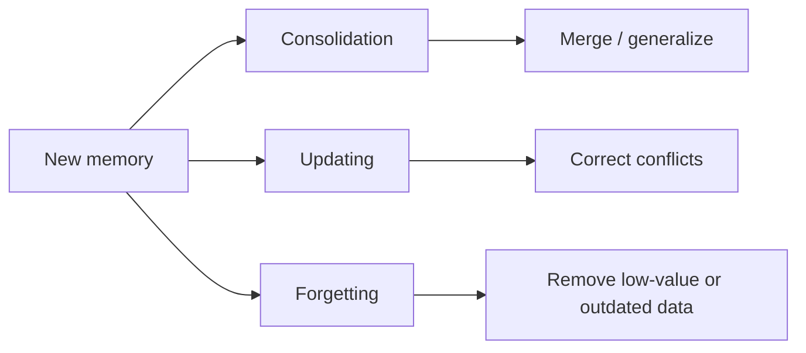
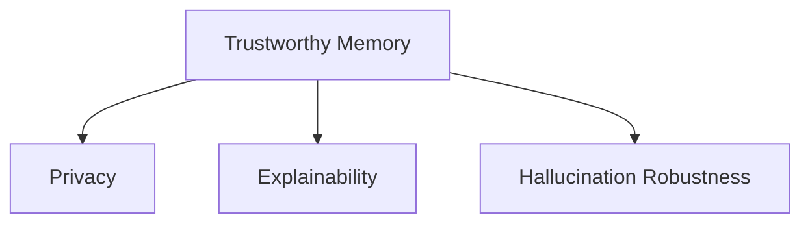
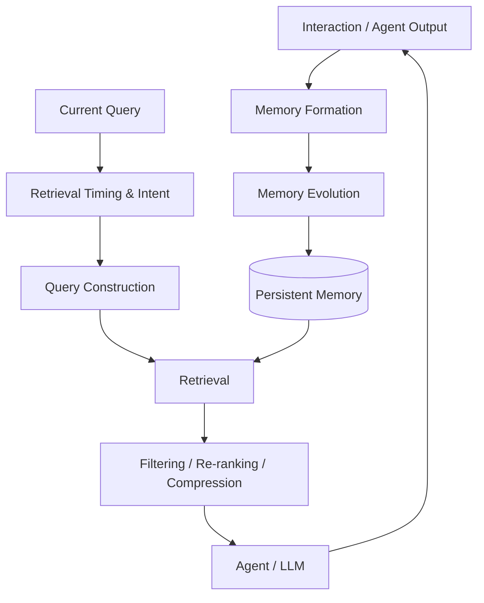

# Paper 1 — Study Notes
## *Memory in the Age of AI Agents: A Survey — Forms, Functions and Dynamics*

**Source:** Yuyang Hu et al.  
**Paper version used:** arXiv v2, 13 Jan 2026  
**Purpose of these notes:** Study only the parts of the paper that are directly useful for designing a persistent memory system for an AI-agent project.

> **Important:** These notes explain the paper in simpler language. They do not add external concepts or outside research.

---

# 1. The core idea

The paper treats **agent memory as a persistent, evolving state** that helps an LLM-based agent use information from previous interactions.

The key point is:

> Memory is not just “store some text and search it later.”

The paper describes a complete lifecycle:


### The three operations

| Operation | Simple meaning | Main question |
|---|---|---|
| **Formation** | Turn raw interaction information into useful memory | **What should be remembered?** |
| **Evolution** | Integrate, correct, or remove memory | **How should memory change?** |
| **Retrieval** | Find and prepare useful memory for the current task | **What memory should be used now?** |

The paper explicitly presents this as a cycle rather than three isolated components.

**Paper location:** pp. 7–8, 46–48

---

# 2. What counts as agent memory?

The paper models memory as an evolving state `M`.

It does **not** require one particular database structure.

The memory state may be represented as:

- text buffer
- key-value store
- vector database
- graph
- hybrid structure

So the paper does **not** say that one storage technology is universally correct.

### Important distinction

The paper separates **agent memory** from related ideas such as RAG and LLM-internal memory.

| Concept | Paper's distinction |
|---|---|
| **Agent memory** | Persistent, evolving memory used by an agent across interaction/task time |
| **Classical RAG** | Usually retrieves from externally maintained knowledge for an inference task |
| **LLM memory** | Includes mechanisms that modify or manage information inside the model itself |
| **Context engineering** | Focuses on managing the information presented to the model within context constraints |

For your project, the important part is the paper's definition of agent memory as a **persistent and evolving memory base**, rather than merely retrieving from a fixed collection.

**Paper location:** pp. 7–12

---

# 3. What can the memory contain?

The paper's **functional taxonomy** divides memory into three main types.



## 3.1 Factual memory

Stores explicit facts about:

- users
- past events
- environment state
- preferences
- constraints
- commitments

The paper says factual memory helps maintain:

**Consistency → Coherence → Adaptability**

Example from the paper's framing:

A system can retain user-specific facts and use them in later interactions instead of treating every interaction as completely new.

### Important for your project

This is the most direct category for **persistent information that should survive across sessions**.

**Paper location:** pp. 31–36

---

## 3.2 Experiential memory

This stores information derived from **past task execution**, rather than only explicit facts.

The paper divides it into:

### Case-based
Remember **what happened**.

Examples:
- past trajectories
- previous solutions
- successful cases

### Strategy-based
Remember **how to approach a task**.

Examples:
- insights
- workflows
- reasoning patterns

### Skill-based
Remember **what the agent can do** through reusable executable capabilities.

The paper describes a progression:

**Past case → abstract strategy → executable capability**

### Important for your project

This matters only if your system is intended to remember not just user/project facts, but also **reusable knowledge from previous task execution**.

**Paper location:** pp. 37–42

---

## 3.3 Working memory

Working memory is for the **current task/session**.

The paper describes it as an actively managed workspace rather than merely keeping the complete conversation history.

For multi-turn tasks, the paper discusses:

- **State consolidation** — compress an expanding interaction into a bounded state
- **Hierarchical folding** — keep active subtask details and compress completed subtasks
- **Cognitive planning** — maintain a plan or structured task state

### Project relevance

Do not confuse this with your persistent memory layer.

A system can have:

**Working memory → current task**  
**Long-term memory → persistent knowledge across tasks**

The paper also states that these roles do not necessarily require completely separate architectural containers; temporal use patterns can create the distinction.

**Paper location:** pp. 42–46

---

# 4. Memory Formation — the most important part

Memory formation converts raw interaction information into something worth storing.

The paper explicitly says the system should **not simply store the entire interaction history verbatim**. It should selectively extract information with potential future utility.

There are five formation approaches:

| Formation type | What it does |
|---|---|
| **Semantic summarization** | Compresses long information into a shorter summary |
| **Knowledge distillation** | Extracts specific factual or experiential knowledge |
| **Structured construction** | Organizes information into structures such as graphs or hierarchies |
| **Latent representation** | Stores information in latent/continuous representations |
| **Parametric internalization** | Moves information into model parameters |

For an external persistent-memory project, the first three are the most directly relevant parts of this section.

---

## 4.1 Semantic summarization

The goal is to reduce a long interaction into a compact summary.

Two approaches discussed:

### Incremental summarization

New information is repeatedly merged into an existing summary.

```text
Old summary + new interaction
        ↓
Updated summary
        ↓
New interaction
        ↓
Updated summary
```

The paper identifies problems:

- inconsistency
- semantic drift
- computational cost
- potential information loss

### Partitioned summarization

The information is divided into separate semantic/session/topic partitions, and each part gets its own summary.

The paper notes a trade-off:

**More efficient and finer-grained**  
but  
**cross-partition relationships can be lost**

### Key takeaway

Summarization is useful for reducing context size, but it is **lossy compression**: exact details can disappear.

**Paper location:** pp. 48–50

---

# 5. Knowledge distillation

This is more specific than general summarization.

Instead of asking:

> “What is the summary of this conversation?”

the system asks:

> “What reusable knowledge should be extracted from this interaction?”

The paper gives two important categories.

### Factual distillation

Extract explicit facts such as:

- user information
- goals
- constraints
- environment information

### Experiential distillation

Extract reusable knowledge from task execution:

- successful strategies
- failed approaches
- reflective insights
- workflows
- procedural knowledge

The paper notes that newer approaches increasingly attempt to learn **what information should be extracted**, instead of relying only on fixed prompts.

**Paper location:** pp. 50–51

---

# 6. Structured memory

The paper says structured construction changes more than storage format: it changes **how information is connected**.

Two major approaches:

### Entity-level construction

Convert information into entities and relationships.

Conceptually:



The paper discusses knowledge graphs and relational structures for this kind of memory.

### Chunk-level construction

Keep larger pieces of information intact, but organize them into:

- trees
- hierarchies
- linked notes
- graphs

### Why structure matters

According to the paper, structured memory can improve:

- interpretability
- retrieval efficiency
- handling of relationships
- multi-hop reasoning

But structured extraction can also introduce **noise or structural errors**, especially when an LLM is responsible for extracting entities and relationships.

**Paper location:** pp. 52–54

---

# 7. Memory Evolution — do not skip this

After forming a memory, the system must decide how it interacts with existing memory.

The paper identifies three mechanisms:



## 7.1 Consolidation

Combines related memories into more general knowledge.

Possible levels:

**Local → Cluster → Global**

The goal is to reduce fragmentation and create reusable abstractions.

### Risk

The paper warns about **information smoothing**:

During abstraction, unusual or exceptional details may disappear.

---

## 7.2 Updating

Updating is different from consolidation.

**Consolidation:** combine and generalize.  
**Updating:** correct or revise existing knowledge.

This becomes important when new information conflicts with stored information.

The paper discusses a progression:

**replace/delete → time-aware updating → delayed consistency → learned updating**

One particularly important idea is **temporal information**.

Instead of simply deleting an old conflicting fact, a system can preserve its history while marking its validity over time.

This helps maintain temporal continuity.

---

## 7.3 Forgetting

The paper says unlimited accumulation is problematic because old or redundant memory can increase:

- noise
- retrieval delay
- interference
- storage requirements

It identifies three forgetting approaches:

| Type | Basic signal |
|---|---|
| **Time-based** | How old is the memory? |
| **Frequency-based** | How often is it accessed? |
| **Importance-driven** | How valuable is the memory? |

### Important warning

A rarely accessed memory is not necessarily useless.

The paper explicitly notes that aggressive forgetting can remove **rare but important knowledge**.

**Paper location:** pp. 55–59

---

# 8. Retrieval — the other core architectural area

The paper breaks retrieval into four stages:


## 8.1 Timing and intent

First decide:

**When should memory be retrieved?**  
and  
**Which memory source should be used?**

The paper describes both always-on retrieval and selective retrieval.

Important risk:

If the agent incorrectly decides that it does **not** need memory, it may fail silently and produce an answer from insufficient knowledge.

The opposite problem also exists:

Retrieving too much memory introduces noise.

So the paper identifies a balance between:

**too little retrieval ↔ too much retrieval**

---

## 8.2 Query construction

The user's raw question may not be the best query for the memory store.

The paper describes:

### Query decomposition

Break one complex request into smaller retrieval queries.

```text
Complex request
      ↓
Sub-query 1
Sub-query 2
Sub-query 3
      ↓
Retrieve separately
      ↓
Combine results
```

### Query rewriting

Rewrite the original query into a form that better matches the memory representation.

### Important takeaway

The paper says the **quality of the retrieval query has a substantial impact on reasoning performance**.

So retrieval design is not simply:

`user query → vector search`

---

# 9. Retrieval strategies

The paper discusses four major retrieval families.

| Strategy | Basic idea | Limitation identified by paper |
|---|---|---|
| **Lexical** | Match words/terms | Misses semantic similarity |
| **Semantic** | Match embeddings/meaning | Can retrieve noisy or spurious results |
| **Graph** | Follow entities/relationships | Depends on useful graph structure |
| **Hybrid** | Combine multiple signals | More complex pipeline |

### Semantic retrieval

The paper states that semantic retrieval is common in agent memory systems because it handles meaning and fuzzy matching better than pure keyword matching.

But **top-K semantic retrieval can still return irrelevant information**.

### Graph retrieval

Useful when relationships between memories matter.

The paper describes graph retrieval as particularly useful for:

- multi-hop relationships
- long-range dependencies
- temporal constraints
- structure-aware retrieval

### Hybrid retrieval

Combines different signals.

The paper gives examples combining:

- lexical + semantic
- semantic + graph
- similarity + recency + importance

**Paper location:** pp. 62–64

---

# 10. Post-retrieval processing

The first retrieval result is not necessarily ready to give to the LLM.

The paper identifies two main operations:

### Re-ranking and filtering

Remove or reorder retrieved memories based on relevance.

The paper specifically discusses filtering:

- irrelevant memories
- redundant memories
- outdated memories
- temporally invalid memories

### Aggregation and compression

Merge several retrieved fragments into a concise context.

So the retrieval pipeline can be viewed as:

**Retrieve → Filter → Re-rank → Merge/Compress → LLM**

This is important because retrieving relevant memories is only part of the problem.

**Paper location:** pp. 64–65

---

# 11. Trustworthy memory

The paper identifies trustworthiness as a major issue because persistent memory can contain **user-specific and potentially sensitive information**.

It identifies three pillars:



### Privacy

The paper discusses:

- access control
- user-controlled retention
- secure/encrypted storage
- memory redaction
- forgetting/erasure

### Explainability

A system should ideally make it possible to understand:

- which memory was retrieved
- how it was used
- how it influenced the output

### Hallucination robustness

The paper discusses:

- conflict detection
- uncertainty-aware behavior
- low-confidence retrieval handling
- cross-checking

One especially relevant design direction from the paper is **version-controlled and auditable memory**.

**Paper location:** p. 75

---

# 12. What this paper tells us about the architecture

Do **not** treat this section as a final architecture decision. This is the set of design questions the paper tells us we need to answer.



### The key architectural questions raised by the paper

1. **What information deserves to become memory?**
2. **What representation should store it?**
3. **How should new information update existing memory?**
4. **How should outdated or redundant memory be handled?**
5. **When and how should memory be retrieved?**

These questions are more important for our project than choosing a particular database at this stage.

---

# 13. The 10 things you should remember from Paper 1

> **1. Memory is persistent and evolving.**

> **2. Memory has a lifecycle: Formation → Evolution → Retrieval.**

> **3. Formation should be selective, not simple full-history storage.**

> **4. Facts and experiences are different kinds of useful memory.**

> **5. Summarization saves space but can lose precise details.**

> **6. Updating is necessary when new information conflicts with old information.**

> **7. Forgetting is necessary for some systems, but aggressive deletion can lose rare useful knowledge.**

> **8. Retrieval itself has multiple stages; query construction matters.**

> **9. Retrieved memory should be filtered/reranked before being given to the LLM.**

> **10. Persistent memory creates privacy, explainability, and hallucination concerns.**

---

# 14. What to put in your Paper 1 PPT

## Slide 1 — Paper overview
**Memory in the Age of AI Agents: A Survey**

Focus:
- Why agent memory matters
- Survey's Forms–Functions–Dynamics framework

## Slide 2 — What is agent memory?

Show:

**Agent ↔ Memory**

Explain that memory is an evolving persistent state and can be stored in different representations.

## Slide 3 — Memory taxonomy

Show:

**Factual | Experiential | Working**

Briefly explain what each stores.

## Slide 4 — Memory lifecycle

Show:

**Formation → Evolution → Retrieval**

This is the most important diagram for our project.

## Slide 5 — Formation + Evolution

Show:

**Extract → Consolidate → Update → Forget**

Explain why storing everything unchanged is not enough.

## Slide 6 — Retrieval pipeline

Show:

**Timing/Intent → Query → Retrieve → Filter/Rerank → Compress**

## Slide 7 — Research implications

Explain the design questions we now need to investigate in later papers.

---

# 15. Glossary — only the terms needed here

**Agent memory:** Persistent, evolving information available to an agent.

**Memory formation:** Converting raw interaction information into memory.

**Memory evolution:** Changing an existing memory repository through consolidation, updating, and forgetting.

**Memory retrieval:** Finding useful memories for the current task.

**Semantic summarization:** Compressing information while trying to preserve its overall meaning.

**Knowledge distillation:** Extracting specific reusable knowledge.

**Structured construction:** Organizing information into relationships/hierarchies such as graphs or trees.

**Consolidation:** Combining related memories into more general knowledge.

**Updating:** Correcting or revising existing memory when new information arrives.

**Forgetting:** Removing outdated, redundant, or low-value memory.

**Re-ranking:** Reordering retrieved memories according to relevance.

**Post-retrieval processing:** Filtering, re-ranking, aggregating, or compressing retrieved memories before they reach the LLM.

---

# Source map

| Topic | Paper pages |
|---|---:|
| Agent memory definition | 6–8 |
| Agent memory vs RAG/context | 9–12 |
| Memory forms | 13–30 |
| Factual memory | 31–36 |
| Experiential memory | 37–42 |
| Working memory | 42–46 |
| Memory lifecycle overview | 46–48 |
| Memory formation | 48–54 |
| Memory evolution | 55–59 |
| Memory retrieval | 59–65 |
| Trustworthy memory | 75 |

**Use the original paper for exact wording, equations, and cited method details. These notes are a study aid, not a replacement for the paper.**
