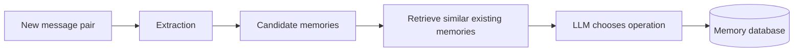
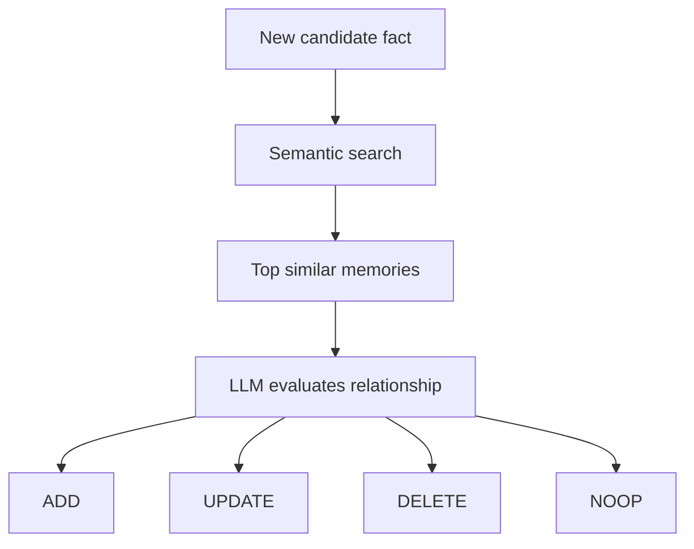
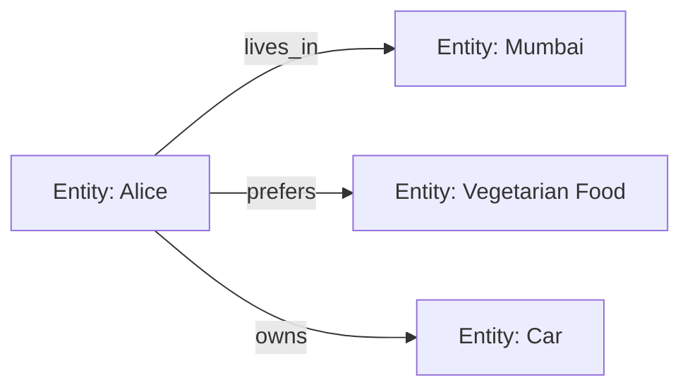
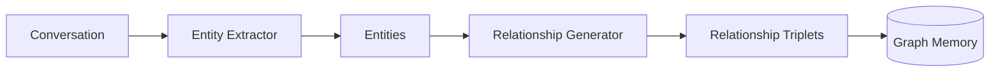
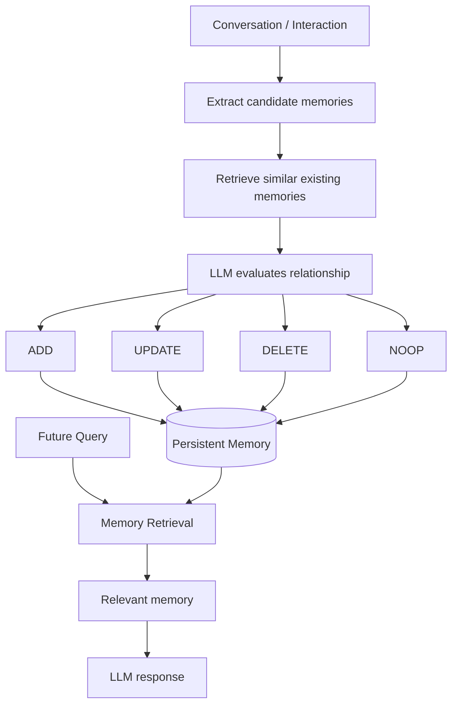

# Paper 2 — Concise Study Guide
## *Mem0: Building Production-Ready AI Agents with Scalable Long-Term Memory*

**Authors:** Prateek Chhikara, Dev Khant, Saket Aryan, Taranjeet Singh, Deshraj Yadav  
**Paper:** arXiv:2504.19413v1, 28 Apr 2025  
**Read only the parts below for your project.**

> These notes explain the paper in simpler language. They use only information stated in the paper.

---

# 1. What problem is the paper solving?

LLMs have fixed context windows. Across long, multi-session conversations, important information can fall outside the active context.

The paper gives a simple example:

```text
Session 1:
User → "I am vegetarian and avoid dairy."

          ↓ time passes / new session

Session 2:
User → "What should I have for dinner?"

Without persistent memory
→ Agent may forget the preference.

With persistent memory
→ Agent can use the previous preference.
```

The authors therefore aim to build a memory system that can:

**extract important information → organize it → retrieve it later**

The paper introduces:

- **Mem0** — natural-language memory
- **Mem0g** — Mem0 extended with graph-based memory

**Paper:** pp. 1–3

---

# 2. Mem0 — the main architecture

Mem0 uses an **incremental processing** approach.

It works in two main phases:



## Phase 1 — Extraction

When a new interaction arrives, Mem0 does not simply store the whole conversation.

It gives the LLM:

1. A conversation summary
2. A sequence of recent messages
3. The newest message pair

These are combined into the extraction prompt.

The LLM then extracts **salient memories** from the new exchange.

### Important point

The extracted memory is a **candidate**. It is not automatically written as a new independent record.

**Paper:** pp. 3–4

---

# 3. Why does Mem0 use both summary + recent messages?

The paper gives two reasons.

### Conversation summary

Provides the **global semantic understanding** of the conversation.

### Recent messages

Provide **fine-grained recent details** that may not yet be present in the summary.

So:

```text
Global context
   +
Recent detailed context
   +
New interaction
   ↓
Memory extraction
```

The summary is generated asynchronously and periodically refreshed.

**Paper:** p. 4

---

# 4. The most important part: memory update logic

After extracting a candidate fact, Mem0 searches for the **top `s` semantically similar memories** already in the database.

The candidate fact + similar memories are then given to the LLM.

The LLM chooses one of four operations:

| Operation | Meaning |
|---|---|
| **ADD** | No equivalent memory exists → create a new memory |
| **UPDATE** | Existing memory has related information → augment it |
| **DELETE** | Existing memory is contradicted → remove it |
| **NOOP** | No change is needed |

Conceptually:



This is one of the most useful ideas in the paper for your project:

> **Memory writing is an evaluation process, not just an insertion process.**

The paper specifically uses an LLM to choose the operation instead of using a separate classifier.

**Paper:** p. 4 + Appendix B, p. 21

---

# 5. Algorithm 1 — understand this

The appendix gives the update algorithm.

The important logic is:

```text
For every extracted fact:

    Find related existing memories

    IF it is not semantically similar
        → ADD

    ELSE IF it contradicts existing memory
        → DELETE

    ELSE IF it adds information
        → UPDATE

    ELSE
        → NOOP
```

For `UPDATE`, the algorithm compares information content and replaces the existing memory when the new fact contains richer information.

For `DELETE`, the contradicted memory is removed.

For `NOOP`, nothing changes.

**Paper:** Appendix B, p. 21

---

# 6. What is actually stored?

The base Mem0 system stores memories as **natural-language representations**.

The paper reports an average of about **7k tokens per conversation** for its long-term memory representation.

This is much smaller than the roughly **26k-token raw conversation** used by the full-context baseline in their experiment.

**Paper:** pp. 13–14

---

# 7. Mem0g — graph memory

Mem0g extends Mem0 by representing memory as a directed, labeled graph.



The paper defines:

- **Nodes** = entities
- **Edges** = relationships
- **Labels** = semantic types / relationship labels

Each entity node contains:

1. Entity type
2. Embedding vector
3. Creation timestamp

Relationships are represented as triplets:

`(source entity, relationship, destination entity)`

**Paper:** pp. 5–6

---

# 8. How Mem0g creates the graph

Mem0g uses two extraction components:



The entity extractor identifies important entities.

The relationship generator determines meaningful relationships between those entities.

Examples given in the paper include relationships such as:

- `lives_in`
- `prefers`
- `owns`
- `happened_on`

The paper notes that LLM-based extraction can produce noise or structural errors.

**Paper:** pp. 5–6

---

# 9. How Mem0g handles conflicting information

When a new relationship arrives, Mem0g searches for semantically similar existing nodes.

It then checks for conflicting relationships.

The LLM-based update resolver can mark a conflicting relationship as **invalid instead of physically deleting it**.

This preserves information needed for temporal reasoning.

```text
Old relationship
      ↓
Conflict detected
      ↓
Marked invalid
      ↓
Historical information remains available
```

This is an important difference from the base Mem0 `DELETE` operation.

**Paper:** p. 6

---

# 10. Mem0g retrieval

The paper uses two retrieval approaches.

### Entity-centric retrieval

```text
Query
 ↓
Identify entities
 ↓
Find corresponding graph nodes
 ↓
Explore incoming/outgoing relationships
 ↓
Relevant subgraph
```

### Semantic triplet retrieval

```text
Query
 ↓
Query embedding
 ↓
Compare with relationship-triplet representations
 ↓
Keep sufficiently relevant triplets
```

So Mem0g can retrieve either around **specific entities** or from **relationships matching the overall query**.

The graph database used in the paper is **Neo4j**.

**Paper:** p. 6

---

# 11. What did they evaluate?

The paper evaluates long-term conversational memory using **LOCOMO**.

The dataset contains:

- 10 extended conversations
- roughly 600 dialogues per conversation
- roughly 26,000 tokens per conversation on average
- around 200 questions per conversation

Question categories:

- Single-hop
- Multi-hop
- Temporal
- Open-domain

**Paper:** p. 6

---

# 12. Evaluation metrics that matter

The paper uses two major groups.

## Response quality

### F1 / BLEU-1
Used as lexical metrics.

The paper says they can be misleading for factual correctness.

Example:

```text
Ground truth: Alice was born in March.
Generated:    Alice was born in July.
```

The wording overlaps strongly, but the fact is wrong.

### LLM-as-a-Judge

A separate LLM judges:

- factual accuracy
- relevance
- completeness
- contextual appropriateness

The paper repeats the judge evaluation 10 times and reports the mean ± standard deviation.

## Deployment efficiency

The paper also measures:

- **Token consumption**
- **Search latency**
- **Total latency**

This matters because a memory system can improve quality while becoming expensive or slow.

**Paper:** pp. 7–8

---

# 13. The main experimental result

The paper compares Mem0 and Mem0g with RAG, full-context processing, and other memory systems.

### Key observation

In their LOCOMO experiment:

- **Mem0:** Overall LLM-as-a-Judge = **66.88%**
- **Mem0g:** Overall LLM-as-a-Judge = **68.44%**
- **Full-context:** **72.90%**

So full-context had the highest overall judge score in this table, but it required much more context and had much higher latency.

Mem0 and Mem0g were therefore presented by the authors as a practical quality/efficiency trade-off.

**Paper:** pp. 11–13

---

# 14. Efficiency result

The paper reports:

| Method | Total latency p95 |
|---|---:|
| Full-context | **17.117 s** |
| Mem0 | **1.440 s** |
| Mem0g | **2.590 s** |

The paper attributes Mem0's efficiency to retrieving only salient memories rather than repeatedly processing fixed-size chunks of the whole conversation.

The paper reports Mem0 as having **over 90% lower p95 latency** than full-context in its evaluation.

**Paper:** pp. 11–14

---

# 15. What happened with graph memory?

This paper does **not** show that graph memory is always better.

Its results differ by question type.

### Single-hop

Mem0 slightly outperformed Mem0g.

Interpretation from the paper: when the answer is located in a single dialogue turn, graph relationships add limited value.

### Multi-hop

Mem0 also outperformed Mem0g in their results.

The authors note possible inefficiency or redundancy in graph representation for this type of task.

### Temporal

Mem0g performed better.

The authors associate this with explicit relational structure being useful for event ordering and temporal relationships.

### Open-domain

Mem0g performed strongly, while Zep had a slightly higher judge score in their comparison.

### Important conclusion

The paper supports **different memory structures for different reasoning needs**, rather than claiming graph memory is universally superior.

**Paper:** pp. 9–12

---

# 16. What this paper contributes to our project

Keep these ideas.

### A. Memory admission

Do not blindly save every message.

```text
Interaction
   ↓
Extract candidate memory
   ↓
Evaluate against existing memory
   ↓
Decide what to do
```

### B. Memory update

A useful memory system needs more than `insert()`.

It needs logic for:

**ADD / UPDATE / DELETE / NOOP**

### C. Similar-memory retrieval before updating

The paper first retrieves semantically similar memories and then asks the LLM to decide what to do.

This connects **retrieval and memory writing**.

### D. Natural-language memory can be enough

Mem0's base system uses natural-language memories and performed well in their evaluation.

So the paper does **not** establish that a knowledge graph is mandatory.

### E. Graph memory is useful for relational/temporal information

Mem0g's results show stronger benefit for temporal reasoning in their experiment.

### F. Efficiency must be evaluated

Do not evaluate memory only by answer accuracy.

The paper also measures:

**quality + token usage + retrieval latency + total latency**

---

# 17. What this paper does NOT answer

This is important for our literature review.

The paper gives a concrete Mem0 architecture, but it does **not** establish a universal answer to:

- the best memory representation for every application
- the best retrieval algorithm for every task
- the best forgetting mechanism
- the best conflict-resolution policy for every domain
- the best architecture for cross-agent/shared memory

Its experiments are primarily on **long-term conversational memory using LOCOMO**.

These questions therefore remain open for us and should be investigated using later papers.

---

# 18. The architecture idea to remember

Do not copy this blindly into our final design. Extract the principle:



The central architectural lesson from this paper is:

> **Persistent memory should have an explicit write/update mechanism, not only a retrieval mechanism.**

---

# 19. Paper 2 — 8 points to remember

1. **Mem0 extracts salient memories instead of storing everything.**
2. **Extraction uses global summary + recent messages + new interaction.**
3. **New memories are compared with similar existing memories.**
4. **The system can ADD, UPDATE, DELETE, or NOOP.**
5. **Mem0 stores natural-language memories.**
6. **Mem0g represents entities and relationships as a graph.**
7. **Graph memory is particularly useful for some relational/temporal cases, but not universally better.**
8. **A memory system should be evaluated for both quality and deployment cost.**

---

# Suggested PPT from this paper

## Slide 1 — Problem
Fixed context → loss of long-term conversational information.

## Slide 2 — Mem0 architecture
**Extract → Compare → Update**

## Slide 3 — Memory update operations
**ADD | UPDATE | DELETE | NOOP**

## Slide 4 — Mem0g
Entities + relationships + graph retrieval.

## Slide 5 — Evaluation
LOCOMO + quality + token/latency metrics.

## Slide 6 — Key findings
Natural-language memory vs graph memory and the quality/efficiency trade-off.

## Slide 7 — Relevance to our project
Focus on **memory admission, updating, retrieval, and evaluation**.

---

# Source map

| Topic | Paper pages |
|---|---:|
| Problem & motivation | 1–3 |
| Mem0 architecture | 3–4 |
| Mem0g architecture | 5–6 |
| Dataset & evaluation | 6–8 |
| Main results | 9–14 |
| Conclusion / future work | 14–15 |
| Algorithm 1 | 21 |

