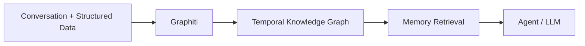
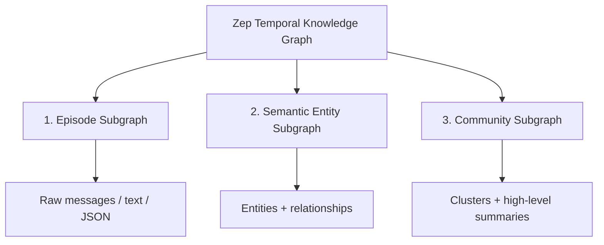
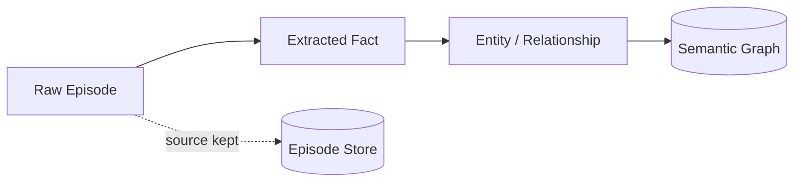
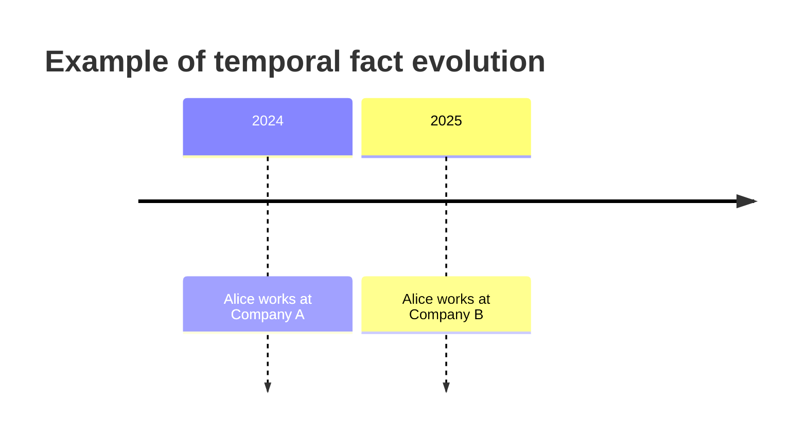
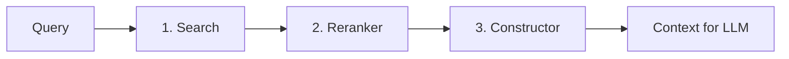
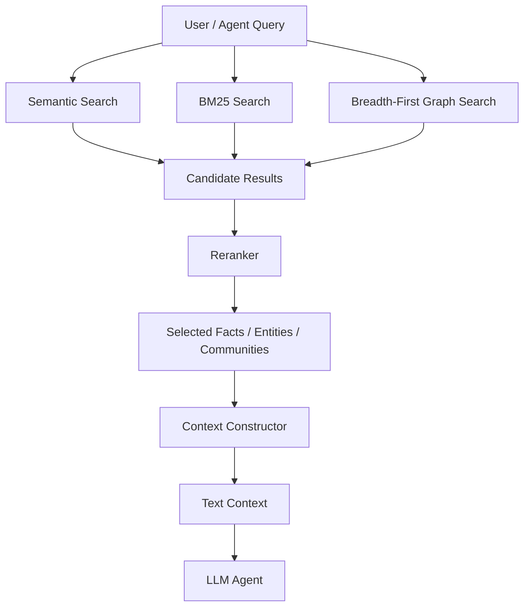

# Paper 3 — Concise Study Guide
## *Zep: A Temporal Knowledge Graph Architecture for Agent Memory*

**Authors:** Preston Rasmussen, Pavlo Paliychuk, Travis Beauvais, Jack Ryan, Daniel Chalef  
**Paper:** arXiv:2501.13956v1 — 20 Jan 2025

> **Scope:** Only the parts of this paper directly useful for understanding and designing a persistent agent-memory system are included. Explanations are simplified without adding outside material.

---

# 1. What problem is Zep solving?

The paper argues that ordinary RAG systems mainly work with **static document collections**, while agent memory needs to handle information that **changes over time**.

For an agent, useful information can come from:

- ongoing conversations
- structured business data
- changing relationships
- facts whose validity changes over time

The paper therefore introduces **Zep**, a memory layer built on **Graphiti**, a dynamically updated and temporally aware knowledge graph.

The central idea is:



The important difference is that Zep does not only keep the latest information. It aims to keep the **history of how information changes**.

**Paper:** pp. 1–2

---

# 2. The most important architecture idea

Zep uses **three hierarchical graph layers**:



## 2.1 Episode subgraph

Stores the **raw input**.

An episode can be:

- a message
- text
- JSON

For conversation memory, the paper focuses on messages.

This layer is described as **non-lossy** because the original episode data is retained.

### Why this matters

It preserves the source from which higher-level facts were derived.

---

## 2.2 Semantic entity subgraph

Converts raw episodes into:

**entities + relationships**

Examples:

```text
Alice ──lives_in──> Mumbai
Alice ──works_for──> Company
```

Entities become nodes.

Relationships become edges.

This layer represents the **meaning extracted from the original conversation**.

---

## 2.3 Community subgraph

Groups strongly connected entities into **communities**.

Each community contains a higher-level summary.

So the hierarchy can be thought of as:

```text
Raw episode
   ↓
Entities + facts
   ↓
Entity communities + summaries
```

The paper uses this upper layer to provide a more global view of related information.

**Paper:** pp. 2–4

---

# 3. Why does Zep keep both raw and derived information?

This is one of the most important ideas in the paper.



The raw episode remains available while semantic information is derived from it.

The paper also creates connections between episodes and the semantic entities/facts derived from them.

These bidirectional links can allow:

**semantic information → source episode**

and

**episode → related entities/facts**

The paper says these links support tracing derived information back to its sources, although this capability was **not directly evaluated in the experiments**.

**Paper:** p. 3

---

# 4. The key feature: temporal memory

Zep explicitly models **when a fact was true**.

This is more than simply storing the timestamp when a record was inserted.

The paper uses **two timelines**:

### Timeline T

Represents the actual time associated with the information.

### Timeline T′

Represents the time when Zep's system created or invalidated the stored information.

So the system can distinguish:

```text
"When was this fact true?"
        vs.
"When did our system record/change it?"
```

The paper stores four important timestamps on facts:

- `t′created`
- `t′expired`
- `tvalid`
- `tinvalid`

The first pair belongs to the system's transaction timeline.

The second pair describes the period during which the fact was valid.

**Paper:** pp. 2–3

---

# 5. Example of temporal updating

Suppose the memory contains:

```text
Alice works at Company A
```

Later the system receives:

```text
Alice works at Company B
```

Zep does not need to erase the old relationship completely.

Instead, the older relationship can be marked as invalid from the point where the newer relationship becomes valid.

Conceptually:



The paper's mechanism is:

```text
New fact
   ↓
Find related existing facts
   ↓
Detect temporal conflict
   ↓
Invalidate conflicting old edge
   ↓
Keep historical information
```

This allows the graph to represent **both current and historical states**.

**Paper:** p. 3

---

# 6. How Zep constructs the graph

Graph construction starts from the episode.

## Step 1 — Entity extraction

The system processes the current message together with the previous `n` messages.

For this paper:

`n = 4`

The speaker is automatically extracted as an entity.

The system also produces an entity summary.

### Entity resolution

New entities are compared with existing entities using:

- semantic similarity
- full-text search

An LLM then determines whether a new node is actually a duplicate of an existing entity.

If it is a duplicate, the existing node can be updated with a more complete name/summary.

---

## Step 2 — Fact extraction

The system extracts facts connecting distinct entities.

A fact is represented as a relationship between two entities.

The paper also allows complex multi-entity facts through its implementation of hyper-edges.

---

## Step 3 — Fact deduplication

Before adding a new relationship, the system searches for related existing edges.

The search is restricted to edges between the same entity pair.

The paper says this reduces erroneous matching and reduces the search space.

---

## Step 4 — Temporal extraction

The system extracts dates associated with the fact.

It handles:

- absolute dates
- relative dates

For example, the paper explicitly discusses expressions such as:

> “two weeks ago”

The reference timestamp is used to resolve relative time.

**Paper:** pp. 3–4 and Appendix

---

# 7. Why the paper uses predefined database queries

A subtle but important engineering decision:

The paper says that after entity resolution, Graphiti uses **predefined Cypher queries** rather than allowing the LLM to generate database queries.

The stated reason is:

- maintain consistent schema formats
- reduce the potential for hallucinations

This is relevant when designing an LLM-driven memory system:

```text
LLM decides WHAT information was extracted
                ↓
Application/system controls HOW it is written
```

The paper makes this distinction explicitly for graph construction.

**Paper:** p. 3

---

# 8. Community construction

After the episode and semantic layers are built, Zep creates communities.

The paper uses **label propagation** rather than Leiden for its dynamic community updates.

When a new entity appears:

```text
New entity
   ↓
Look at neighboring entities
   ↓
Find the community shared by most neighbors
   ↓
Add entity to that community
   ↓
Update community summary
```

The paper notes an important trade-off:

- dynamic updates reduce latency and LLM cost
- but communities can gradually diverge from those produced by a complete recomputation

Therefore, periodic full community refreshes are still needed.

**Paper:** p. 4

---

# 9. Retrieval — extremely important

Zep divides retrieval into **three stages**:



## 9.1 Search

Search identifies candidate:

- semantic edges/facts
- entity nodes
- community nodes

Zep combines three search methods.

### Cosine semantic search

Finds semantically similar information.

### BM25 full-text search

Finds information based on word/term matching.

### Breadth-first graph search

Expands through nearby graph nodes and edges.

The paper describes these as capturing different forms of similarity:

```text
BM25
→ word similarity

Cosine
→ semantic similarity

BFS
→ graph/context similarity
```

This is a major architectural idea from the paper.

**Paper:** pp. 4–5

---

# 10. Reranking

Initial search is designed to get a broad set of candidates.

The reranker then improves **precision** by deciding which results should appear first.

Zep supports:

- Reciprocal Rank Fusion
- Maximal Marginal Relevance
- episode-mention based reranking
- node-distance reranking
- cross-encoder based reranking

The paper notes that cross-encoder reranking is the most computationally expensive of these approaches.

Conceptually:

```text
Many candidates
      ↓
Reranking
      ↓
Most useful candidates
```

**Paper:** p. 5

---

# 11. Constructor

After reranking, Zep converts the selected graph information into a **text context** that can be given to the LLM.

The constructor includes:

### For facts
- fact
- valid date range

### For entities
- entity name
- entity summary

### For communities
- community summary

So the final agent does not need to reason directly over raw graph database objects.

```text
Graph retrieval
      ↓
Selected graph information
      ↓
Text context
      ↓
LLM
```

**Paper:** p. 4

---

# 12. Zep's complete retrieval pipeline

Put everything together:



This is probably the **single most useful diagram from Paper 3 for your project**.

---

# 13. What did the paper evaluate?

The paper uses two memory evaluations.

## DMR — Deep Memory Retrieval

The benchmark contains:

- 500 conversations
- 5 chat sessions per conversation
- up to 12 messages per session

The authors point out an important limitation:

The benchmark mostly tests relatively simple single-turn fact retrieval, and the conversations are short enough to fit in current context windows.

Therefore, the authors argue that DMR does not fully represent difficult long-term memory use.

---

## LongMemEval

The paper uses LongMemEval because it contains much longer conversations.

Average context:

**~115,000 tokens**

Question types include:

- single-session user
- single-session assistant
- single-session preference
- multi-session
- knowledge update
- temporal reasoning

This benchmark is therefore much closer to the paper's intended problem.

**Paper:** pp. 5–7

---

# 14. Main results

## DMR

Using gpt-4-turbo:

- MemGPT: **93.4%**
- Full conversation: **94.4%**
- Zep: **94.8%**

Using gpt-4o-mini:

- Full conversation: **98.0%**
- Zep: **98.2%**

The paper itself warns that these results should be interpreted carefully because DMR conversations are relatively short.

**Paper:** p. 6

---

## LongMemEval

| Model | Full context | Zep |
|---|---:|---:|
| gpt-4o-mini | 55.4% | **63.8%** |
| gpt-4o | 60.2% | **71.2%** |

Average context passed to the model:

- Full-context: **115k tokens**
- Zep: **1.6k tokens**

Total latency p95 / comparable reported latency:

- Full-context gpt-4o-mini: **31.3 s**
- Zep gpt-4o-mini: **3.20 s**
- Full-context gpt-4o: **28.9 s**
- Zep gpt-4o: **2.58 s**

The authors report roughly **90% response-time reduction** for Zep in this evaluation.

**Paper:** pp. 6–7

---

# 15. Where did Zep help most?

The paper reports stronger improvements in several categories, especially:

- preference questions
- multi-session questions
- temporal reasoning
- knowledge updates with gpt-4o

However, performance was **not better in every category**.

For example, the Zep result was lower for:

- single-session-assistant questions

The paper explicitly identifies this as an exception requiring further work.

This matters because the paper does **not** justify a claim that temporal graph memory is universally superior.

**Paper:** pp. 7–8

---

# 16. What this paper gives us for our project

These are the ideas worth carrying into the literature review.

## 1. Time should be treated as part of memory

A memory record may need to answer:

> **When was this true?**

not just:

> **What is true?**

---

## 2. Keep source information when possible

Zep keeps raw episodes and derives semantic information from them.

This supports a useful pattern:

```text
Original source
     +
Derived memory
```

rather than storing only a transformed summary.

---

## 3. Memory can be hierarchical

Zep demonstrates one concrete hierarchy:

```text
Episodes
   ↓
Entities + Facts
   ↓
Communities
```

This gives us another architecture option to compare against the flatter memory structures seen in earlier papers.

---

## 4. Retrieval can combine multiple signals

Zep combines:

**semantic + lexical + graph**

before reranking.

This gives us a concrete alternative to using only vector similarity.

---

## 5. Retrieval should be separated into stages

The paper's design is:

**Search → Rerank → Construct context**

That separation is useful when designing our own retrieval pipeline.

---

## 6. Updating should preserve temporal history

The paper shows one way to represent changing facts without simply destroying the old relationship.

This is directly relevant to the question:

> **How should our system handle new information that contradicts old information?**

---

# 17. What this paper does NOT establish

Do not take these as conclusions from the paper:

- A temporal knowledge graph is the best architecture for all agent memory.
- Every memory system needs three graph layers.
- Graph retrieval is always better than vector retrieval.
- Zep's benchmark results automatically generalize to every domain.
- The proposed temporal invalidation mechanism solves all memory conflicts.

The experiments are focused on the specific Zep/Graphiti system and the evaluated benchmarks.

---

# 18. Paper 3 — 8 things to remember

1. **Zep treats agent memory as dynamic, not static.**
2. **Graphiti stores episodes, semantic entities/facts, and communities.**
3. **Temporal information is explicitly stored with facts.**
4. **Old facts can be invalidated instead of simply erased.**
5. **Graph construction includes entity extraction, resolution, fact extraction, deduplication, and temporal extraction.**
6. **Retrieval = Search → Rerank → Construct context.**
7. **Search combines semantic, lexical, and graph-based methods.**
8. **The LongMemEval experiment shows a large reduction in context size and latency for Zep in the evaluated setup.**

---

# 19. PPT structure for Paper 3

## Slide 1 — Problem
Static RAG is not enough for continuously changing agent memory.

## Slide 2 — Zep architecture
Show:

**Episode → Semantic → Community**

## Slide 3 — Temporal knowledge
Show a fact becoming invalid while historical information remains.

## Slide 4 — Graph construction
**Extract → Resolve → Add → Deduplicate → Temporal update**

## Slide 5 — Retrieval
**Search → Rerank → Constructor → LLM**

## Slide 6 — Evaluation
DMR + LongMemEval.

## Slide 7 — Results
Accuracy + context size + latency.

## Slide 8 — Relevance to our project
Focus on:
**temporal memory + hierarchical representation + hybrid retrieval + staged retrieval**

---

# Source map

| Topic | Paper pages |
|---|---:|
| Problem / motivation | 1–2 |
| Three graph layers | 2–4 |
| Temporal modeling | 2–3 |
| Entity / fact construction | 3–4 |
| Community construction | 4 |
| Retrieval pipeline | 4–5 |
| DMR | 5–6 |
| LongMemEval | 6–8 |
| Conclusion / limitations | 8 |
| Prompt details | 8–10 |
