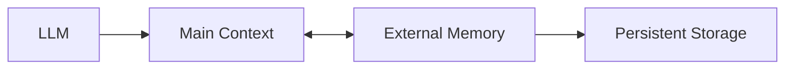
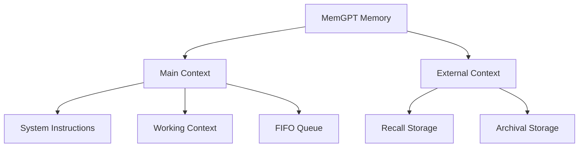
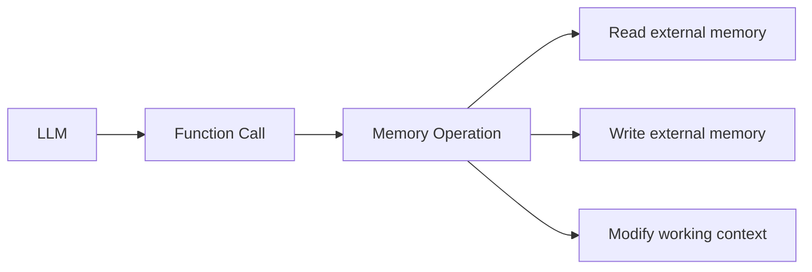
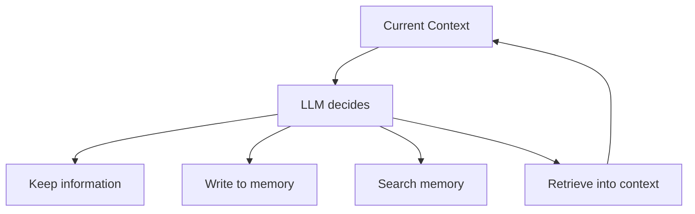
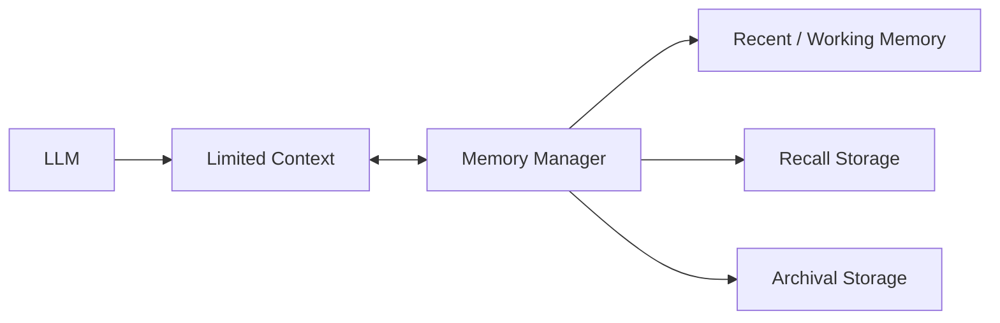
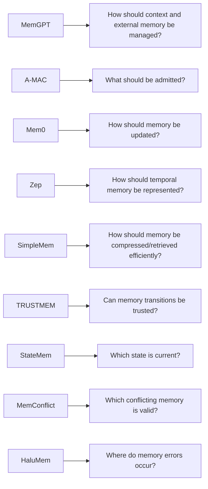

# Part B — Paper 1
## *MemGPT: Towards LLMs as Operating Systems*

**Authors:** Charles Packer, Sarah Wooders, Kevin Lin, Vivian Fang, Shishir G. Patil, Ion Stoica, Joseph E. Gonzalez  
**Paper:** arXiv:2310.08560v2 — 12 Feb 2024

> **Why this paper is relevant:** MemGPT is an early paper that treats the LLM context window as a managed memory resource. For our project, the important ideas are **memory hierarchy, external storage, self-directed memory operations, and context management**.

---

# 1. Core problem

An LLM has a limited context window.

MemGPT asks:

> **Can a fixed-context LLM behave as if it had a much larger context by moving information between in-context and external memory?**

The paper borrows the idea of **virtual memory** from operating systems.



The key analogy is:

```text
LLM context       ↔ physical/main memory
External storage  ↔ disk
```

The paper calls this **virtual context management**.

fileciteturn36file0L8-L22

---

# 2. MemGPT memory hierarchy

The paper divides memory into two primary levels.



## Main context

Information currently inside the LLM prompt.

### Working context
A fixed-size read/write area for important information.

For conversational agents, it is intended for things such as:

- important user facts
- preferences
- persona information

### FIFO queue
A rolling history of recent messages.

When the queue grows too large, older information is moved out.

---

## External context

Information outside the fixed context window.

### Recall storage
Stores conversation messages and can be searched/retrieved.

### Archival storage
Stores arbitrary-length external information that can be explicitly written and searched.

**Most important point:**

> **Only information in main context is directly visible to the LLM during inference.**

External information has to be brought back into main context.

---

# 3. How memory moves

MemGPT uses **function calls** generated by the LLM to control memory.



The agent can therefore decide:

- when to save information
- when to retrieve old information
- what information should remain in working context

This is a major difference from a system where memory management is entirely controlled by an external fixed policy.

**Paper:** §2.3

---

# 4. Memory pressure

MemGPT does not wait until the context is completely full.

The paper uses two levels:

```text
Warning threshold
      ↓
Tell the agent memory pressure is coming

Flush threshold
      ↓
Evict part of the FIFO queue
      ↓
Create/update summary
      ↓
Free context space
```

When information leaves the FIFO queue:

- it is no longer directly visible in context
- it remains in recall storage
- it can be retrieved later

This is the paper's main mechanism for extending effective context length.

---

# 5. Recursive summary

When old messages are evicted, MemGPT creates a **recursive summary** of the evicted content.

The next summary is built using:

```text
Previous summary
+
Newly evicted messages
```

This allows information from increasingly old parts of the conversation to remain represented in a compact form.

But the important limitation is:

> **Summaries are not the same as the original messages.**

Information may be compressed when it is removed from the active queue.

---

# 6. Self-directed memory management

The paper's distinctive idea is that the **LLM itself chooses memory operations**.



The LLM receives:

- instructions describing the memory hierarchy
- function schemas
- feedback from executed functions

If a function call produces an error, the result is returned to the LLM so it can adjust its next action.

This creates a loop:

**decide → execute → observe feedback → decide again**

**Paper:** §2.3

---

# 7. Retrieval can be iterative

When the first search does not contain enough information, MemGPT can make additional function calls.

The paper uses a special mechanism called a **heartbeat** to request another inference cycle.

```text
Query
 ↓
Search
 ↓
Inspect result
 ↓
Search again
 ↓
Retrieve more information
 ↓
Answer
```

This means retrieval is not necessarily a single `top-k` operation.

It can become an **interactive retrieval process**.

---

# 8. Main experimental areas

The paper evaluates MemGPT mainly in two areas:

### A. Long conversations

The **Deep Memory Retrieval (DMR)** task tests whether the agent can remember information from previous conversations.

The paper also examines conversation openers to evaluate whether stored persona information helps maintain conversational continuity.

### B. Document analysis

Large documents are stored in archival memory and retrieved as needed.

The paper also evaluates a nested key-value retrieval task to test multi-step external-memory access.

For our project, the **long-conversation memory setup** is the more relevant experiment.

---

# 9. The main architectural lesson

MemGPT's contribution can be reduced to:



The core principle is:

> **Treat context as a limited resource and explicitly manage what enters and leaves it.**

That is the part most relevant to our project.

---

# 10. What MemGPT gives us — and what it does not

## Useful for our project

**Memory hierarchy**  
Separate active context from persistent external storage.

**Explicit memory operations**  
Use controlled operations for read/write/update.

**Context pressure management**  
Do not wait for context overflow.

**Iterative retrieval**  
Allow the agent to retrieve additional information when the first result is insufficient.

**Feedback loop**  
Return operation results/errors to the agent.

## Not established by this paper

The paper does **not** establish that:

- LLM-directed memory management is always best
- its specific storage structure is optimal
- recursive summaries preserve all important information
- its retrieval strategy is best for every memory task

---

# 11. Connection to our Part A papers



MemGPT is therefore mainly relevant to the **overall memory-management layer**, while the later papers address more specific problems.

---

# 12. 6 things to remember

1. **LLM context is treated as a limited memory resource.**
2. **MemGPT separates active context from external memory.**
3. **The LLM can explicitly read/write its external memory through functions.**
4. **Memory pressure triggers movement of information out of active context.**
5. **Old information can be summarized and later retrieved from external storage.**
6. **The operating-system analogy is mainly a mechanism for managing context, not proof of one universal memory architecture.**

---

# PPT — 5 slides

## Slide 1 — Problem
**Limited context window → need virtual context management**

## Slide 2 — Memory hierarchy
```text
Main Context
   ├── Working Context
   └── FIFO Queue

External Context
   ├── Recall Storage
   └── Archival Storage
```

## Slide 3 — Memory management
**Memory pressure → eviction → storage → later retrieval**

## Slide 4 — Self-directed retrieval
**LLM → function call → memory → feedback → next action**

## Slide 5 — Relevance
**Context management + external persistent memory + explicit memory operations**

---

# Reading priority

### Must read
**§1 Introduction**  
**§2 MemGPT architecture**  
**§2.1 Main context**  
**§2.2 Queue Manager**  
**§2.3 Function Executor**

### Skim
**§3.1 Conversational agents**

### Skip for now
Most detailed document-analysis experiments and appendix prompts.
