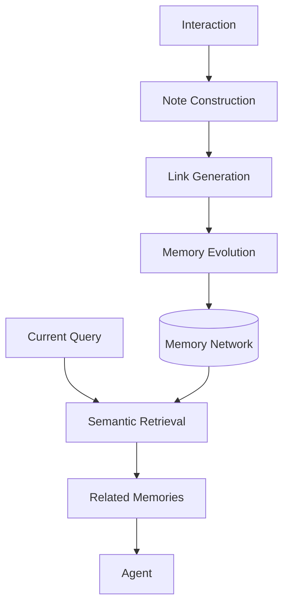
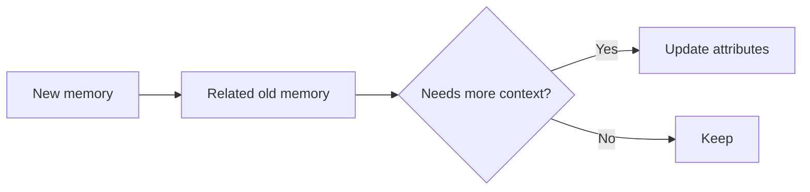
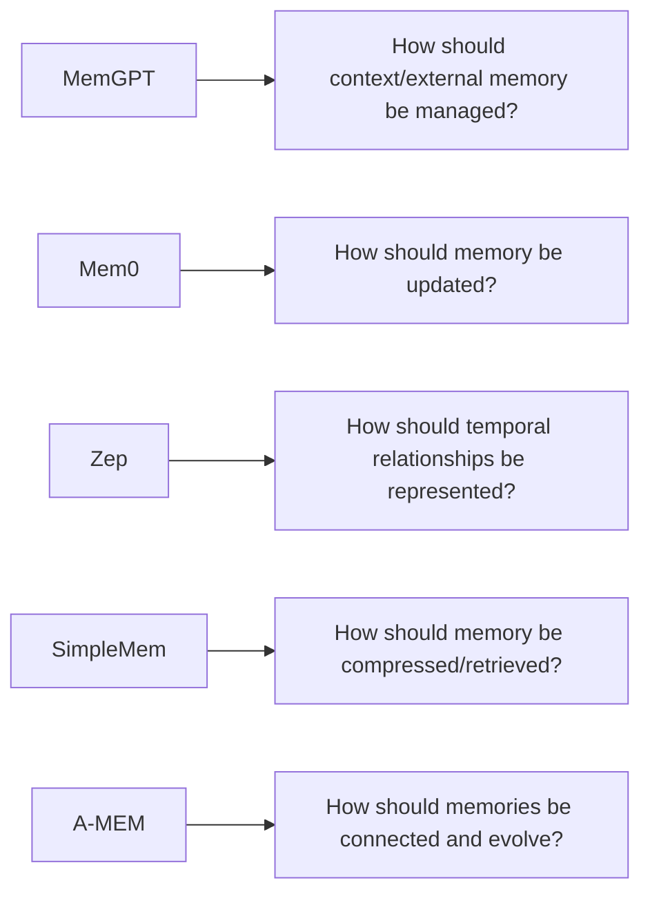

# Part B — Paper 2
## *A-Mem: Agentic Memory for LLM Agents*

**Authors:** Wujiang Xu, Zujie Liang, Kai Mei, Hang Gao, Juntao Tan, Yongfeng Zhang  
**Paper:** arXiv:2502.12110v11 — 8 Oct 2025

> **Read this paper for one main reason:** A-MEM asks how an agent can **organize and evolve memories dynamically**, instead of relying on a fixed memory schema and fixed operations.

---

# 1. Core problem

Traditional memory systems usually require developers to define:

- how memory is stored
- when it is written
- when it is retrieved
- how memories are organized

The paper argues that these fixed structures can limit adaptation when the agent encounters new types of information.

A-MEM instead tries to let the memory structure **emerge from the memories themselves**.


The paper's central idea is inspired by the **Zettelkasten** approach: store atomic notes and connect related notes into a network. fileciteturn41file0L14-L32 fileciteturn41file0L78-L99

---

# 2. A-MEM architecture

A-MEM has four important operations:

```text
1. Note Construction
2. Link Generation
3. Memory Evolution
4. Memory Retrieval
```

The paper's **Figure 2 on page 3** shows the complete architecture: a new interaction becomes a note; relevant historical notes are retrieved to generate links; related memories can then evolve; retrieval later returns related notes and their linked memories. fileciteturn41file0L184-L192



---

# 3. Note Construction — what is stored?

Each memory is an **atomic, self-contained note**.

The paper represents a note with:

```text
content
timestamp
keywords
tags
contextual description
linked memories
embedding
```

The contextual description, keywords, and tags are generated by an LLM.

The embedding is calculated from the textual parts of the note and is used for similarity matching.

### Why this matters

A-MEM does not keep only the original sentence.

It adds several representations so the same memory can be:

- searched semantically
- categorized
- connected to related memories
- interpreted with more context

The paper explicitly says each note should capture **one self-contained unit of knowledge**. fileciteturn41file0L222-L261

---

# 4. Link Generation — the key idea

When a new note arrives:

```text
New note
   ↓
Embedding similarity search
   ↓
Top-k nearby memories
   ↓
LLM checks for meaningful relationships
   ↓
Links created
```

The first step is **not** an exhaustive comparison against every memory.

A-MEM first retrieves the top-k semantically similar memories.

Then the LLM decides which connections are meaningful based on shared attributes and contextual relationships.

This allows the system to capture relationships that may not be obvious from similarity alone.

fileciteturn41file0L262-L288

---

# 5. Memory Evolution

After links are generated, A-MEM may modify the nearby historical memories.

The LLM decides whether to update:

- context
- keywords
- tags

The updated memory **replaces the previous version** in the memory set.



The authors describe this as continuous memory evolution: as more experiences arrive, existing memories can acquire richer descriptions and connections.

fileciteturn41file0L289-L311

---

# 6. Memory Retrieval

For a new query:

```text
Query
 ↓
Query embedding
 ↓
Cosine similarity with memory notes
 ↓
Top-k memories
 ↓
Context for the agent
```

There is an additional feature:

> If a retrieved memory belongs to a linked group/"box", the system also accesses similar memories linked within that group.

So retrieval is not only:

**nearest note**

but can become:

**nearest note → related linked memories**

This is intended to help connect information distributed across multiple memories.

fileciteturn41file0L312-L329

---

# 7. Why the links matter

A-MEM's main difference from a flat memory collection is:

```text
Flat memory:

M1   M2   M3   M4   M5


A-MEM:

M1 ─── M3 ─── M5
 │      │
 M2 ─── M4
```

The links represent relationships discovered between memories.

This is intended to improve tasks where the answer requires combining multiple pieces of historical information.

The paper's ablation study supports this direction: removing **Link Generation + Memory Evolution** produces a large performance drop, while removing only Memory Evolution still leaves Link Generation providing a substantial benefit. fileciteturn41file0L440-L480

---

# 8. Results — only the important findings

The main evaluation uses **LoCoMo** and compares A-MEM with LoCoMo, ReadAgent, MemoryBank, and MemGPT.

A-MEM is tested with six foundation models.

The paper reports strong performance especially for **multi-hop and temporal** questions.

For example, with GPT-4o-mini:

```text
Multi-hop F1     = 27.02
Temporal F1      = 45.85
Single-hop F1    = 44.65
Adversarial F1   = 50.03
```

For the same model, the paper reports an average generated answer length of about **2.5k tokens** for A-MEM versus about **17k tokens** for the MemGPT baseline.

The authors attribute the gain partly to structured memory organization and selective retrieval. fileciteturn41file0L355-L405

---

# 9. Ablation — remember this

The paper compares:

```text
Base
+ Link Generation
+ Memory Evolution
+ Both
```

With GPT-4o-mini:

```text
Without both modules
→ Multi-hop F1: 9.65

Without Memory Evolution
→ Multi-hop F1: 21.35

Full A-MEM
→ Multi-hop F1: 27.02
```

So according to the paper:

**Link Generation is a major foundation**, while **Memory Evolution provides additional refinement**. fileciteturn41file0L440-L480

---

# 10. Retrieval `k` — more is not always better

The paper tests:

`k = 10, 20, 30, 40, 50`

The general pattern is:

```text
Increase k
   ↓
Performance improves initially
   ↓
Gains plateau
   ↓
Can slightly decrease
```

The authors interpret this as a trade-off:

**more historical context ↔ more noise / harder processing**

So A-MEM also reinforces a point seen in other papers:

> **Retrieving more memories does not automatically mean better reasoning.** fileciteturn41file0L481-L488

---

# 11. What A-MEM adds to our project

This paper gives us a specific answer to one architecture question:

> **Should memories be isolated records or explicitly connected?**

A-MEM argues for **connected memory**.

The useful design ideas are:

### Atomic memory units
Each memory should represent one self-contained piece of knowledge.

### Semantic links
Related memories can be connected dynamically rather than through a completely fixed schema.

### Memory evolution
New experiences can change the descriptions/attributes of existing memories.

### Retrieval through relationships
Retrieval can start from a relevant memory and expand through its links.

---

# 12. But do not copy A-MEM blindly

The paper has limitations.

The authors state that memory organization quality is influenced by the underlying LLM, because different models can generate different descriptions and links.

The current implementation also focuses on **text-only** interactions.

fileciteturn41file0L668-L688

More importantly for our architecture research:

> A-MEM does not establish that a dynamically linked memory network is universally better than a flat or hybrid representation.

Its evidence is based on its evaluated conversational benchmarks.

---

# 13. Connection to our previous papers



A-MEM therefore adds **dynamic organization and linking** to our architecture research.

---

# 14. 7 things to remember

1. **A-MEM uses atomic memory notes instead of a purely flat memory collection.**
2. **Each note has content + metadata + contextual description + embedding + links.**
3. **New notes retrieve similar old notes before creating links.**
4. **The LLM decides which meaningful relationships should become links.**
5. **Related historical memories can evolve when new memories arrive.**
6. **Retrieval can expand from a matched note to linked memories.**
7. **The paper shows strong reported gains on multi-hop/temporal tasks, but does not prove this structure is universally optimal.**

---

# PPT — 5 slides

## Slide 1 — Problem
**Fixed memory structures limit adaptation**

## Slide 2 — A-MEM architecture
**Note → Link → Evolve → Retrieve**

## Slide 3 — Memory note
Show:

**Content + Context + Keywords + Tags + Embedding + Links**

## Slide 4 — Dynamic linking
**New memory → similar memories → LLM creates meaningful links**

## Slide 5 — Findings
**Better organization + multi-hop/temporal performance + retrieval trade-off**

---

# Read these sections

**Must read:** §1 Introduction, §3.1 Note Construction, §3.2 Link Generation, §3.3 Memory Evolution, §3.4 Retrieve Relative Memory, §4.4 Ablation.

**Skim:** §4.1 Dataset/Evaluation, §4.5 Hyperparameter Analysis.

**Skip initially:** Most of Related Work, detailed model-by-model tables, and appendix prompts.
