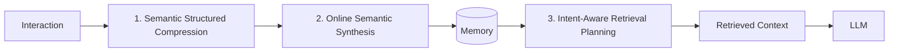
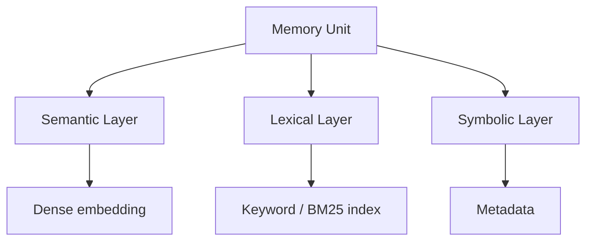
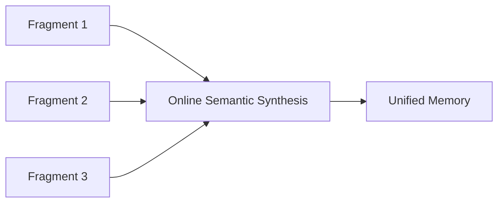
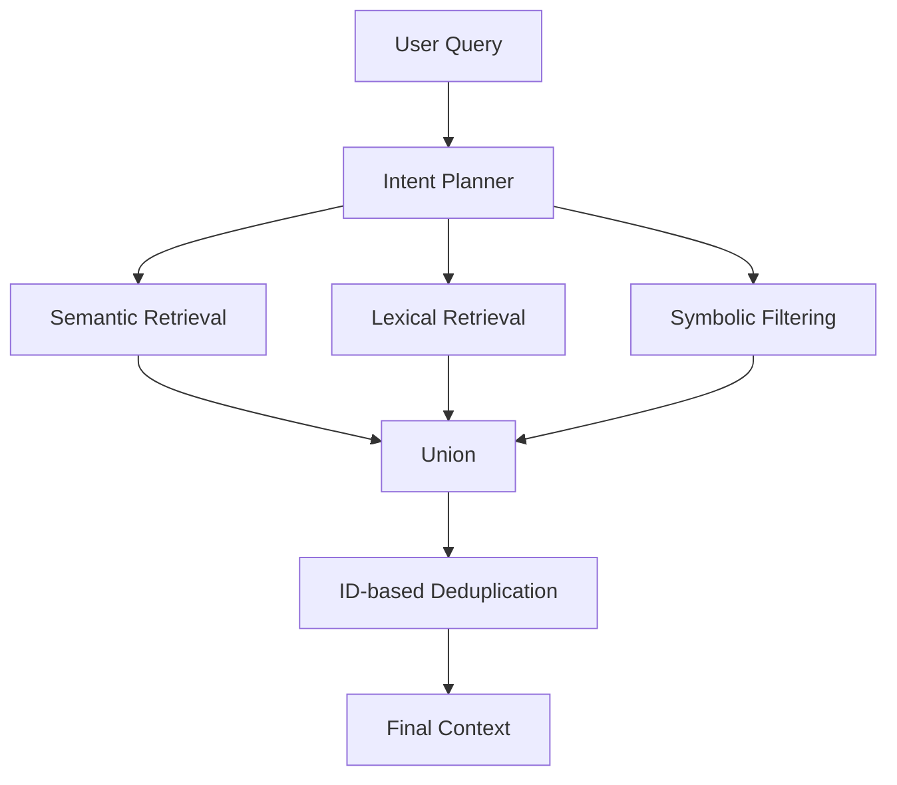

# Paper 4 — Concise Study Guide
## *SimpleMem: Efficient Lifelong Memory for LLM Agents*

**Authors:** Jiaqi Liu, Yaofeng Su, Peng Xia, Siwei Han, Zeyu Zheng, Cihang Xie, Mingyu Ding, Huaxiu Yao  
**Paper version:** arXiv:2601.02553v3 — 29 Jan 2026  
**Type:** Preprint

> **Scope:** This guide includes only the paper content that is directly useful for understanding and designing a persistent memory system. The explanations are simplified from the paper; no outside concepts are added.

---

# 1. Why did the authors build SimpleMem?

The paper identifies two problems with existing long-term memory approaches:

### Problem 1 — Store too much

Some systems retain large parts of the interaction history.

That creates:

- redundant information
- lower information density
- larger retrieval/inference cost
- more irrelevant context

### Problem 2 — Filter repeatedly

Other systems use repeated reasoning/filtering to remove noise.

That can improve relevance, but the paper says it increases:

- token usage
- latency
- computation

So the authors want a memory system that is both:

**information-dense + retrieval-efficient**

The proposed system is **SimpleMem**.

**Paper:** pp. 1–2

---

# 2. The whole SimpleMem architecture

SimpleMem has **three stages**:



### In simple words

**Stage 1:** Remove low-value information and turn useful dialogue into compact memory units.

**Stage 2:** Combine related memory units while writing them so the memory does not become fragmented.

**Stage 3:** Understand the query and dynamically decide what and how much to retrieve.

This three-stage pipeline is the core contribution of the paper.

**Paper:** pp. 1–4

---

# 3. Stage 1 — Semantic Structured Compression

This stage starts with incoming dialogue.

## Step 1: Split dialogue into sliding windows

The incoming interaction is divided into **overlapping windows**.

In the paper's implementation:

`window size W = 20`

Each window contains a short contiguous part of recent interaction.

---

## Step 2: Semantic density gating

The model evaluates whether a window contains useful information.

The important idea is:

> A window does not have to produce a memory.

If the model considers a window low-value, it can produce an **empty set**, which means the content is discarded.

Example from the paper's idea:

```text
"Hey!"
"Wow, cool!"
"That's great!"
"Gotta run!"
      ↓
Low information density
      ↓
Discard
```

The authors use the LLM itself as the semantic judge rather than a separate binary classifier.

**Paper:** p. 2

---

# 4. Turning useful dialogue into memory units

For a useful window, SimpleMem performs one unified transformation.

It does three important things together:


### Reference resolution

Ambiguous references are converted into explicit entities.

Example from the paper's case study:

```text
"my kids"
      ↓
"Sarah's kids"
```

### Temporal normalization

Relative expressions are converted into absolute timestamps.

Examples shown in the paper:

```text
"yesterday"   → absolute date
"last week"   → absolute date
"next month"  → absolute month
```

### Self-contained facts

Complex dialogue is converted into memory units that can be understood independently.

The paper's objective is to avoid storing fragments whose meaning depends heavily on the original conversation.

**Paper:** pp. 2–3

---

# 5. Why this normalization matters

Without normalization, the memory may contain statements such as:

```text
"Yesterday I painted..."
"Last week we went camping..."
```

Those phrases only make sense relative to the original conversation time.

SimpleMem stores the normalized time instead.

This is particularly important for **long-term temporal retrieval**.

The paper's ablation later shows a large drop in temporal performance when this semantic compression stage is removed.

**Paper:** pp. 3, 7–8

---

# 6. Multi-view indexing

After memory units are created, SimpleMem gives each memory unit **three complementary representations**.



## Semantic layer

Uses dense embeddings.

Purpose:

**meaning-based / fuzzy matching**

The paper gives the example:

```text
Query: "hot drink"
Memory: "latte"
```

Semantic retrieval can connect them even when the exact words differ.

---

## Lexical layer

Uses a sparse inverted index.

Purpose:

**exact keyword matching**

The paper specifically notes its usefulness for:

- exact terms
- rare proper nouns

---

## Symbolic layer

Stores structured metadata.

Examples mentioned:

- timestamps
- entity types

Purpose:

**deterministic filtering**

So the memory can be searched by meaning, exact terms, or structured constraints.

**Paper:** p. 3

---

# 7. Stage 2 — Online Semantic Synthesis

A problem remains:

Even useful memory units can be **fragmented**.

Suppose the system has:

```text
User wants coffee
User prefers oat milk
User likes it hot
```

SimpleMem combines these during the write process:

```text
User prefers hot coffee with oat milk.
```

The paper calls this **Online Semantic Synthesis**.

### Important point

This happens **during writing**, before the memory is committed to the database.

It is therefore an **intra-session consolidation mechanism**.



### Why?

According to the paper, otherwise related facts accumulate as separate entries and the retriever must reconstruct their meaning later.

The authors therefore try to create a compact, higher-density representation **before retrieval is needed**.

**Paper:** pp. 3–4

---

# 8. Stage 3 — Intent-Aware Retrieval Planning

A fixed `top-k` retrieval is not always appropriate.

A simple query may need only a few memories.

A complex query may need more.

SimpleMem therefore adds a planning step.

```text
User query + history
          ↓
Intent Planner
          ↓
What does the query need?
How deep should retrieval go?
          ↓
Search plan
```

The planner generates:

- a semantic query
- a lexical query
- a symbolic query
- an estimated retrieval depth `d`

The retrieval depth is then used to determine the candidate limit `n`.

The paper expresses this relationship as:

`n ∝ d`

So:

**more complex query → deeper retrieval**

**simpler query → smaller retrieval**

**Paper:** pp. 3–4

---

# 9. Parallel multi-view retrieval

Once the plan is created, SimpleMem queries the three indexes in parallel.



### Semantic retrieval

Finds top candidates using embedding similarity.

### Lexical retrieval

Finds top candidates using BM25.

### Symbolic retrieval

Keeps candidates satisfying metadata constraints.

### Union

The results are combined.

The paper says this naturally removes duplicates because the same memory unit can appear in more than one result set and is represented by the same ID.

**Paper:** p. 4

---

# 10. Why this retrieval design is useful

The three retrieval views solve different problems.

| View | Main purpose |
|---|---|
| **Semantic** | Find similar meaning |
| **Lexical** | Find exact words/entities |
| **Symbolic** | Apply structured constraints |

The paper's approach is therefore not:

```text
Query → one vector search
```

It is:

```text
Query
 ↓
Understand intent
 ↓
Create multiple retrieval signals
 ↓
Search multiple views
 ↓
Combine results
```

The paper specifically uses **adaptive retrieval depth** rather than retrieving the same amount for every query.

**Paper:** pp. 3–4

---

# 11. The case study — understand this example

The paper gives a long-term conversation example of about:

**24,000 raw tokens → about 800 tokens of stored memory**

The system:

1. removes low-information dialogue
2. resolves references
3. normalizes time
4. organizes memory units
5. retrieves only relevant entries

For the query:

> “What paintings has Sarah created?”

the planner identifies:

- relevant semantic information
- relevant temporal constraints

and combines retrieval signals to return the relevant painting memories.

The case study's final answer uses memories such as:

```text
Sarah and her kids painted a sunset with palm trees.
Sarah finished painting a horse portrait.
```

The paper describes this as a **30× token reduction** in that example.

**Paper:** pp. 7–8

---

# 12. Evaluation setup

SimpleMem is evaluated on:

### LoCoMo

The paper describes conversations with:

- 200–400 turns
- interleaved topics
- temporal shifts
- 1,986 evaluation questions

Reasoning categories:

- multi-hop
- temporal
- open-domain
- single-hop

### LongMemEval-S

Designed for very long interaction histories and includes categories such as:

- temporal
- multi-session
- knowledge-update
- user
- assistant
- preference

The authors evaluate SimpleMem with multiple LLM backbones, including large and smaller models.

**Paper:** pp. 4–6

---

# 13. What the results show

For the paper's **GPT-4.1-mini LoCoMo experiment**:

| Method | Average F1 | Token Cost |
|---|---:|---:|
| Mem0 | 34.20 | 973 |
| SimpleMem | **43.24** | **531** |

SimpleMem also reports:

**Temporal F1: 58.62**

for GPT-4.1-mini in this experiment.

For **LongMemEval-S with gpt-4.1-mini**:

| Method | Average accuracy |
|---|---:|
| Full-context | 39.57% |
| Mem0 | 59.81% |
| LightMem | 68.67% |
| SimpleMem | **76.87%** |

For **gpt-4.1**:

| Method | Average accuracy |
|---|---:|
| Full-context | 56.72% |
| Mem0 | 58.51% |
| LightMem | 76.86% |
| SimpleMem | **83.97%** |

These are the paper's reported results for its evaluated setups.

**Paper:** pp. 5–6

---

# 14. The ablation study — very important

The authors remove one component at a time.

## Remove Semantic Structured Compression

Average F1:

`43.24 → 31.29`

Temporal F1:

`58.62 → 25.40`

The paper attributes the temporal degradation to losing normalization such as:

- reference resolution
- temporal normalization

---

## Remove Online Semantic Synthesis

Average F1:

`43.24 → 38.24`

Multi-hop F1:

`43.46 → 29.85`

The paper attributes this to related facts remaining fragmented.

---

## Remove Intent-Aware Retrieval

Average F1:

`43.24 → 37.78`

Open-domain:

`19.76 → 14.50`

Single-hop:

`51.12 → 41.20`

The paper attributes these drops to using fixed retrieval depth rather than adapting retrieval to query needs.

**Paper:** pp. 7–8

---

# 15. What is especially relevant to our project?

This paper adds several ideas to our research map.

## 1. Normalize memory before storing it

Do not rely on the original dialogue wording forever.

Store memory in a form where:

- references are explicit
- temporal expressions are normalized
- facts are self-contained

---

## 2. Memory quality depends on information density

The paper's central design goal is not simply reducing storage size.

It tries to increase:

**useful information per token**

That is why it combines filtering + synthesis + structured indexing.

---

## 3. Use more than one retrieval signal

The paper gives a concrete hybrid design:

**semantic + lexical + symbolic**

This is different from a vector-only memory system.

---

## 4. Retrieval amount should depend on the query

A fixed `top-k` can be:

- too small for complex questions
- too large for simple questions

SimpleMem therefore makes retrieval depth adaptive.

---

## 5. Writing and retrieval are connected

The system improves retrieval partly by improving what gets written into memory.

```text
Better memory representation
        ↓
Better retrieval
        ↓
Less context needed
        ↓
Lower token cost
```

---

# 16. What this paper does NOT establish

Do not treat the paper as proving that:

- semantic compression is universally best
- three indexes are required for every memory system
- symbolic metadata is always necessary
- adaptive retrieval is always better for every task
- SimpleMem generalizes automatically to every domain

Its evidence comes from the experiments and benchmarks reported in this paper.

---

# 17. Paper 4 — 10 things to remember

1. **SimpleMem has three stages:** compression → synthesis → retrieval planning.
2. **Low-value dialogue can be discarded before storage.**
3. **Useful dialogue is converted into self-contained memory units.**
4. **References and relative time are normalized before storage.**
5. **Each memory is indexed semantically, lexically, and symbolically.**
6. **Related memories are synthesized during writing.**
7. **Retrieval depth is adapted to inferred query complexity.**
8. **All three retrieval views are queried in parallel.**
9. **The paper evaluates both accuracy and token/compute efficiency.**
10. **Ablations show that all three stages contribute to the reported performance.**

---

# 18. PPT structure for Paper 4

## Slide 1 — Problem
Long-term memory becomes redundant and expensive.

## Slide 2 — SimpleMem architecture
Show:

**Compression → Synthesis → Retrieval Planning**

## Slide 3 — Semantic Structured Compression
Show:

**Window → Gate → Normalize → Memory Units**

## Slide 4 — Multi-view indexing
Show:

**Semantic + Lexical + Symbolic**

## Slide 5 — Online Semantic Synthesis
Show fragmented facts becoming one unified memory.

## Slide 6 — Intent-aware retrieval
Show:

**Query → Planner → Adaptive depth → Parallel retrieval**

## Slide 7 — Results + ablation
Show the main accuracy/token findings and the effect of removing each stage.

## Slide 8 — Relevance to our project
Focus on:

**memory quality + temporal normalization + hybrid retrieval + adaptive retrieval budget**

---

# Source map

| Topic | Paper pages |
|---|---:|
| Motivation & contribution | 1–2 |
| Semantic Structured Compression | 2–3 |
| Multi-view indexing | 3 |
| Online Semantic Synthesis | 3 |
| Intent-Aware Retrieval Planning | 3–4 |
| Retrieval implementation | 4 |
| Evaluation | 4–6 |
| Main results | 5–6 |
| Efficiency analysis | 6–7 |
| Ablation | 7–8 |
| Case study | 7–8 |
| Related work | 8 |
