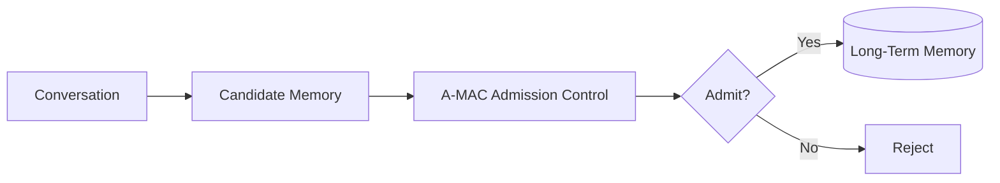
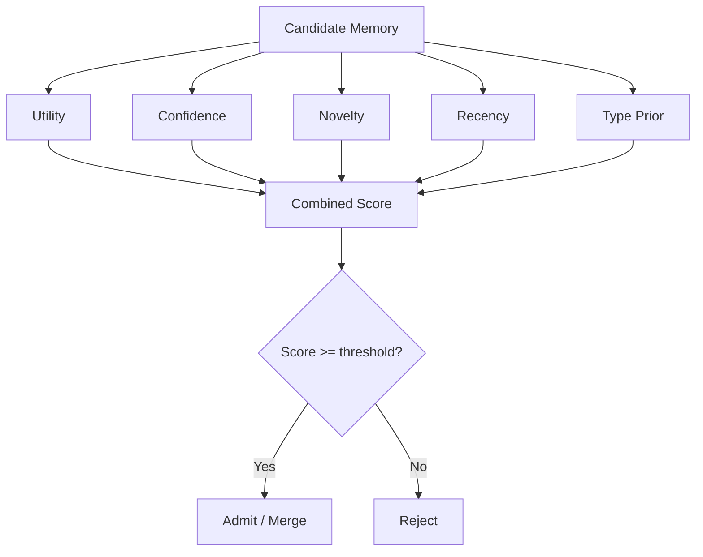
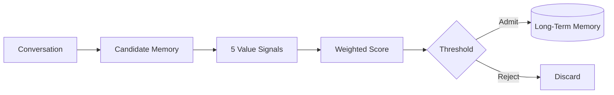

# Paper 4 — Concise Study Guide
## *Adaptive Memory Admission Control for LLM Agents (A-MAC)*

**Authors:** Guilin Zhang, Wei Jiang, Xiejiashan Wang, Aisha Behr, Kai Zhao, Jeffrey Friedman, Xu Chu, Amine Anoun  
**Publication:** ICLR 2026 Workshop MemAgent  
**arXiv:** 2603.04549v1, 4 Mar 2026

> **Scope:** Only the parts directly useful for our persistent-memory project are included. Explanations are simplified from this paper only; no outside concepts are added.

---

# 1. Why this paper matters to our project

The paper focuses on a very specific problem that the previous papers did not address in as much detail:

> **Before storing something in long-term memory, how should the system decide whether it is worth storing?**

The authors call this **memory admission**.

They identify two bad extremes:

```text
Store almost everything
→ large / noisy memory
→ higher retrieval cost
→ obsolete or hallucinated information may persist

Store too little
→ important information is lost
→ future interactions may lack needed context
```

A-MAC treats this as an explicit **decision problem**.

This is highly relevant to our project because it gives us a concrete approach for the **memory gate / admission layer**.

**Paper:** pp. 1–3

---

# 2. Where to focus in the paper

Read these sections:

| Priority | Section | Why |
|---|---|---|
| **Essential** | §3 Methodology | The actual A-MAC design |
| **Essential** | §3.1–3.3 | Admission decision, five signals, scoring and algorithm |
| **Important** | §4.2–4.5 | Results, ablation, threshold and latency |
| **Important** | §4.6 | Cross-domain behavior |
| **Skip initially** | §2 Related Work | Only useful for understanding what A-MAC is trying to improve |
| **Skip** | References | Not needed for understanding this paper |

---

# 3. The central idea: Memory Admission

A-MAC assumes that some upstream process has already extracted **candidate memories** from the conversation.

Then A-MAC decides:



The paper says a candidate can be:

- admitted as a new memory
- used to update/supersede an existing memory
- rejected because it is redundant or unreliable

The important design decision is therefore separated from memory extraction.

**Paper:** §3.1, pp. 3–5

---

# 4. Before scoring: normalize the conversation

A-MAC first performs lightweight normalization.

It:

- splits turns into atomic information units
- resolves temporal expressions
- resolves coreferences
- removes low-value content such as greetings/acknowledgments

The purpose is to make the candidate memory **self-contained and well-formed** before scoring it.

Conceptually:

```text
Raw conversation
      ↓
Atomic facts
      ↓
Resolve references + time
      ↓
Remove obvious low-value content
      ↓
Candidate memory
```

**Paper:** p. 4

---

# 5. The five memory-value signals

This is the core of the paper.

A-MAC gives each candidate five scores, each from **0 to 1**.



## 5.1 Utility — `U`

**Question:** Could this memory be useful in future interactions?

The paper uses **one LLM call** to assess utility.

The LLM rates whether the candidate:

- is actionable
- could support likely follow-up questions
- captures persistent user constraints/preferences

---

## 5.2 Confidence — `C`

**Question:** Is there evidence in the conversation supporting this memory?

A-MAC looks for supporting spans from previous turns.

It uses **ROUGE-L** between the candidate and its supporting text.

The paper's purpose is to reduce the chance that unsupported information enters long-term memory.

---

## 5.3 Novelty — `N`

**Question:** Is this information already represented in memory?

The paper computes semantic similarity between the candidate and existing memories.

The formula is:

`N(m) = 1 − max cosine similarity(m, existing memory)`

So:

```text
Very similar to existing memory
→ low novelty

Very different
→ high novelty
```

---

## 5.4 Recency — `R`

**Question:** How recently was the information mentioned?

The paper uses exponential decay:

`R(m) = exp(−λ · τ(m))`

where `τ(m)` is elapsed time.

For its experiments:

`λ = 0.01 per hour`

The paper reports this as a half-life of approximately **69 hours**.

---

## 5.5 Type Prior — `T`

**Question:** Does this type of information normally deserve long-term storage?

The paper uses rule-based pattern matching.

It gives higher prior values to stable information such as:

- preferences
- identity statements

and lower values to transient states.

This factor turned out to be the most influential feature in the paper's ablation.

**Paper:** pp. 4–5, 7

---

# 6. Combining the five signals

A-MAC combines the five scores using a weighted linear equation:

`S(m) = w1U + w2C + w3N + w4R + w5T`

The weights:

- are non-negative
- sum to 1

Then:

```text
IF S(m) >= θ
    → candidate is admitted
ELSE
    → candidate is rejected
```

The weight vector and threshold are **learned from data** rather than manually fixed.

The authors optimize them using **5-fold cross-validation** and F1 score.

**Paper:** §3.1 and §3.3, pp. 4–5

---

# 7. What happens when a candidate conflicts with existing memory?

The algorithm does more than simply admit/reject.

After a candidate passes the threshold:

```text
Find conflicting memory
        ↓
Conflict exists?
   ┌────┴────┐
  No        Yes
   ↓          ↓
 ADD      Compare scores
             ↓
       Keep higher-scoring
       representation
             ↓
          Merge
```

The paper defines a conflict when semantic similarity is above **0.85** but the content differs.

If the new candidate has the higher score, A-MAC removes the conflicting old memory and inserts a merged representation.

**Paper:** p. 5

---

# 8. Why this is different from Mem0

The paper positions the difference mainly at the **admission-control stage**.

### Mem0-style idea

```text
Extract memory
   ↓
Find similar memories
   ↓
LLM decides ADD / UPDATE / DELETE / NOOP
```

### A-MAC idea

```text
Extract candidate
   ↓
Score:
Utility
Confidence
Novelty
Recency
Type Prior
   ↓
Learned threshold
   ↓
Admit / reject
   ↓
Conflict handling
```

A-MAC deliberately uses the LLM only where semantic judgment is difficult, while the other signals are computed with lightweight rules/metrics.

The paper's claim is that this improves **interpretability and efficiency** relative to fully LLM-driven admission policies.

**Paper:** pp. 1–5

---

# 9. Main experimental result

The paper evaluates on **LoCoMo**.

Test set:

**225 examples**

A-MAC results:

- **Precision:** 0.417
- **Recall:** 0.972
- **F1:** 0.583
- **Latency:** 2644 ms

For comparison in the paper:

- A-mem: F1 0.541
- MemoryBank: F1 0.452
- MemGPT: F1 0.324

The authors emphasize that A-MAC keeps high recall while improving precision, reducing the number of unnecessary memories being admitted.

**Paper:** pp. 6–7

---

# 10. The ablation result you should remember

The authors remove each feature and measure the F1 drop.

| Removed feature | F1 without it |
|---|---:|
| None | **0.583** |
| Type Prior | 0.476 |
| Novelty | 0.555 |
| Utility | 0.560 |
| Confidence | 0.568 |
| Recency | 0.570 |

The biggest drop comes from removing **Type Prior**.

The authors interpret this as evidence that distinguishing persistent content (such as preferences/identity) from transient content is particularly useful for admission.

**Paper:** p. 7

---

# 11. Threshold matters

The threshold `θ` controls the precision–recall trade-off.

The paper reports:

```text
Lower threshold
→ admit more memories
→ higher recall
→ lower precision

Higher threshold
→ admit fewer memories
→ higher precision
→ lower recall
```

In their validation analysis, the best threshold was:

`θ = 0.55`

The paper also reports that the F1 curve is relatively flat between **0.50 and 0.60**, suggesting some robustness to the exact threshold in this experiment.

**Paper:** pp. 7–8

---

# 12. Where does the computation time go?

This is an important engineering result.

| Component | Latency |
|---|---:|
| Utility — LLM | 2580 ms |
| Confidence | 18 ms |
| Novelty | 32 ms |
| Recency | <1 ms |
| Type Prior | 14 ms |
| **Total** | **2644 ms** |

So almost all admission latency comes from the **single LLM utility call**.

The paper uses this to justify its hybrid design:

```text
Expensive semantic judgment
        ↓
        LLM

Simple deterministic signals
        ↓
 Rules / metrics
```

**Paper:** p. 8

---

# 13. Cross-domain result

The paper tests personal and professional conversations without retuning the learned weights.

Reported F1:

- Personal: **0.482**
- Professional: **0.338**

The authors note that performance is higher for personal conversations, which they associate with explicit preference statements being easier for the Type Prior feature to recognize.

This also shows that the same policy does not perform identically across domains.

**Paper:** pp. 8–9

---

# 14. What this paper gives our project

This paper gives us one major architectural component:

## A dedicated Memory Admission / Memory Gate

Instead of:

```text
Conversation → Memory DB
```

we should consider:

```text
Conversation
   ↓
Candidate extraction
   ↓
Admission / Memory Gate
   ↓
Persistent memory
```

The paper gives us **five concrete dimensions** that can be investigated for this gate:

**Utility + Confidence + Novelty + Recency + Type**

This does **not** mean our final project must use these exact five features. It gives us a research-backed design candidate to compare with later papers.

---

# 15. What this paper does NOT prove

Do not conclude from this paper that:

- these five features are universally optimal
- a linear weighted score is the best possible admission mechanism
- Type Prior will always be the most important feature
- the `0.55` threshold should be used in our system
- A-MAC automatically generalizes to every memory domain

The reported results are from the paper's LoCoMo experiments and its specific setup.

---

# 16. Paper 4 — 8 things to remember

1. **Memory admission should be treated as a separate decision problem.**
2. **A-MAC scores candidate memories using five signals.**
3. **Confidence is used to reduce unsupported/hallucinated memories.**
4. **Novelty prevents redundant memory storage.**
5. **Recency models temporal decay.**
6. **Type Prior distinguishes persistent information from transient information.**
7. **The final admission decision uses learned weights + a threshold.**
8. **This creates an explicit memory gate between extraction and persistent storage.**

---

# 17. PPT structure

## Slide 1 — Problem
Why should every extracted fact be stored?

## Slide 2 — A-MAC architecture



## Slide 3 — Five signals

**Utility | Confidence | Novelty | Recency | Type Prior**

## Slide 4 — Admission algorithm

**Score → Conflict check → Merge / Add / Reject**

## Slide 5 — Results

F1 + precision/recall + latency.

## Slide 6 — Relevance to our project

**Memory Gate / Admission Control**

---

# Source map

| Topic | Paper pages |
|---|---:|
| Motivation | 1–3 |
| Admission formulation | 3–4 |
| Five signals | 4–5 |
| Algorithm | 5 |
| Main results | 6 |
| Ablation | 7 |
| Threshold | 7–8 |
| Latency | 8 |
| Cross-domain | 8–9 |
| Conclusion | 9 |
