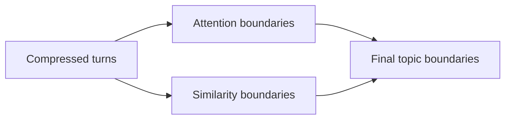
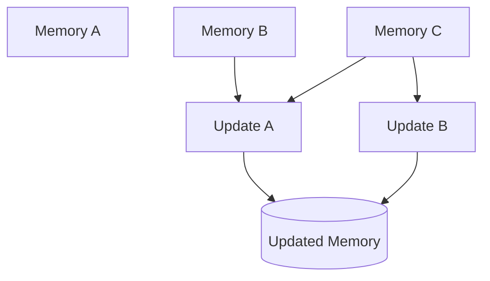

# Part B — Paper 3
## *LightMem: Lightweight and Efficient Memory-Augmented Generation*

**Authors:** Jizhan Fang et al.  
**Venue:** ICLR 2026  
**Paper:** arXiv:2510.18866v4 — 28 Feb 2026

> **Read this paper for one main reason:** LightMem focuses on making long-term memory **cheaper and faster** by filtering information early, grouping it by topic, and moving expensive memory maintenance to offline “sleep time.”

---

# 1. The problem

The paper identifies three efficiency problems in existing memory systems:

```text
1. Raw dialogue contains lots of redundant information.
2. Processing each turn separately can mix topics or lose details.
3. Updating long-term memory during inference adds latency.
```

LightMem tries to address all three.

Its architecture has **three modules**:


The paper's Figure 2 on page 4 shows this complete pipeline. fileciteturn43file0L142-L142

---

# 2. Light1 — Sensory Memory

The first goal is to remove **redundant tokens before expensive memory processing**.

## Pre-compression

LightMem uses **LLMLingua-2** to decide which input tokens to retain.

```text
Raw dialogue
    ↓
Token retention model
    ↓
Keep informative tokens
    ↓
Compressed dialogue
```

The paper describes this as token-level filtering.

It also discusses an alternative entropy-based filtering mechanism: tokens that are less predictable in context may contain more distinctive information and therefore be retained.

### Project relevance

This is the paper's first important idea:

> **Do not send all raw interaction data through the expensive memory-construction pipeline.**

**Paper:** §3.1, pp. 3–4. fileciteturn43file0L130-L163

---

# 3. Topic Segmentation

After compression, LightMem groups information into **topic-based segments**.

It does not use only a fixed window.

Instead, it combines:

- attention-based boundaries
- semantic similarity boundaries

The final boundary is based on their intersection.



This is meant to avoid mixing unrelated topics while keeping related turns together.

The paper evaluates the segmentation and reports accuracy above **80%** across the tested compression ratios.

Removing topic segmentation reduced QA accuracy by:

- **6.3% for GPT**
- **5.4% for Qwen**

The paper also reports that larger STM thresholds improve efficiency, but the best accuracy threshold depends on the model and compression ratio.

**Paper:** §3.1 + §5.3–5.5, pp. 3–4, 9. fileciteturn43file0L164-L178 fileciteturn43file0L501-L520

---

# 4. Light2 — Topic-aware Short-Term Memory

Each topic segment is stored temporarily in an **STM buffer**.

When the buffer reaches its threshold:

```text
STM buffer full
      ↓
Summarize each topic structure
      ↓
Create long-term memory entry
```

Each stored LTM entry contains:

```text
topic
summary
user turns
model turns
embedding
```

The important design choice is **topic-constrained summarization**.

The paper argues that processing many unrelated sessions together can mix topics and produce inaccurate memory entries.

**Paper:** §3.2, p. 5. fileciteturn43file0L186-L200

---

# 5. Light3 — Long-Term Memory + Sleep-Time Update

This is the most important architectural idea in LightMem.

At **test time**, new memory entries are inserted directly into long-term memory.

The system does **not** perform the expensive update immediately.

It calls this a **soft update**.

```text
Interaction
   ↓
Create memory entry
   ↓
Insert immediately
   ↓
Continue inference

        later...

Sleep time
   ↓
Find related entries
   ↓
Resolve updates
   ↓
Run updates in parallel
```

The expensive consolidation/update process is therefore moved away from the online inference path.

**Paper:** §3.3, pp. 5–6. fileciteturn43file0L201-L228

---

# 6. How sleep-time updating works

For each memory entry `ei`, LightMem creates an update queue containing similar **later** entries.

The paper applies a timestamp condition:

```text
candidate timestamp ≥ current entry timestamp
```

So a later memory can be considered as a potential updater of an earlier memory.

The update queues are independent, allowing multiple update operations to execute **in parallel**.



### Why this matters

The paper's goal is to avoid:

```text
Online update 1
→ wait
→ Online update 2
→ wait
→ Online update 3
```

and instead do maintenance separately and in parallel.

**Paper:** §3.3, pp. 5–6. fileciteturn43file0L205-L228

---

# 7. Why “soft update” is useful

The paper gives an example where two related pieces of information are **not actually contradictory**.

A hard update may overwrite the older memory incorrectly.

Example:

```text
History 1:
User plans a Tokyo trip.

History 2:
User asks about trains to Kyoto.
```

A hard update could incorrectly replace the Tokyo information with Kyoto.

LightMem instead keeps both pieces during online inference:

```text
Tokyo trip + Kyoto train inquiry
```

The expensive reasoning about how memories should be reorganized happens later during sleep-time update.

The paper uses this example to argue that delaying complex update decisions can preserve information.

**Paper:** §5.6, p. 10. fileciteturn43file0L521-L540

---

# 8. Efficiency model

The paper compares LightMem with conventional systems.

Its key mechanism is:

```text
Compression
   +
Buffering
   +
Fewer summarization calls
   +
Selective updates
   +
Parallel offline updates
```

The paper gives a complexity formulation showing that the number of summarization calls is reduced relative to systems that summarize every turn independently.

For our project, the important lesson is not the full equation.

It is:

> **Move expensive work out of the latency-sensitive path whenever correctness allows it.**

**Paper:** §4, pp. 5–6. fileciteturn43file0L243-L269

---

# 9. Main results — only remember the big picture

On **LongMemEval-S** and **LoCoMo**, the paper reports that LightMem generally improves accuracy while using fewer tokens, fewer API calls, and less runtime than the compared memory baselines.

For example, on LoCoMo with GPT-4o-mini:

```text
LightMem (0.7, 512) = 71.95% ACC
A-MEM                = 64.16%
Mem0                  = 61.69%
Naive RAG             = 63.64%
```

The corresponding total memory-construction tokens reported by the paper are:

```text
LightMem = 99.76k
A-MEM     = 1149.43k
Mem0      = 1693.39k
```

The exact result depends on the model and LightMem configuration.

**Paper:** Tables 2–3, pp. 7–8. fileciteturn43file0L310-L355 fileciteturn43file0L361-L390

---

# 10. What the paper says about compression

The paper tests different compression ratios.

Its important observation:

```text
More compression
→ fewer tokens / greater efficiency

Too much compression
→ can remove useful information
```

The best compression setting depends on the STM threshold and model.

The paper reports that compression ratios of **50%–80%** can produce performance comparable to uncompressed input in its pre-compression experiment.

So:

> **Compression is a trade-off, not a free improvement.**

**Paper:** §5.3, pp. 8–9. fileciteturn43file0L394-L407

---

# 11. What LightMem adds to our architecture research


The useful architecture ideas are:

**Early filtering**  
Reduce useless data before expensive processing.

**Topic-aware grouping**  
Avoid mixing unrelated conversations during memory creation.

**Soft online update**  
Keep inference fast by avoiding complex real-time consolidation.

**Offline consolidation**  
Perform expensive memory maintenance later and in parallel.

---

# 12. Connection to the papers we already read

```text
MemGPT
→ manage limited context

A-MEM
→ organize memories through links

LightMem
→ make memory processing cheaper
   by filtering, buffering, and delaying updates
```

LightMem therefore adds an important **efficiency layer** to our research.

It is less focused on conflict correctness than papers such as TRUSTMEM, StateMem, and MemConflict.

---

# 13. Do not conclude that LightMem is universally best

The paper's experiments show strong results in its evaluated settings, but they do not prove that:

- sleep-time updates are always appropriate
- compression is always beneficial
- topic segmentation is required for every memory system
- offline updates can replace all online conflict handling
- the exact `r` and `th` settings should be copied into our project

The paper itself shows that the best configuration depends on the model and threshold.

---

# 14. 6 things to remember

1. **Filter redundant information before expensive memory processing.**
2. **Group dialogue by semantic topic instead of relying only on fixed boundaries.**
3. **Use a short-term buffer before constructing long-term memory.**
4. **Insert new memory quickly and defer expensive consolidation to sleep time.**
5. **Run independent offline memory updates in parallel.**
6. **Compression improves efficiency but can trade off against information preservation.**

---

# PPT — 5 slides

## Slide 1 — Problem
**Existing memory systems are expensive and slow.**

## Slide 2 — LightMem architecture
**Sensory → STM → LTM → Sleep Update**

## Slide 3 — Three key mechanisms
**Compression | Topic segmentation | Sleep-time update**

## Slide 4 — Results
**Accuracy + token usage + API calls + runtime**

## Slide 5 — Relevance
**Reduce online memory cost by moving expensive processing offline.**

---

# Read these sections

**Must read:** §1 Introduction, §3.1 Sensory Memory, §3.2 Topic-aware STM, §3.3 Sleep-time Update, §5.2 Main Results, §5.6 Sleep-time Update.

**Skim:** §4 Complexity Analysis, §5.3–5.5 parameter/segmentation analysis.

**Skip initially:** Most Related Work and appendix implementation details.
