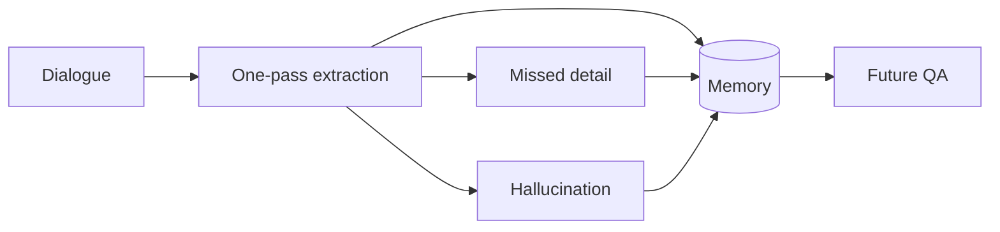
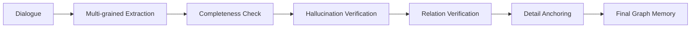
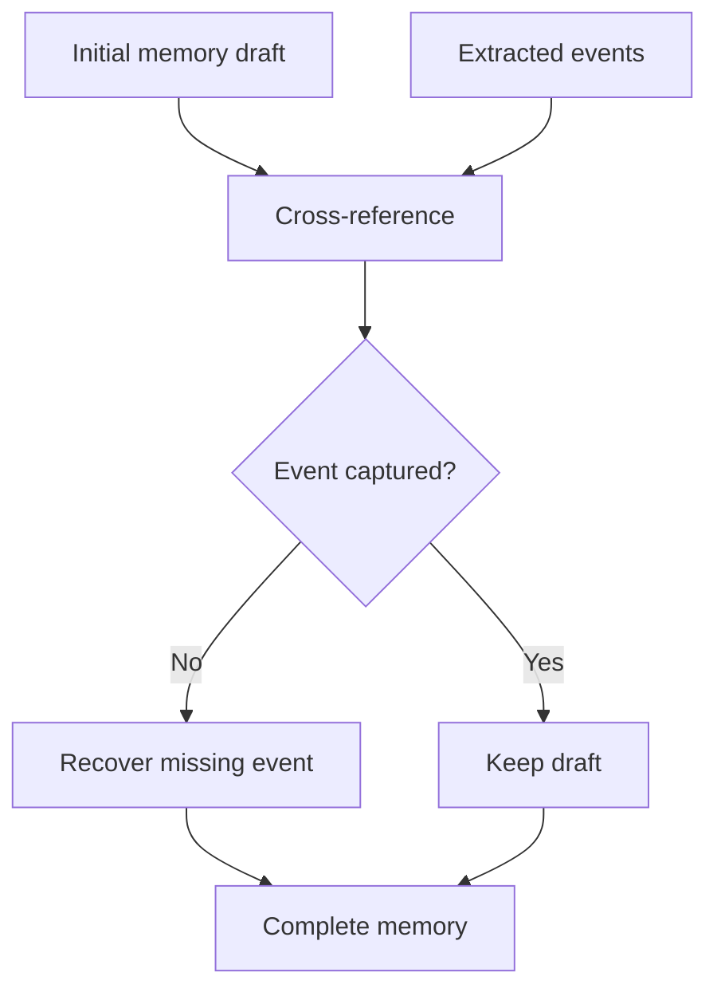
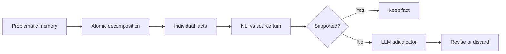
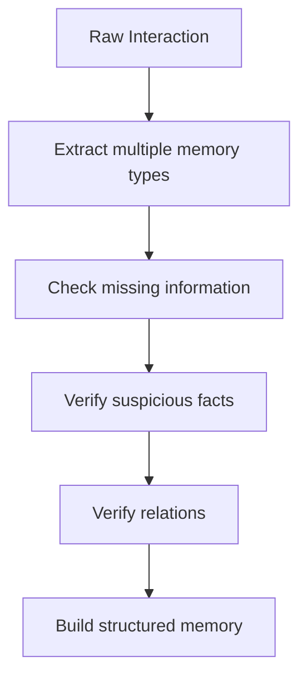

# Part B — Paper 4
## *Beyond Static Summarization: Proactive Memory Extraction for LLM Agents*

**Authors:** Chengyuan Yang, Zequn Sun, Wei Wei, Wei Hu  
**Paper:** arXiv:2601.04463v2 — 1 Sep 2026

> **Read this paper for one main reason:** ProMem focuses on improving the **memory extraction/write stage** itself. Its claim is that one-pass summarization can lose important details and retain hallucinated facts.

---

# 1. The problem

The paper identifies two weaknesses in common memory extraction:

### 1. Ahead-of-time extraction

The system creates memory **before it knows what future questions will be asked**.

A single summary may mix:

- details
- events
- relations

and lose small but important information.

### 2. One-off extraction

Memory is created once and not checked again.

If the first extraction:

- misses information, or
- contains a hallucination,

the error can remain in long-term memory.



The paper's Figure 3 reports that one-off extraction reduced memory from **157K to 12.79K tokens**, but QA accuracy fell from **74.13% to 50.66%**. fileciteturn44file0L193-L246

---

# 2. ProMem: the core architecture

ProMem turns extraction into a **multi-grained, iterative process**.



The four main stages are:

1. **Multi-grained extraction**
2. **Completeness checking**
3. **Hallucination verification**
4. **Relation verification + detail anchoring**

The paper's Figure 4 on page 4 shows these stages together. fileciteturn44file0L364-L369

---

# 3. Multi-grained extraction

Instead of one prompt for everything, ProMem separates memory into different information types.

```text
Dialogue
 ├── Fine details
 ├── Events
 └── Relations between events
```

### Fine-grained details

Extracts atomic information such as:

- times
- locations
- entities

### Events

Dialogue turns are clustered by topic, then converted into higher-level events describing user states, actions, or stories.

### Relations

The system infers logical relations between events, including:

- causal
- temporal

The paper runs **detail extraction and event abstraction in parallel** to reduce latency. fileciteturn44file0L247-L256 fileciteturn44file0L370-L381

---

# 4. Completeness Check — very important

The initial memory draft may still miss events.

ProMem therefore compares:

```text
Extracted events
       ↕
Initial memory draft
```

using embedding similarity.

For each event, it finds the most similar memory-draft entry.

If similarity is below the completeness threshold:

```text
Event not matched
      ↓
Treat as missed
      ↓
Add it to memory
```

So:



The goal is specifically to reduce **omission**.

**Paper:** §3.3, pp. 4–5. fileciteturn44file0L382-L414

---

# 5. Hallucination Verification

Completeness alone is not enough.

A more complete memory may also contain false facts.

ProMem uses a two-level verification process:

```text
Memory entry
   ↓
Match to source dialogue turn
   ↓
NLI check
   ↓
Entailment? → keep
Contradiction/Neutral? → deeper checking
```

For problematic entries:



The important detail is that ProMem does **not automatically delete the whole memory entry** when only one part is wrong.

It decomposes the entry and removes/revises the problematic atomic fact.

**Paper:** §3.4, pp. 4–5. fileciteturn44file0L415-L444

---

# 6. Relation Verification + Detail Anchoring

A flat memory can contain the right facts but lose relationships between them.

ProMem checks candidate relations using **probe questions**.

```text
Candidate relation
      ↓
Can the memory answer a question
about this relation by itself?
      ↓
Yes → relation may already be implicit
No  → verify relation against dialogue
```

Only relations that need explicit supplementation are added.

Then fine-grained details are linked to their corresponding events using the dialogue **turn IDs**.

Final structure:

```text
Events
  ├── Relations
  └── Anchored details
```

The paper describes the final result as a **graph-structured memory**. fileciteturn44file0L445-L471

---

# 7. Results — only the important numbers

On **HaluMem**:

| Method | Memory Integrity | Memory Accuracy | Memory F1 | QA Accuracy |
|---|---:|---:|---:|---:|
| Mem0 | 42.91 | 86.26 | 57.31 | 53.02 |
| LightMem | 57.94 | 92.33 | 71.19 | 55.81 |
| **ProMem** | **81.37** | **94.68** | **87.52** | **63.43** |

The paper therefore reports its highest overall memory-quality scores for ProMem on this benchmark.

**Paper:** Table 1, p. 6. fileciteturn44file0L507-L521

---

# 8. Ablation — this is worth remembering

Removing modules hurts different things:

| Variant | Integrity | QA Accuracy | QA Hallucination |
|---|---:|---:|---:|
| **ProMem** | **81.37** | **63.43** | **17.43** |
| w/o Completeness Check | 69.48 | 58.45 | 18.00 |
| w/o Hallucination Verification | 80.84 | 60.35 | **21.40** |
| w/o Detail Anchoring | 80.91 | 57.80 | 19.50 |
| w/o Relations | 81.15 | 61.12 | 18.40 |
| One-off Extraction | 54.03 | 50.60 | 25.13 |

The paper's interpretation:

- **Completeness Check** recovers missed information.
- **Hallucination Verification** reduces wrong facts.
- **Detail Anchoring** helps answer questions needing specific details.
- **Relations** help reasoning.

fileciteturn44file0L576-L620

---

# 9. A very important comparison

The paper compares ProMem's extracted memory with other memory systems on **LongMemEval-S** and **LoCoMo**.

It reports:

**LongMemEval-S:** ProMem **72.12% QA accuracy**

The paper also reports ProMem outperforming LightMem in this comparison.

The authors attribute this to a difference in focus:

```text
LightMem
→ focuses on efficient retrieval / memory processing

ProMem
→ focuses on extraction quality
```

The paper's broader claim is that **better stored information can matter more than more sophisticated retrieval**, but this is the authors' interpretation of their experiments, not a universal result.

**Paper:** §4.5, pp. 7–8. fileciteturn44file0L656-L678

---

# 10. The key architecture lesson for our project

ProMem suggests that the write pipeline can be:



So instead of:

```text
Conversation → LLM summary → Store
```

the paper proposes:

```text
Conversation
→ Extract
→ Re-check
→ Verify
→ Structure
→ Store
```

This is the paper's most direct contribution to our architecture research.

---

# 11. The trade-off

ProMem explicitly acknowledges that this approach uses **more tokens than one-pass summarization**.

The authors argue this is acceptable because:

- extraction is a **write-once, read-many** operation
- extraction can run in the background
- memory errors can affect many future tasks

They also note that smaller models can perform some stages such as:

- decomposition
- NLI checking
- semantic matching

**Paper:** §3.6, p. 5. fileciteturn44file0L472-L490

---

# 12. What this paper does NOT prove

Do not conclude that:

- every memory system needs graph structure
- every memory should undergo multiple LLM verification stages
- ProMem's exact thresholds/models are optimal for our system
- iterative extraction is always worth its extra cost

The paper's own limitations include increased computational cost/latency and dependence on the backbone LLM's reasoning ability. fileciteturn44file0L827-L844

---

# 13. 6 things to remember

1. **One-pass extraction can lose important information.**
2. **Memory extraction should be treated as an iterative process.**
3. **Completeness checking targets omissions.**
4. **Atomic NLI verification targets hallucinated/incorrect facts.**
5. **Relations and fine details help preserve reasoning-relevant structure.**
6. **Better memory quality can improve downstream QA without changing the retrieval system.**

---

# PPT — 5 slides

## Slide 1
**Problem: One-off memory extraction loses information and can preserve hallucinations**

## Slide 2
**ProMem pipeline**

```text
Extract → Completeness → Verify → Relations → Final Memory
```

## Slide 3
**Completeness + Hallucination Verification**

## Slide 4
**Results + ablation**

## Slide 5
**Project relevance: improve the write/extraction pipeline before optimizing retrieval**

---

# Read these sections

**Must read:** §3.1 Motivation, §3.2 Multi-Grained Memory Disentanglement, §3.3 Completeness Check, §3.4 Hallucination Verification, §3.5 Relation Verification.

**Skim:** §4.2–4.5 experiments.

**Skip initially:** Most Related Work and detailed appendix prompts.
