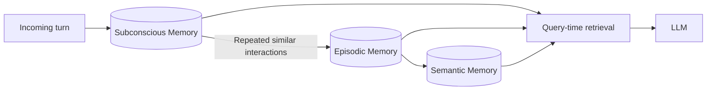
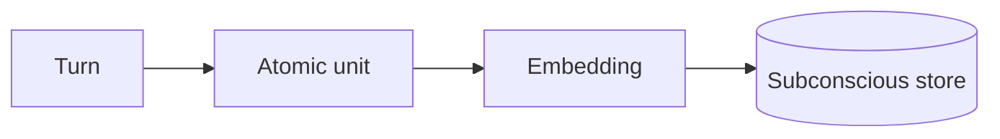
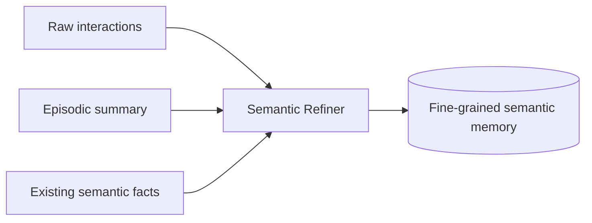

# Part B — Paper 5
## *RecMem: Recurrence-based Memory Consolidation for Efficient and Effective Long-Running LLM Agents*

**Authors:** Zijie Dai, Shiyuan Deng, Sheng Guan, Yizhou Tian, Xin Yao, Xiao Yan, James Cheng  
**Paper:** arXiv:2605.16045v1 — 15 May 2026

> **Why this paper matters:** RecMem asks a simple question: **Do we really need an expensive LLM memory update for every interaction?** Its answer is to keep all interactions in a cheap lower-level memory and consolidate only when similar information repeatedly appears.

---

# 1. The core problem

Most memory systems use **eager consolidation**:

```text
Every incoming interaction
        ↓
LLM extracts / updates memory
        ↓
Repeat for every turn
```

The paper argues this can waste tokens because:

- some interactions contain little useful information
- some are noisy
- some are unrelated to existing memories

RecMem instead uses:

```text
Every interaction
      ↓
Cheap storage
      ↓
Consolidate only when recurrence is detected
```

The paper's Figure 1 contrasts these two designs and reports much lower construction cost for RecMem. fileciteturn46file0L101-L120

---

# 2. RecMem architecture

RecMem has **three memory tiers**:



### Subconscious memory
A cheap, faithful store of interaction units.

### Episodic memory
Higher-level narratives describing how a topic/event develops over multiple turns.

### Semantic memory
Fine-grained facts such as:

- user preferences
- constraints
- entity relations
- precise details

The paper says all three can contribute evidence at query time. fileciteturn46file0L198-L219

---

# 3. Subconscious memory — the safety net

Each user-assistant exchange is stored as one **atomic interaction unit** with:

```text
user message
assistant response
timestamp
embedding
```

The embedding is created with a lightweight encoder and immediately indexed.

So interactions that never trigger consolidation are **still available for later retrieval**.



This is important because RecMem does **not** throw away information just because it was not consolidated. fileciteturn46file0L229-L278

---

# 4. Recurrence-based consolidation — the key idea

When a new interaction arrives:

```text
New interaction
      ↓
Retrieve top-k similar subconscious units
      ↓
Keep units above similarity threshold θsim
      ↓
Count them
      ↓
Is count ≥ θcount?
```

If **yes**:

```text
semantic cluster
      ↓
Episodic + semantic consolidation
```

If **no**:

```text
remain only in subconscious memory
```

Formally, the paper defines a relevant set `Ri` and triggers consolidation when:

`|Ri| ≥ θcount`

with each relevant interaction satisfying the similarity threshold:

`cos(vi, vj) ≥ θsim`

fileciteturn46file0L279-L304

---

# 5. Why recurrence?

The paper's assumption is:

> Information that repeatedly appears is more likely to be worth expensive long-term consolidation.

So:

```text
Rare interaction
→ keep cheaply

Repeated related interactions
→ consolidate
```

This is the main efficiency mechanism.

But the paper explicitly identifies a limitation:

> **A rare but important fact may not recur.**

Examples given include a one-time safety instruction or unique user constraint.

The subconscious layer protects against complete loss because the original interaction remains directly retrievable, but it does not receive the richer cross-turn consolidation.

fileciteturn46file0L693-L725

---

# 6. Episodic memory

When consolidation triggers, RecMem creates an **episode** describing the evolving topic.

Before creating a new episode, it uses a **merge-first** strategy:

```text
New interaction
      ↓
Nearest existing episode
      ↓
Similar enough?
   ┌──┴──┐
  Yes    No
   ↓      ↓
Merge   wait for consolidation
```

The goal is to avoid having many separate summaries for the same evolving topic.

If a new consolidation is triggered, relevant interaction units are timestamp-sorted before the LLM creates the episodic narrative.

So episodic memory provides:

**high-level structure + temporal continuity**

fileciteturn46file0L305-L371

---

# 7. Semantic refinement — very important

Episodic summaries can become broader as more turns are merged.

That creates a problem:

```text
Episode becomes more complete
        ↓
But specific details may become less precise
```

RecMem therefore creates **semantic memory** from the same source interactions.

The refiner receives:

- raw interaction units
- the episodic summary
- related existing semantic facts

and performs two tasks:

### Detail Recovery
Find important details omitted from the episode.

### Fact Maintenance
Avoid redundant facts and update evolving user facts.



This is the paper's second safeguard against information loss.

fileciteturn46file0L372-L416

---

# 8. Query-time retrieval

At answer time, RecMem embeds the query and retrieves from **all three stores**:

```text
Subconscious
Episodic
Semantic
     ↓
small retrieval budgets
     ↓
merged context
     ↓
LLM answer
```

The default budgets reported in the paper are:

```text
ksub = 10
kepi = 5
ksem = 10
```

with:

`ksem = 2 × kepi`

The goal is to keep the final context small while covering:

- raw interaction evidence
- event-level structure
- precise facts

fileciteturn46file0L417-L436

---

# 9. Main results — only what matters

### LoCoMo, GPT-4.1-mini

| System | Overall | Construction tokens |
|---|---:|---:|
| Mem0 | 62.92 | 1520.8K |
| A-Mem | 68.83 | 1459.9K |
| RecMem | **81.10** | **193.2K** |

RecMem therefore uses about **87% fewer construction tokens than Mem0** and about **87% fewer than A-Mem** in this reported setup.

### LongMemEval-S, GPT-4.1-mini

| System | Overall | Construction tokens |
|---|---:|---:|
| Mem0 | 62.92 | 1520.8K |
| A-Mem | 68.83 | 1459.9K |
| RecMem | **81.10** | **193.2K** |

These values correspond to the paper's reported LoCoMo comparison table; for LongMemEval-S, the paper's GPT-4.1-mini overall scores are **74.40 Mem0, 71.60 A-Mem, and 76.80 RecMem**, with **1,626.54K, 1,264.25K, and 365.49K** construction tokens respectively. fileciteturn46file0L507-L545

**Important:** Do not merge the LoCoMo and LongMemEval numbers. They are separate tables.

---

# 10. The most useful experimental finding

The paper's main conclusion is about the **cost/performance trade-off**.

On LoCoMo with GPT-4.1-mini:

```text
RecMem construction = 193.2K tokens
Mem0                  = 1520.8K
A-Mem                 = 1459.9K
```

Yet RecMem still achieves a high overall score among memory systems.

On LongMemEval-S, the conversations are much longer, and the paper reports that RecMem retains its strong overall performance while reducing construction cost.

The paper also notes that **Full Context is slightly better than RecMem on LoCoMo**, where conversations average about 16K tokens, but this does not hold in the longer LongMemEval-S setting.

fileciteturn46file0L570-L594

---

# 11. Ablation — remember the pattern

The paper removes one tier at a time.

Reported LoCoMo scores:

```text
RecMem               81.10
No Episodic          79.94
No Semantic          70.58
Direct Extraction    74.22
No Subconscious      51.88
```

Interpretation from the paper:

- **Subconscious memory is critical** because it is the only faithful carrier of all raw interactions.
- **Semantic memory matters more than episodic memory** for the benchmark because it preserves fine-grained facts.
- **Episodic memory still helps semantic refinement** by providing a useful reference.

fileciteturn46file0L630-L672

---

# 12. What RecMem adds to our project

This paper gives us an important **when-to-consolidate** mechanism.

Instead of:

```text
Every message → expensive memory processing
```

consider:

```text
Every message
    ↓
Cheap persistent interaction store
    ↓
Recurrence / similarity signal
    ↓
Expensive consolidation only when justified
```

That complements A-MAC:

```text
A-MAC
→ Is this candidate worth storing?

RecMem
→ Is this information recurring enough to justify expensive consolidation?
```

---

# 13. The key limitation for our architecture

Do **not** equate recurrence with importance.

The paper explicitly says recurrence is only a **proxy for salience**.

A unique but critical memory may appear once.

RecMem's current protection is:

```text
Not consolidated
      ↓
Still preserved in subconscious memory
      ↓
Can still be retrieved directly
```

But it will not receive the same richer cross-turn consolidation.

This suggests that a final architecture may need a trigger mechanism more general than **recurrence alone**.

fileciteturn46file0L693-L725

---

# 14. 6 things to remember

1. **LLM-based consolidation for every interaction is expensive.**
2. **RecMem stores every interaction cheaply in subconscious memory.**
3. **Repeated semantic recurrence triggers higher-level consolidation.**
4. **Episodic memory preserves evolving event structure.**
5. **Semantic refinement recovers fine-grained facts that episode summaries may lose.**
6. **Recurrence saves cost, but rare important information is its main limitation.**

---

# PPT — 5 slides

## Slide 1 — Problem
**Eager memory consolidation is expensive.**

## Slide 2 — RecMem architecture
```text
Subconscious → Episodic → Semantic
```

## Slide 3 — Recurrence trigger
```text
Similarity → Relevant set → Count threshold → Consolidate
```

## Slide 4 — Results
**Large construction-token reduction + competitive accuracy**

## Slide 5 — Project relevance
**Add a “when should we consolidate?” layer before expensive memory processing.**

---

# Read these sections

**Must read:** §3.1 Overview, §3.2 Subconscious Memory, §3.3 Episodic Memory, §3.4 Semantic Memory.

**Skim:** §3.6 threshold discussion, §4.2 main results, §4.3 ablation.

**Skip initially:** Most appendix details and extended benchmark descriptions.
