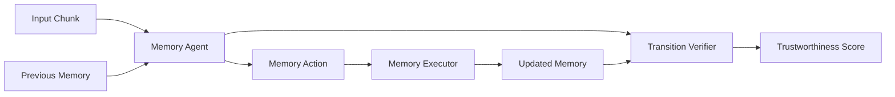
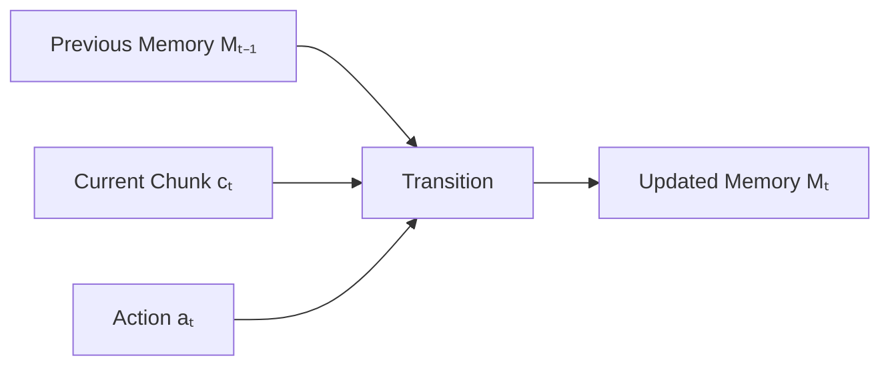
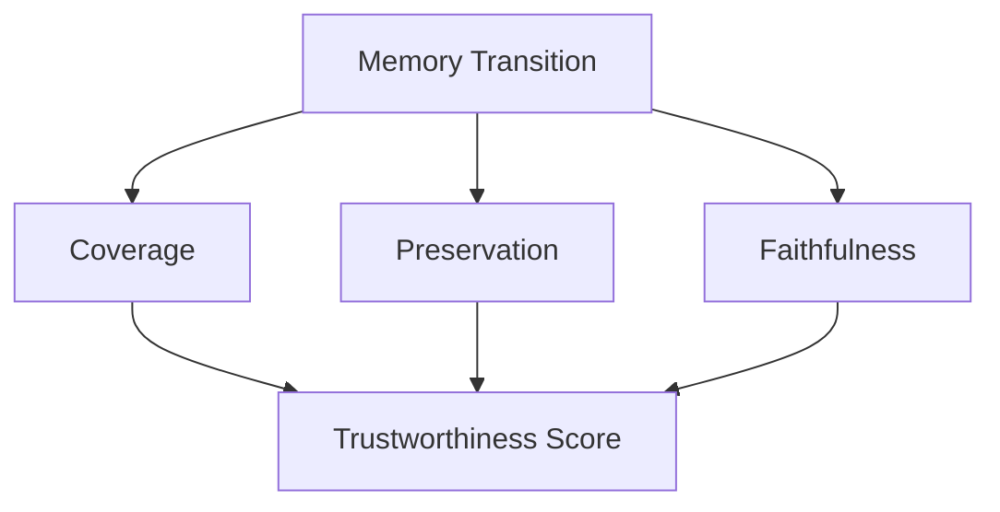
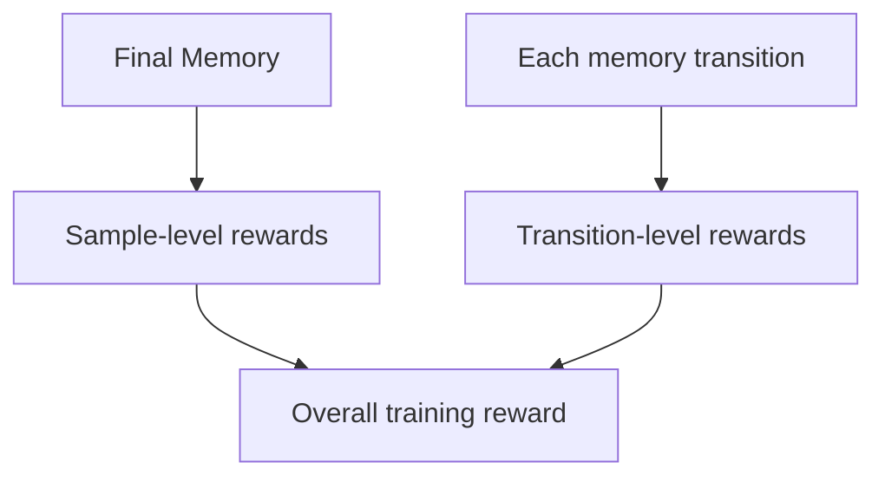
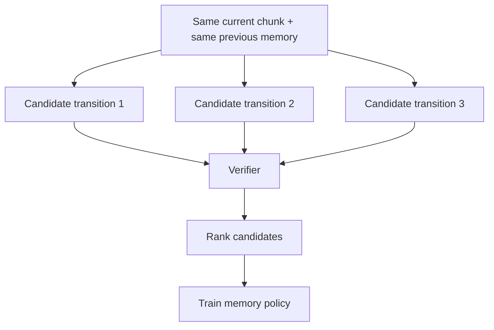
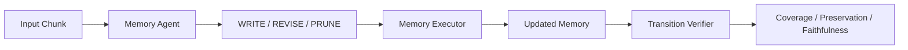

# Paper 6 — Concise Study Guide
## *TRUSTMEM: Learning Trustworthy Memory Consolidation for LLM Agents with Long-Term Memory*

**Authors:** Tianyu Yang, Sudipta Paul, Vijay Srinivasan, Vivek Kulkarni, Srinivas Chappidi  
**Paper:** arXiv:2606.25161v1 — 23 Jun 2026  
**Affiliation:** Samsung Electronics / University of Notre Dame

> **Scope:** Only the parts directly useful for our persistent-memory project are included. Everything below is derived from this paper; no outside material is added.

---

# 1. What problem does TRUSTMEM solve?

The paper focuses on a problem that appears **after a memory system decides to update memory**:

> **Can we trust the individual memory update?**

Existing memory agents can perform operations such as:

**write → revise/update → delete/prune**

But an update may:

- **omit** important information
- **corrupt** existing information
- **hallucinate** unsupported information

The key risk is persistence:

```text
Bad memory update
      ↓
Stored in long-term memory
      ↓
Retrieved later
      ↓
Influences future reasoning
      ↓
Error can persist across interactions
```

So the paper argues that memory quality should not be judged only by the **final answer**. The individual transitions that create the memory also need supervision.

**Paper:** pp. 1–3

---

# 2. The core idea of TRUSTMEM

TRUSTMEM introduces a **Memory Transition Verifier**.

Instead of only asking:

> “Was the final answer correct?”

it asks:

> “Was this particular memory transition trustworthy?”

The overall system is:



The memory agent processes the input stream **chunk by chunk**.

At every step:

`previous memory + current chunk → memory action → updated memory`

That step is called a **memory transition**.

---

# 3. What actions can the memory agent perform?

TRUSTMEM uses three structured memory-editing actions:

| Action | Meaning |
|---|---|
| **WRITE** | Add new useful information |
| **REVISE** | Update/merge existing memory using corrections, refinements, or additional evidence |
| **PRUNE** | Remove information that has become invalid, redundant, or no longer useful |

The agent may also produce **no action** when the current chunk does not require a memory change.

After the agent chooses an action, a deterministic **Memory Executor** applies it to the store.

```text
Current chunk + previous memory
            ↓
       Agent chooses
      WRITE / REVISE / PRUNE
            ↓
      Memory Executor
            ↓
        New memory
```

**Paper:** §3.1, p. 4

---

# 4. What is a memory transition?

The paper formally represents one transition as:

`zₜ = (cₜ, Mₜ₋₁, aₜ, Mₜ)`

In simple terms:

- `cₜ` = current input chunk
- `Mₜ₋₁` = memory before the update
- `aₜ` = action taken
- `Mₜ` = memory after the update

This is important because the paper evaluates the **change itself**, not just the resulting final memory.



**Paper:** §3.1, p. 4

---

# 5. Memory Transition Verifier — the most important part

The verifier is a **frozen LLM** that checks each local memory transition.

It receives a compact view containing:

- the current chunk
- generated memory-editing action
- memory entries touched/retrieved by the action

The verifier does not need the entire memory bank.

It evaluates three properties:



## Coverage

**Did the update preserve important information from the current chunk?**

Main failure associated with this:

**Omission**

---

## Preservation

**Did the update keep valid previous memory?**

This checks against:

- unjustified deletion
- distortion
- destruction of valid information

Main failure associated with this:

**Corruption / destructive update**

---

## Faithfulness

**Is newly added or modified memory supported by the current chunk or previous memory?**

This targets:

**Hallucinated / unsupported memory**

The verifier combines these judgments into a trustworthiness score:

`V(zₜ) ∈ [0, 1]`

**Paper:** §3.2, p. 5

---

# 6. Why final-answer evaluation is not enough

The paper describes a **credit assignment gap**.

Suppose the system processes many chunks:

```text
Chunk 1 → bad update
Chunk 2 → okay
Chunk 3 → okay
...
Chunk 20 → wrong final answer
```

A final reward only tells the system that something went wrong.

It does not directly identify:

> **Which memory update caused the problem?**

The opposite can also happen:

```text
Bad memory update
      ↓
No failure in current task
      ↓
Final answer looks correct
      ↓
Unsafe memory remains stored
      ↓
Can cause failure later
```

TRUSTMEM therefore adds **transition-level supervision**.

**Paper:** pp. 2, 5

---

# 7. The reward has two levels

TRUSTMEM combines:

### Sample-level rewards

Evaluate the **final memory state** after processing the whole input stream.

The paper includes:

- **Task Reward** — downstream usefulness
- **Efficiency Reward** — encourages compact memory

### Transition-level rewards

Evaluate each individual update.

The paper includes:

- **Action Execution Reward** — was the action valid/executable?
- **Content Type Reward** — is the produced memory content specific and non-empty?
- **Verifier Reward** — how trustworthy was the transition?

Conceptually:



This lets training consider both:

**“Was the final memory useful?”**

and

**“Were the individual updates safe?”**

**Paper:** §3.3, pp. 5–6

---

# 8. Why Transition-Ranked GRPO?

The paper does not use the verifier only as a simple absolute score.

It generates multiple candidate memory transitions from the **same state** and compares them.



The idea is:

> Which candidate update is better than the others for the same situation?

The paper calls this **Transition-Ranked GRPO (TR-GRPO)**.

This adds a relative preference signal on top of the scalar rewards.

**Paper:** §3.4, p. 6

---

# 9. What kinds of memory errors does the paper measure?

TRUSTMEM evaluates three main transition-level failures:

| Error | Simple meaning |
|---|---|
| **Omission** | Important information was left out |
| **Corruption** | Existing or new information was changed incorrectly |
| **Hallucination** | Unsupported information was introduced |

The paper's Figure 1 gives concrete examples of all three.

### Example from the paper

Input contains a timeline for a subject.

An existing method stores only part of it:

```text
Input:
formed → split → reunions → founder information

Stored:
formed → founder information
```

The paper labels the missing timeline information as **Omission**.

Another example shows an unrelated statement being added to memory even though it is not supported by the input. That is labeled **Hallucination**.

**Paper:** Figures 1–2, pp. 1–2

---

# 10. Main results

TRUSTMEM is evaluated in three settings:

### Mem-α validation set

The paper reports an overall score of:

**66.3**

This is **4.4 points higher** than Mem-α in the reported comparison.

---

### MemoryAgentBench

Reported average:

**65.7**

The paper reports a **6.5-point improvement** over Mem-α.

---

### HaluMem

For memory extraction, TRUSTMEM reports:

**F1 = 69.45**

The paper says this is **12.14 F1 points above the strongest prior result** in that comparison.

**Paper:** pp. 7–9

---

# 11. Reliability results — especially important

On the Mem-α validation trajectories, the paper reports:

| Error type | TRUSTMEM rate |
|---|---:|
| **Omission** | 8.08% |
| **Corruption** | 0.14% |
| **Hallucination** | 0.01% |

The authors report reductions of:

- **40.1%** for omission
- **79.1%** for corruption
- **50.0%** for hallucination

relative to the strongest baseline for each error type.

The paper notes that **omission is the dominant error type** because memory construction is inherently compressive.

**Paper:** §4.5, p. 10

---

# 12. Ablation study

The paper removes important parts of its training design.

| Variant | Overall score |
|---|---:|
| **TRUSTMEM** | **66.3** |
| Without action-execution reward | 54.0 |
| Without efficiency reward | 61.8 |
| Without verifier reward | 58.7 |
| PRM-style GRPO | 60.3 |

Two especially important observations:

### Remove the Memory Transition Verifier

`66.3 → 58.7`

The paper interprets this as evidence that transition-level verification contributes useful supervision.

### Replace Transition-Ranked GRPO

`66.3 → 60.3`

The paper reports that ranking candidate transitions provides a stronger learning signal than simply using verifier scores as scalar rewards.

**Paper:** §4.4, pp. 8–9

---

# 13. What this paper adds to our project

This paper gives us a new layer that complements the earlier papers.

From previous papers:

```text
Extraction
    ↓
Admission / Selection
    ↓
Update
    ↓
Storage
    ↓
Retrieval
```

TRUSTMEM adds:

```text
                 ┌───────────────┐
Candidate update │ Transition    │
───────────────→ │ Verifier      │
                 └───────┬───────┘
                         ↓
                 Safe / trustworthy
                 memory transition
```

The key research idea is:

> **Do not only evaluate whether memory is useful; evaluate whether each memory change is trustworthy.**

This is especially relevant to our earlier concerns about:

**hallucination + contradiction + information loss during memory updates.**

---

# 14. Difference from A-MAC

This is useful because we have already studied A-MAC.

### A-MAC

Focuses on:

**Should this candidate enter long-term memory?**

```text
Candidate
  ↓
Utility / Confidence / Novelty / Recency / Type
  ↓
Admission decision
```

### TRUSTMEM

Focuses on:

**Was this memory transition correctly performed?**

```text
Current chunk + previous memory
  ↓
WRITE / REVISE / PRUNE
  ↓
Transition Verifier
  ↓
Coverage / Preservation / Faithfulness
```

So these papers address **different points in the memory lifecycle**.

---

# 15. Difference from Mem0

Mem0 gives the LLM update operations such as:

**ADD / UPDATE / DELETE / NOOP**

TRUSTMEM instead defines:

**WRITE / REVISE / PRUNE**

and, more importantly, evaluates the **resulting state transition** using coverage, preservation, and faithfulness.

So the new contribution is not simply another set of edit commands.

It is the **verification and training of memory-editing behavior**.

---

# 16. What this paper does NOT prove

Do not conclude that:

- a transition verifier is necessary for every memory system
- GPT-4o-mini-style verification is the best possible verifier
- GRPO is the only useful training method
- the reported error rates will transfer directly to our project
- TRUSTMEM's exact reward weights or training setup should be copied

The evidence is from the paper's particular training setup and evaluated benchmarks.

---

# 17. Paper 6 — 8 things to remember

1. **Memory errors can become persistent system-state errors.**
2. **Final-answer rewards are not enough to identify bad memory updates.**
3. **TRUSTMEM evaluates each memory transition.**
4. **The verifier checks coverage, preservation, and faithfulness.**
5. **Memory actions are WRITE, REVISE, and PRUNE.**
6. **Training combines final-memory rewards with transition-level rewards.**
7. **Transition-Ranked GRPO compares multiple candidate updates from the same state.**
8. **The paper explicitly measures omission, corruption, and hallucination.**

---

# 18. PPT structure

## Slide 1 — Problem
Why memory updates themselves can be unsafe.

## Slide 2 — TRUSTMEM architecture



## Slide 3 — Three trustworthiness dimensions

**Coverage | Preservation | Faithfulness**

## Slide 4 — Training

**Sample-level + Transition-level rewards**

## Slide 5 — Transition-Ranked GRPO

Same state → multiple candidate updates → verifier → ranking.

## Slide 6 — Results

Utility + reliability results.

## Slide 7 — Relevance to our project

**Trustworthy memory update / verification layer**

---

# Source map

| Topic | Paper pages |
|---|---:|
| Problem & motivation | 1–3 |
| Framework overview | 4 |
| Transition Verifier | 5 |
| Reward design | 5–6 |
| Transition-Ranked GRPO | 6 |
| Main experiments | 7–9 |
| Reliability | 10 |
| Case studies | 1–2, 10 |
| Conclusion | 10 |
