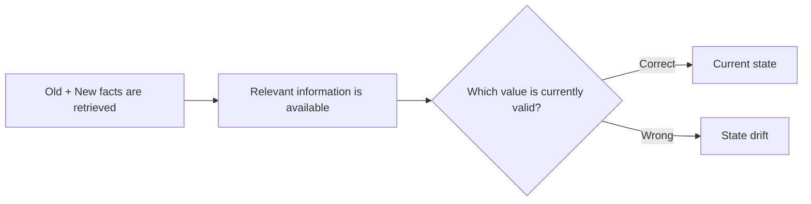
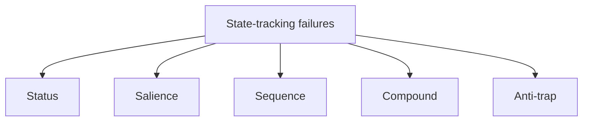
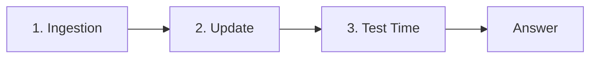
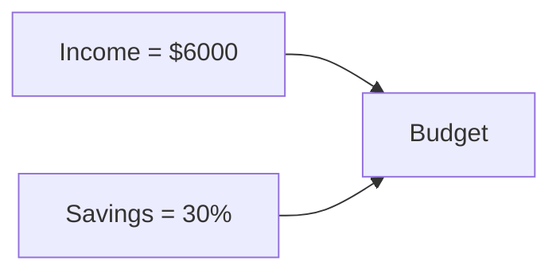
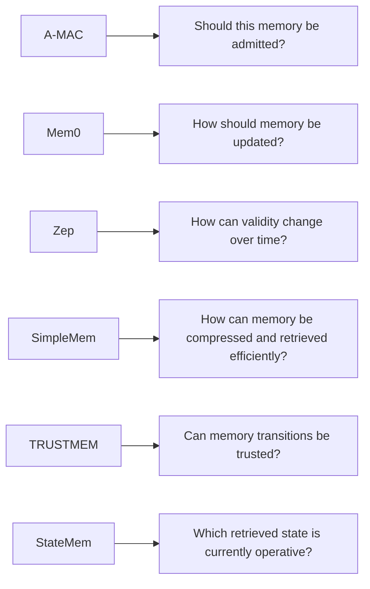
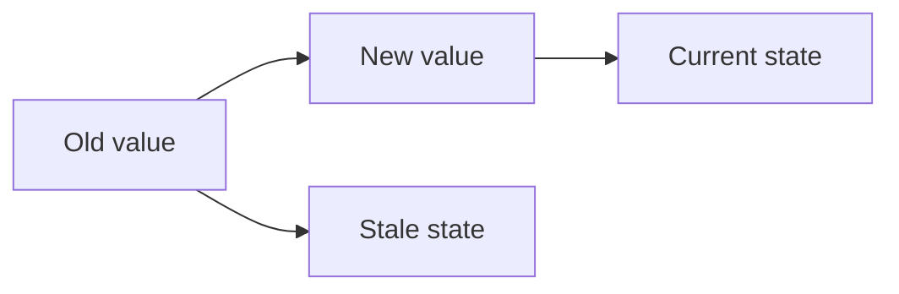

# Paper 7 — Concise Study Guide
## *Can Agent Memory Systems Track Evolving State?*

**Authors:** Xinyi Fan, Miri Liu, Ruozhen Yang, Siru Ouyang, Jiawei Han  
**Institution:** University of Illinois Urbana-Champaign  
**Paper:** arXiv:2608.19652v1 — 20 Aug 2026

> **Scope:** Only the parts directly useful for our persistent-memory project are included. The explanations below are simplified from this paper only.

---

# 1. The main problem

The paper says there is an important difference between:

**remembering a fact** and **knowing which version of that fact is currently valid**.

They call the second capability **state tracking**.

Example:

```text
Earlier:
Budget = $600

Later:
Budget = $400

Current question:
"What is the current budget?"

Recall-only system:
→ may retrieve both values

State-tracking system:
→ identifies $400 as the current value
```

The paper calls the failure to maintain the current state **state drift**.

> **State drift:** the relevant information is present, but the agent acts on a stale or incomplete version instead of the state currently in force.

**Paper:** pp. 1–3 fileciteturn22file0L94-L105

---

# 2. Why better retrieval alone is not enough

This is the paper's most important argument.



A system can have:

**perfect retrieval + wrong answer**

because it still has to determine which retrieved information represents the current state.

The paper tests this using a **perfect-retrieval setting** and finds that state drift still occurs.

On one LongMemEval oracle evaluation, the paper reports that **16 of 36 confirmed failures (44.4%)** were state-drift failures, despite the relevant facts being guaranteed to be present.

**Paper:** §3.2, pp. 2–3 fileciteturn22file0L212-L236

---

# 3. State drift has different causes

The paper identifies five failure modes in its benchmark.



### Status error
A value **was actually superseded**, but the system keeps using the older value.

### Salience error
The correct value is still valid, but a more frequently or prominently mentioned value wins.

**Important:** nothing was actually superseded here.

### Sequence error
A derived value depends on another value, but the system does not recompute the derived value after its input changes.

### Compound error
Multiple failure mechanisms interact.

### Anti-trap
The benchmark tests the opposite situation: an update should **not** cause the old value to be discarded. This checks whether a system invalidates information too aggressively.

**Paper:** §4.1, pp. 3–4 fileciteturn22file0L242-L286

---

# 4. StateMemBench

The authors create **StateMemBench** specifically to isolate state tracking.

It contains:

- **234 multi-session scenarios**
- **3 domains:** research, shopping, personal finance
- **short and long conversation conditions**
- **322 graded probes**

The benchmark deliberately creates scenarios where:

```text
Old state
   ↓
Update / supersession
   ↓
Possibly dependent values
   ↓
Final question
```

The important part is that the causal relationships are explicitly stated, so the benchmark does not require the model to discover hidden dependencies.

This lets the authors test:

> **Can the memory system maintain changing state?**

rather than:

> **Can the model discover the relationship in the first place?**

**Paper:** §4.2–4.3, pp. 3–4 fileciteturn22file0L322-L356

---

# 5. How StateMem represents memory

StateMem is a **state-first** memory method.

Instead of treating memory as a collection of generic text snippets, it stores **structured state units**.

Each unit contains:

```text
id
content
priority
source
dependencies
```

The paper uses:

```text
priority ∈ {hard, soft}
```

and dependencies such as:

- `derived_from`
- `coupled_with`

Units persist across sessions in a **StateStore**.

**Paper:** §5.1, pp. 4–5 fileciteturn22file0L452-L474

---

# 6. StateMem has three stages



## 6.1 Ingestion

A **TurnEncoder** processes each conversation turn.

It converts the turn into zero or more state units.

The stored unit records:

- the content
- its source
- its priority
- dependencies on other units

The encoder can also mark existing units as being at risk of supersession.

---

## 6.2 Update

When new information supersedes an old unit:

```text
Old unit
   ↓
marked superseded

New replacement
   ↓
added as active
```

Then a deterministic **Rechecker** follows the dependency graph.

If an active unit depends on something that just changed:

```text
Dependency changed
       ↓
Dependent unit
       ↓
needs_recheck
```

### Important point

The superseded unit is **not physically deleted**.

It remains in the store for auditability but becomes inactive.

The paper says dependency propagation runs in `O(|E|)` and adds **no LLM calls**.

---

## 6.3 Test Time

When the agent receives a question:

1. The StateStore assembles the currently valid state.
2. Stale/suspect units are marked.
3. Relevant state is provided to the LLM.
4. The LLM recomputes the answer using the current state.

The paper emphasizes that the deterministic layer handles **which state is valid and which units are stale**, while the LLM performs the final answer computation.

**Paper:** §5.2–5.3, pp. 5–6 fileciteturn22file0L475-L500

---

# 7. The key idea: dependencies

This is particularly important for our project.

Suppose:

```text
Income = $6000
Savings = 30%
Budget = Income × (1 - Savings)
```

Then the memory should not store only three unrelated text records.

It can represent:



If income changes:

```text
Income = $7500
        ↓
Budget becomes stale
        ↓
Recompute budget
```

This is exactly the type of **sequence/dependency problem** the paper targets.

The paper's Figure 2 shows this mechanism in a finance example: an updated take-home pay supersedes the previous value, dependent units are marked stale, and the derived budget is recomputed before answering.

**Paper:** Figure 2, pp. 4–5 fileciteturn22file0L357-L456

---

# 8. Why supersession is important

The paper's ablation shows that **supersession marking** provides the largest single improvement among the StateMem components.

On DeepSeek-V4-Flash:

```text
Extraction-only:       0.174
+ Supersession:        0.298
Full StateMem:         0.363
```

This supports the paper's claim that explicitly identifying:

> **“This new value replaces that old value.”**

is central to state tracking.

**Paper:** §6.2, p. 6 fileciteturn22file0L597-L610

---

# 9. Main StateMemBench results

The paper reports state-agreement accuracy on the benchmark.

### Qwen-3.5-9B

```text
StateMem = 0.233
Mem0     = 0.149
```

### DeepSeek-V4-Flash

```text
StateMem = 0.363
A-Mem    = 0.199
Dense    = 0.205
```

The paper reports statistically significant improvement over the strongest memory baseline on both backbones (`p < 0.001`).

The paper also notes that **GraphRAG scored 0.224 on Qwen**, close to StateMem's 0.233, while StateMem's advantage was clearer on the stronger DeepSeek backbone.

**Paper:** §6.2, p. 6 fileciteturn22file0L578-L610

---

# 10. LongMemEval / LoCoMo results

On existing memory benchmarks, the paper reports:

| Method | LongMemEval Qwen | LongMemEval DeepSeek |
|---|---:|---:|
| Mem0 | 0.566 | 0.594 |
| StateMem | **0.580** | **0.656** |

For LoCoMo:

| Method | Qwen | DeepSeek |
|---|---:|---:|
| Mem0 | 0.481 | 0.462 |
| StateMem | **0.566** | **0.592** |

The paper emphasizes that StateMem's advantage is concentrated on tasks involving **updates and temporal reasoning**.

For example, on LongMemEval temporal reasoning:

- DeepSeek: `0.624` vs `0.391` for long-context
- Qwen: `0.398` vs `0.248` for long-context

**Paper:** §6.1, pp. 5–6 fileciteturn22file0L501-L577

---

# 11. An important limitation in the results

The paper itself finds that performance depends partly on the answer model.

On Qwen-3.5-9B, several systems show high drift rates.

The authors report that on the stronger DeepSeek-V4-Flash backbone, StateMem's drift rate falls from:

**64.3% → 49.1%**

and correct answers increase from:

**75 → 117**

The paper interprets this as evidence that an explicit state representation helps a capable answerer use the current state correctly.

So:

```text
Good memory structure
+
Capable answer model
```

are both relevant in the reported results.

**Paper:** §6.3, pp. 6–7 fileciteturn22file0L639-L653

---

# 12. StateMemWrapper — a very useful idea

The authors also test StateMem as a **lightweight answer-time wrapper** around existing memory systems.

It does not replace the backend's memory system.

Instead, before answering, it creates a question-specific state trace:

```text
Initial value
   ↓
Revision
   ↓
Revision
   ↓
Current value
```

and applies four resolution rules:

1. Later information supersedes earlier information.
2. Standing rules outrank individual instances.
3. Derived quantities are recomputed instead of simply quoted.
4. A fact is retired only by explicit supersession or expiry.

The wrapper adds no extra LLM call in the experiment.

The authors report that the wrapper improved every tested backend on StateMemBench.

**Paper:** §6.4, pp. 7–8 fileciteturn22file0L654-L733

---

# 13. What this paper adds to our project

This paper gives us a new architectural concern that the previous papers did not isolate as clearly:

```text
Memory storage
      ↓
Memory retrieval
      ↓
State resolution
      ↓
Current answer
```

The important question becomes:

> **When multiple memories are retrieved, how does our system determine the current operative state?**

Useful mechanisms from this paper to investigate:

### Supersession

Store which memory replaces which older memory.

### Dependencies

Store relationships such as:

```text
A → derived_from → B
```

so changes can propagate.

### Stale marking

When a dependency changes, mark dependent memories as needing re-checking.

### Recompute

Do not blindly retrieve a previously calculated value. Recompute it from the current inputs.

---

# 14. How this connects to our previous papers



This is the main reason Paper 7 is valuable:

**It shifts the problem from “Can we retrieve the memory?” to “Can we maintain the correct current state?”**

---

# 15. What this paper does NOT prove

Do not conclude that:

- every memory system needs a state graph
- every memory should be represented as explicit state units
- supersession is sufficient to solve all memory problems
- deterministic state handling is always better than LLM-based handling
- StateMem's exact structure should be copied into our final architecture

The authors themselves show different behavior across benchmarks and model backbones.

---

# 16. Paper 7 — 8 things to remember

1. **Recall ≠ state tracking.**
2. **State drift can happen even when the needed facts are retrieved.**
3. **Supersession is central to maintaining the current state.**
4. **Dependencies matter because changing one fact can invalidate derived facts.**
5. **StateMem represents memory as structured state units.**
6. **Superseded memories remain stored but inactive for auditability.**
7. **A deterministic rechecker can propagate staleness without another LLM call.**
8. **State-aware processing can be added on top of existing memory backends.**

---

# 17. PPT structure

## Slide 1 — Problem
**Long-horizon recall is not enough: agents need state tracking.**

## Slide 2 — State drift



## Slide 3 — Failure modes

**Status | Salience | Sequence | Compound | Anti-trap**

## Slide 4 — StateMem architecture

**Ingestion → Update → Test Time**

## Slide 5 — Supersession + dependencies

Show a changed input causing a derived value to become stale and recomputed.

## Slide 6 — StateMemBench

234 scenarios, 3 domains, short/long settings.

## Slide 7 — Results

StateMemBench + LongMemEval/LoCoMo.

## Slide 8 — Relevance to our project

**State resolution + supersession + dependency tracking**

---

# Source map

| Topic | Paper pages |
|---|---:|
| Problem / state drift | 1–3 |
| StateMemBench | 3–4 |
| StateMem architecture | 4–6 |
| Existing benchmark results | 5–6 |
| StateMemBench results | 6 |
| Drift analysis | 6–7 |
| Wrapper | 7–8 |
| Conclusion | 8 |
