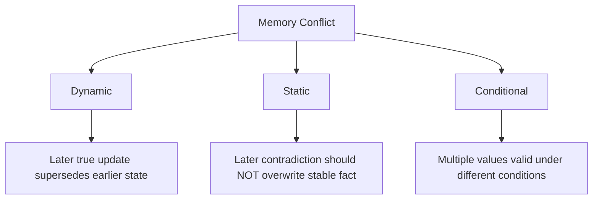
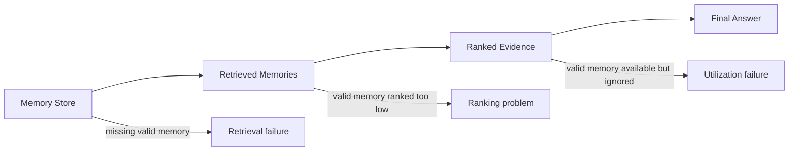
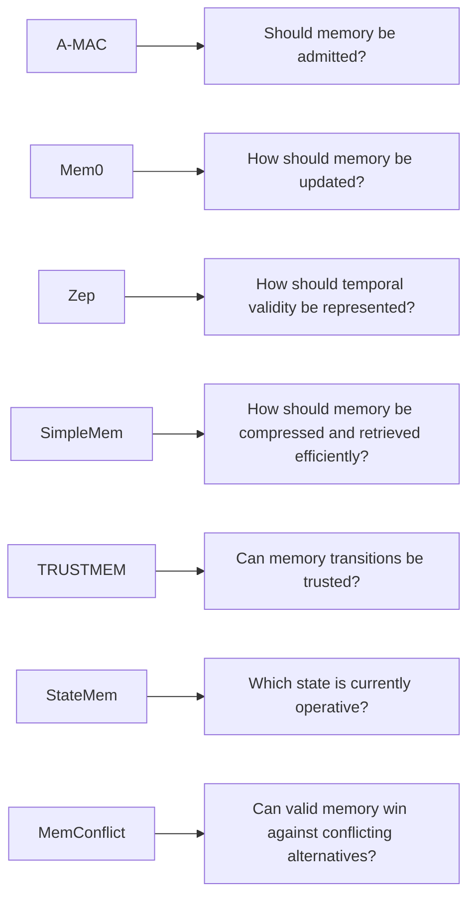

# Paper 8 — Concise Study Guide
## *MemConflict: Evaluating Long-Term Memory Systems Under Memory Conflicts*

**Authors:** Zhen Tao, Jinxiang Zhao, Peng Liu, Dinghao Xi, Yanfang Chen, Wei Xu, Zhiyu Li  
**arXiv:** 2605.20926v1 — 20 May 2026

> **Scope:** Only the parts directly useful for our persistent-memory project are included. The explanations below are simplified from this paper only.

---

# 1. What problem is this paper studying?

Most memory evaluations ask:

> **Did the agent give the correct answer?**

MemConflict argues that this is not enough.

A long-term memory system may contain several plausible memories at the same time:

```text
Old value
New value
Contradictory value
Condition-specific value
Similar but non-target value
```

The real question becomes:

> **Which memory is valid for this particular query?**

The paper defines memory validity using three dimensions:

```text
Temporal validity
       +
Factual correctness
       +
Contextual applicability
```

This produces three conflict types:

**Dynamic | Static | Conditional**

**Paper:** pp. 2–3 fileciteturn25file0L64-L96

---

# 2. The three conflict types

This is the most important conceptual part of the paper.



## Dynamic conflict

A fact genuinely changes.

Example:

```text
Earlier:
Residence = Beijing

Later:
Residence = Shanghai

Current answer:
Shanghai
```

The system must recognize that the later value supersedes the earlier value.

---

## Static conflict

A later statement contradicts a stable fact, but the later statement is **not** a real update.

Example:

```text
True:
Name = Li Ming

Later false mention:
Name = Li Lei
```

The system should keep the true stable value.

---

## Conditional conflict

Two memories can both be correct because they apply under different conditions.

Example:

```text
Morning → Coffee
Night   → Milk
```

The system must preserve the **condition → value** relationship.

**Paper:** pp. 3, 11–12 fileciteturn25file0L153-L169 fileciteturn25file0L642-L698

---

# 3. Distractors — another important problem

MemConflict also introduces **semantically similar distractors**.

A distractor is:

- valid information
- about another related entity
- similar to the target information
- but **not valid for the target user**

Example:

```text
Target user:
Residence = Shanghai

Related person:
Residence = Beijing
```

Both memories may look relevant.

The system must preserve the **identity/attribution boundary**.

```text
Query
 ↓
Similar candidates
 ↓
Which one belongs to the target user?
 ↓
Correct memory
```

**Paper:** §3.3.5, pp. 12–13 fileciteturn25file0L699-L716

---

# 4. Why answer-only evaluation is not enough

MemConflict separates three possible failure locations:



A system can fail because:

1. The correct memory was never retrieved.
2. The correct memory was retrieved but ranked too low.
3. The correct memory was retrieved but the LLM failed to use it correctly.

Conversely:

> A correct answer does not necessarily mean the correct memory was retrieved or highly ranked.

This is one of the most useful evaluation ideas for our project.

**Paper:** pp. 5, 13–15 fileciteturn25file0L264-L270 fileciteturn25file0L823-L968

---

# 5. The MemConflict evaluation pipeline

The paper constructs a controlled benchmark.


The five major construction steps are:

**Profile initialization → Timeline/conflict construction → Dialogue generation → Query/label construction → Evaluation**

The benchmark processes histories **session by session**, so conflicts appear as the long-term memory develops.

**Paper:** §3, pp. 7–14 fileciteturn25file0L400-L412

---

# 6. What does the benchmark actually test?

For each query, MemConflict defines a set of competing memory candidates.

The gold memory is the candidate that is valid **for that query and available history**.

The query may test:

```text
Dynamic:
"What is the current value?"

Static:
"What is the true value despite the contradiction?"

Conditional:
"When does this preference apply?"
```

The important word is:

**query-conditioned**

A memory is not simply “good” or “bad”.

It is evaluated according to whether it is valid **for this specific query**.

**Paper:** pp. 8–9 fileciteturn25file0L504-L545

---

# 7. Dataset scale

The paper reports that each of its 12 experimental benchmark instances contains, on average:

- **52.33 sessions**
- **2,349.17 turns**
- **203,910.83 tokens**
- **124.33 evaluation queries**

So this is specifically testing extended multi-session memory behavior.

**Paper:** p. 14 fileciteturn25file0L969-L982

---

# 8. The evaluation metrics

MemConflict has two levels.

## A. Black-box — final answer

### Answer Accuracy (AA)

Was the final answer correct?

---

## B. White-box — memory behavior

### Support Evidence Hit@K (SEH@K)

Was the correct supporting memory present in the top-K retrieved memories?

```text
1 = gold memory retrieved
0 = gold memory not retrieved
```

### Support Rank Score (SRS)

If the correct memory was retrieved:

> **How high was it ranked?**

Higher rank receives a higher score.

```text
Rank 1 → best
Rank 2 → lower
Rank 3 → lower
...
Not retrieved → 0
```

---

## Additional conflict diagnostics

### UOCS
For dynamic conflicts:

> Did the system recognize the update and preserve the correct order?

### CRS
For static conflicts:

> Did the system recognize that incompatible information exists?

These metrics let the researchers inspect **memory behavior**, not just the final answer.

**Paper:** pp. 14–15 fileciteturn25file0L876-L968

---

# 9. Main experimental findings

The paper evaluates six systems:

**A-Mem, LangMem, Letta, MemOS, Mem0, Memobase**

The important observation is:

> **No single system performs uniformly across all conflict types and metrics.**

The systems show different strengths for:

- dynamic conflicts
- static conflicts
- conditional conflicts

The paper also finds that **static conflicts are particularly difficult on average**, while conditional performance is more polarized across systems.

**Paper:** pp. 18–20 fileciteturn25file0L183-L201

---

# 10. The white-box result is more important than the leaderboard

The paper finds that:

**SEH@3 > SRS**

for most systems.

That means:

```text
Correct memory exists in retrieved set
BUT
it is not necessarily near the top
```

This is critical.

A retriever may technically retrieve the right memory but still produce poor answers because an outdated or competing memory is ranked higher.

So:

> **Retrieval recall alone is not enough; ranking quality matters.**

**Paper:** pp. 19–20 fileciteturn25file0L19-L20

---

# 11. Retrieval depth

The paper varies:

`K = 2, 3, 5`

Increasing K generally improves the chance of finding the correct memory.

But the paper observes:

```text
More retrieved items
        ↓
Higher chance of including gold memory
        ↓
Does NOT guarantee better ranking
```

Therefore, simply increasing top-K is not a complete solution to conflict handling.

The system must also:

- preserve valid memories
- rank them properly
- distinguish competing candidates

**Paper:** §4.4.1, pp. 20–21 fileciteturn25file0L19-L20

---

# 12. Longer histories make memory conflicts harder

When the authors add more unrelated conversation around the conflict:

```text
Original conflict
     ↓
+ unrelated sessions
     ↓
Longer history
     ↓
Performance decreases
```

The decline appears in:

- Answer Accuracy
- SEH@3
- SRS

This means longer histories affect both:

**retrieval** and **final answer generation**.

**Paper:** §4.4.2, pp. 21–22

---

# 13. Distractors make retrieval harder

Removing semantically similar distractors improves performance for all systems.

This shows that:

> **Topical similarity is not sufficient.**

The system also needs to identify:

- correct entity
- correct attribute
- correct conflict candidate

The paper notes that even without distractors, performance differences remain, so distractors are only one part of the problem.

**Paper:** §4.4.3, pp. 22–23

---

# 14. Implicit queries are harder

The paper compares direct queries with **implicit queries**.

Direct:

```text
"What is the user's residence?"
```

Implicit:

```text
A question that requires the system
to infer what memory attribute is relevant.
```

Under implicit queries, both:

**SEH@3 ↓**  
**SRS ↓**  
**AA ↓**

for most systems.

This means the system has difficulty even identifying the correct memory target when the query does not explicitly name it.

### Project implication

Our retrieval pipeline should not assume:

```text
query words ≈ memory field
```

**Paper:** §4.4.4, p. 24 fileciteturn25file0L772-L818

---

# 15. Conflict distance matters

The paper compares:

- **Near:** 5–10 intervening sessions
- **Far:** 20–25 intervening sessions

As conflict distance increases:

```text
AA ↓
SEH@3 ↓
SRS ↓
```

The authors interpret this as evidence that systems have difficulty connecting competing memories that are far apart in the history.

This is particularly relevant for long-term memory because:

> an update may be separated from the original fact by many unrelated interactions.

**Paper:** §4.4.5, pp. 24–25 fileciteturn25file0L19-L20

---

# 16. Evidence Utilization Gap — very useful concept

The paper defines:

`EUG = SEH@3 − AA`

In simple terms:

```text
Correct memory retrieved
        ↓
But final answer still wrong
        ↓
Evidence Utilization Gap
```

This isolates a problem after retrieval.

A system may have the necessary evidence but fail to use it correctly.

The paper explicitly separates:

### Retrieval failure
Correct memory is missing.

### Utilization failure
Correct memory is present, but the answer is still wrong.

The authors find retrieval failures dominate many cases, but utilization failures are also significant for some conflict types and systems.

**Paper:** pp. 26–28 fileciteturn25file0L894-L968

---

# 17. The paper's strongest design recommendations

The authors derive four practical directions.

## 1. Store more than isolated text

Memory representations should explicitly capture:

- temporal state
- source attribution
- applicability conditions

```text
Memory
├── content
├── when valid
├── who/what it belongs to
└── under what condition it applies
```

---

## 2. Add conflict-aware reranking

Retrieved candidates should be ranked using more than generic relevance.

The paper suggests considering:

**temporal validity + factual consistency + condition matching + query relevance**

---

## 3. Verify memory before answering

The paper suggests a memory-verification step so that valid evidence is not ignored or overridden by a more salient but invalid memory.

---

## 4. Balance reliability and efficiency

More sophisticated memory construction can improve organization, but may increase writing cost.

Therefore the system has to balance:

```text
Memory writing cost
        +
Retrieval quality
        +
Answer-time reasoning
```

**Paper:** §4.6, pp. 28 fileciteturn25file0L28-L28

---

# 18. What Paper 8 adds to our architecture research

Our current research map now becomes:



This paper adds an important distinction:

> **Correct memory retrieval is not just about finding relevant information. It is about selecting the valid candidate among competing memories.**

---

# 19. Paper 8 — 8 things to remember

1. **Memory validity is query-conditioned.**
2. **Dynamic conflicts ≠ static conflicts ≠ conditional conflicts.**
3. **Semantically similar distractors can interfere with memory selection.**
4. **Answer accuracy alone cannot tell us where a memory system failed.**
5. **SEH@K measures whether the supporting memory was retrieved.**
6. **SRS measures whether the supporting memory was ranked highly.**
7. **Retrieving the right memory does not guarantee that the LLM will use it correctly.**
8. **Conflict-aware memory needs temporal, factual, attribution, and condition-aware handling.**

---

# 20. PPT structure

## Slide 1 — Problem
**Long-term memory under conflicting information**

## Slide 2 — Three conflict types

```text
Dynamic | Static | Conditional
```

## Slide 3 — Why answer-only evaluation fails

```text
Store → Retrieve → Rank → Answer
          ↑
     inspect here
```

## Slide 4 — MemConflict benchmark

**Profile → Timeline → Conflicts → Dialogue → Query → Evaluation**

## Slide 5 — Evaluation metrics

**AA | SEH@3 | SRS | UOCS | CRS**

## Slide 6 — Findings

Longer history, distractors, implicit queries, and larger conflict distance make the task harder.

## Slide 7 — Design implications

**Temporal + source + condition metadata + conflict-aware ranking + verification**

## Slide 8 — Relevance to our project

Conflict-aware memory selection is a separate problem from basic retrieval.

---

# Reading priority

### Must read
**§1 Introduction** — understand the problem  
**§3.1 Problem Formulation** — understand query-conditioned validity  
**§3.3 conflict construction** — understand dynamic/static/conditional conflicts + distractors  
**§3.6 Evaluation Protocol** — understand AA / SEH / SRS  
**§4.3 Main Results** — understand what current systems struggle with  
**§4.4 Sensitivity Analysis** — understand what makes memory failure worse  
**§4.5–4.6 Diagnostics + recommendations** — directly useful for our architecture

### Skip for now
Most of **§2 Related Work**, detailed benchmark-generation formulas, and appendices.

---

# Source map

| Topic | Pages |
|---|---:|
| Motivation | 2–4 |
| Conflict types | 3 |
| Problem formulation | 8–9 |
| Profile / conflict construction | 9–13 |
| Query construction | 13 |
| Evaluation metrics | 14–15 |
| Main results | 18–20 |
| Retrieval depth | 20–21 |
| Dialogue length | 21–22 |
| Distractors | 22–23 |
| Implicit queries | 24 |
| Conflict distance | 24–25 |
| Reliability diagnosis | 26–28 |
| Design implications | 28 |
