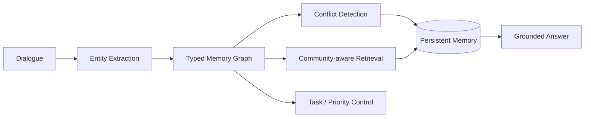
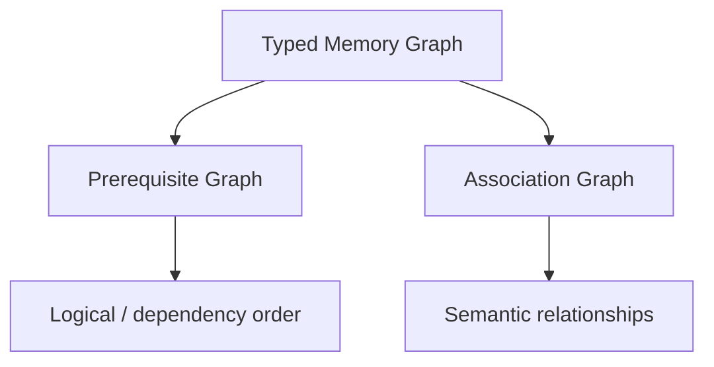
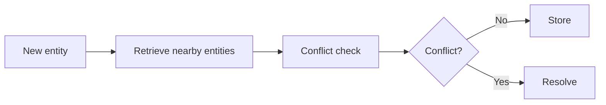

# Part B — Paper 6
## *Accurate and Efficient Long-Term Memory for LLM Agents*

**Framework:** MOSAIC — *Memory-Organized Structured Agent for Information Collection*  
**Paper:** arXiv:2607.16211v1 — 15 May 2026

> **Read this paper for one main reason:** MOSAIC combines **structured memory, ingestion-time conflict detection, efficient retrieval, and task-state tracking**.

---

# 1. The problem

The paper identifies three weaknesses in existing long-term memory systems:

```text
1. Flat storage
   → relationships between memories are lost

2. Passive ingestion
   → new information is stored without checking conflicts

3. Monolithic retrieval
   → flat semantic search is weak for multi-hop / temporal reasoning
```

The authors also identify a fourth issue for structured information-gathering tasks:

> **Memory of facts is not enough; the agent also needs a persistent representation of which required information has been obtained, what is still missing, and which dependencies affect what should be asked next.**

fileciteturn47file0L86-L111

---

# 2. MOSAIC architecture



The main components are:

**Typed graph + conflict detection + hash-accelerated retrieval**

The paper presents these as the three core capabilities of MOSAIC. fileciteturn47file0L105-L123

---

# 3. Entity-typed memory graph

Each memory is represented as a typed entity node.

Types are:

```text
Event
Persona
Relationship
```

A node contains:

```text
entity content
type
embedding
confidence
last-update timestamp
```

Edges represent relationships such as:

- temporal
- causal
- associative

The paper separates the graph into two complementary subgraphs.

### Prerequisite graph `GP`

Represents:

> **What must be resolved before something else can be meaningfully queried?**

### Association graph `GA`

Represents:

> **What information is semantically related?**



This separation is important because the paper treats **dependency** and **semantic association** as different relationships. fileciteturn47file0L209-L243

---

# 4. Neighbor-Conditioned Stability (NCS)

This is the paper's main theoretical idea.

The rule is:

> **A node only needs to be re-evaluated when one of its graph neighbors changes.**

```text
Neighbor unchanged
      ↓
Node remains stable
      ↓
No recomputation

Neighbor changed
      ↓
Mark node "dirty"
      ↓
Re-score it
```

The paper implements this using a **dirty flag**.

This reduces re-evaluation from reasoning over the whole graph to the local update frontier.

The paper states the per-turn cost becomes proportional to the affected neighborhood rather than the total graph size.

fileciteturn47file0L244-L272

---

# 5. Conflict detection — the most important practical idea

MOSAIC checks a new memory **when it is being saved**.



For each nearby candidate, an LLM checks for:

- numerical contradiction
- semantic contradiction
- logical contradiction

If a conflict exists, the system can:

```text
Update old memory
OR
Reject new memory
OR
Flag both for review
```

The paper describes this as a **firewall** against error compounding because the contradiction is handled before it reaches later retrieval/reasoning stages.

fileciteturn47file0L294-L312

---

# 6. Confidence gating

Every extracted value receives a confidence score based on:

```text
Directness
+
Consistency
+
Specificity
```

If:

`confidence < 0.6`

the value is treated as unreliable and the system can trigger targeted clarification instead of committing it to memory.

The stored entity can also keep:

- confidence
- timestamp
- source turn
- evidence snippet
- belief distribution

So MOSAIC does not store only:

```text
fact = value
```

It keeps supporting metadata around the fact.

fileciteturn47file0L313-L340 fileciteturn47file0L349-L364

---

# 7. Community-aware retrieval

At query time:

```text
Query
 ↓
Find relevant community
 ↓
Retrieve relevant entities
 ↓
Traverse graph relationships
 ↓
Build multi-hop evidence
```

This uses:

**community detection + embedding similarity + graph traversal**

The purpose is to exploit relationships that flat semantic retrieval does not explicitly represent.

fileciteturn47file0L341-L364

---

# 8. Main results

## LoCoMo

MOSAIC reports:

**89.35% overall accuracy**

Compared with:

**Mem0: 62.14%**

The paper reports especially large improvements on:

- **multi-hop**
- **temporal**

From the paper's Table 1:

```text
MOSAIC multi-hop  = 81.56%
MOSAIC temporal   = 90.34%
MOSAIC single-hop = 92.87%
```

The paper's Figure 2 on page 7 visually shows MOSAIC's higher scores across the four categories and overall.

fileciteturn47file0L451-L460 fileciteturn47file0L510-L540

---

# 9. HaluMem results

On **HaluMem-Medium**, MOSAIC reports:

```text
Extraction F1       = 86.77%
QA correctness      = 73.10%
QA hallucination    = 10.17%
QA omission         = 16.74%
```

On **HaluMem-Long**:

```text
Extraction F1       = 85.84%
QA correctness      = 70.75%
QA hallucination    = 9.58%
QA omission         = 19.67%
```

The paper notes an important limitation:

> On HaluMem-Medium, MOSAIC's **memory updating** is still weaker than MemOS on update correctness and omission.

So the graph clearly helps extraction and retrieval-backed answering, while the write/update path remains an area for improvement.

fileciteturn47file0L548-L589

---

# 10. Conflict-detection experiment

The authors manually inject **50 factual errors** into hypertension clinical guidelines.

Types:

```text
14 numerical
13 semantic
23 logical
```

MOSAIC detects:

**33 / 50 = 66%**

Best baseline:

**14%**

The paper's Figure 4 shows that MOSAIC detects:

**72.7% implicit conflicts**  
**64.1% explicit conflicts**

The paper also analyzes missed conflicts:

```text
~60% → contradictions outside the k-nearest search radius
~40% → numerical conflicts that remain plausible
```

So even MOSAIC's conflict detector is not complete.

fileciteturn47file0L605-L634 fileciteturn47file0L709-L722

---

# 11. Why this paper is useful for our architecture

MOSAIC gives us four concrete ideas:

### 1. Structured memory
Represent entities and their relationships explicitly.

### 2. Save-time validation
Check new information against existing related information **before committing it**.

### 3. Confidence + evidence
Keep not only the value, but also where it came from and how confident the system is.

### 4. Local updates
When something changes, re-evaluate only the affected neighborhood instead of everything.


---

# 12. Connection to our previous papers

```text
A-MAC
→ admission decision

Mem0
→ memory update operations

Zep
→ temporal graph representation

SimpleMem / LightMem
→ compression + efficient processing

TRUSTMEM
→ verify memory transitions

StateMem
→ supersession + dependency tracking

MemConflict
→ conflict-aware validity

HaluMem
→ operation-level evaluation

MOSAIC
→ structured graph + save-time conflict detection
   + local state updates
```

MOSAIC therefore combines several themes we have already seen, but its distinctive contribution is **conflict detection at ingestion + graph-based organization + local re-evaluation**.

---

# 13. Important limitation

The paper itself notes:

- the conflict benchmark uses **one domain** and only 50 injected errors
- the LoCoMo evaluation uses a fixed set of 10 conversations
- the evaluated MOSAIC implementation uses one LLM family
- HaluMem update performance is still mixed
- open-domain performance is lower than its conversation-grounded strengths

fileciteturn47file0L839-L858

So the results are useful evidence, but not proof that a graph-based architecture is universally optimal.

---

# 14. 6 things to remember

1. **Flat memory loses relationships needed for multi-hop and temporal reasoning.**
2. **New information should be checked against related existing information before storage.**
3. **Memory entries can carry confidence, timestamps, sources, and evidence.**
4. **Graph neighbors can determine which parts of memory need re-evaluation.**
5. **Graph-based retrieval helps combine related information across turns.**
6. **MOSAIC shows strong reported results, but conflict detection and write-time updating remain imperfect.**

---

# PPT — 5 slides

## Slide 1 — Problem
**Flat + passive memory → contradictions + weak relational reasoning**

## Slide 2 — MOSAIC architecture
**Entity extraction → typed graph → conflict detection → retrieval**

## Slide 3 — Conflict detection
**New fact → neighbors → conflict check → update / reject / review**

## Slide 4 — Results
**LoCoMo + HaluMem + 66% conflict detection**

## Slide 5 — Project relevance
**Structured memory + save-time validation + confidence/evidence + local updates**

---

# Read these sections

**Must read:** §3.1 Problem Formulation, §3.2 Entity-Typed Memory Graph, §3.3 NCS, §3.5 Conflict Detection, §3.6 Confidence Gating, §3.7 Community Retrieval, §5.1–5.3 Results.

**Skim:** §3.4 scoring, §3.9 convergence.

**Skip initially:** most Related Work and detailed mathematical proofs.
