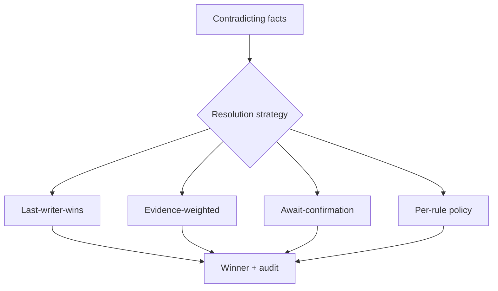
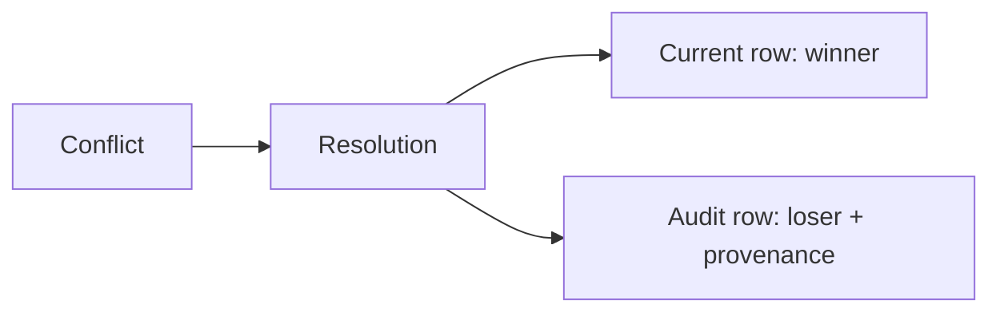
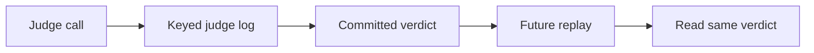
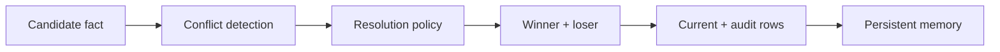

# Part B — Paper 7
## *TOKI: A Bitemporal Operator Algebra for Contradiction Resolution in LLM-Agent Persistent Memory*

**Author:** Ziming Wang  
**Paper:** arXiv:2606.06240v1 — 4 Jun 2026

> **Read this paper for one main reason:** TOKI treats memory contradiction handling as a **write-time correctness problem**. It asks not only *which fact wins*, but also *how the system preserves history, provenance, and reproducibility of that decision*.

---

# 1. What problem is TOKI solving?

A persistent memory system can receive:

```text
Old fact:
Alice → medication → penicillin

New fact:
Alice → medication → amoxicillin
```

Both cannot be the active value when their valid-time periods overlap.

The paper argues that contradiction resolution is not merely a retrieval problem. It is a **write-time data-management problem**.

Without proper handling, three failures can occur:

```text
1. Replay inconsistency
   Same contradiction → different winner later

2. Belief-drift skew
   Concurrent updates corrupt the stored belief state

3. Audit erasure
   The losing fact disappears permanently
```

These are the paper's three agent-memory-specific anomalies: **N1, N2, N3**. fileciteturn49file0L9-L34

---

# 2. The key concept: bitemporal memory

TOKI represents a memory fact with **two time dimensions**:

```text
Valid time
→ When was this fact true?

System time
→ When did the memory system store/change it?
```

A fact therefore carries:

```text
subject
predicate
object
valid-time period
system-time period
provenance
confidence
```

Two facts are contradictory when they:

- have the same subject + predicate
- have different objects
- have overlapping valid-time periods

Example:

```text
(alice, medication, penicillin)
(alice, medication, amoxicillin)
```

The paper's running example shows the winner becoming the current row while the losing fact remains recoverable in an audit row. fileciteturn49file0L145-L174

---

# 3. Four contradiction-resolution strategies

TOKI turns four existing resolution strategies into typed operators:

| Strategy | Basic idea |
|---|---|
| **Last-writer-wins** | Later write wins |
| **Evidence-weighted** | Higher-confidence evidence wins |
| **Await-confirmation** | Wait for an external confirmation |
| **Per-rule policy** | Follow an explicit policy |

The important contribution is that each strategy gets an explicit **isolation requirement** and records its provenance.

Conceptually:



The paper's Table 1 maps these operators to isolation assumptions and the anomalies that weaker isolation can admit. fileciteturn49file0L46-L54

---

# 4. Dual-row schema — probably the most useful implementation idea

When a conflict is resolved, TOKI does **not simply overwrite the old fact**.

It stores two logical rows in one physical table:

```text
CURRENT ROW
→ winning fact

AUDIT ROW
→ losing fact + provenance + strategy + system time
```



Normal retrieval sees only:

**`row_kind = current`**

The audit information is available through a separate audit view.

This directly addresses **N3: audit erasure**.

fileciteturn49file0L204-L239

---

# 5. Why logging the LLM judge matters

Some resolution strategies use an LLM/external judge.

The paper argues:

> Calling the same stochastic judge again can produce a different winner.

Example:

```text
First call:
A wins

Later replay:
B wins
```

TOKI therefore **logs the judge decision** using a key containing the relevant inputs/decoder parameters.



The paper's theorem says that, within its stated relational schedule model and for a boundedly nondeterministic judge, this keyed-log discipline is necessary for replay consistency.

Important scope:

**This theorem does not cover deterministic judges, offline precomputed verdicts, or every possible source of model drift.** fileciteturn49file0L131-L140 fileciteturn49file0L779-L814

---

# 6. The practical write path

The paper's Algorithm 1 can be reduced to:

```text
New fact arrives
      ↓
Find current fact(s) on same subject+predicate
      ↓
Duplicate?
  ├─ Yes → no new state
  └─ No
      ↓
Contradiction?
  ├─ No → insert as current
  └─ Yes
      ↓
Choose typed resolution operator
      ↓
Record judge result if needed
      ↓
Select winner / loser
      ↓
Close loser
      ↓
Insert winner
      ↓
Insert audit row
      ↓
Commit
```

The paper also enforces a binary-incumbent precondition in its incremental implementation: more than one conflicting incumbent causes an explicit error rather than silently guessing. fileciteturn49file0L824-L860

---

# 7. What the experiments actually show

TOKI evaluates:

- eight memory/system designs for the anomaly study
- controlled mechanism tests
- scaling
- provenance representation
- theorem-boundary grids
- a limited cross-system utility comparison

### Important findings

**Audit-row defence:**  
Moves the paper's selected natural-workload LoCoMo slice by **+0.86**.

**Memory-layer ablation:**  
On 1,444 answerable LoCoMo questions:

```text
With typed memory   = 0.540
Without memory      = 0.048
Δ                   = +0.492
```

The paper presents these as mechanism/ablation evidence, not as a broad head-to-head superiority claim. fileciteturn49file0L131-L140 fileciteturn49file0L629-L682

---

# 8. The cross-system result needs careful interpretation

The paper's cross-system LoCoMo comparison is explicitly **underpowered**.

It reports confidence intervals covering zero for the measured comparisons and therefore makes **no utility-superiority claim**.

So for our project:

> Use TOKI mainly for the **write-time correctness contract**, not as evidence that its entire memory architecture is better than every other system.

This limitation is explicitly stated in §4.6 and §6. fileciteturn49file0L723-L744

---

# 9. What TOKI adds to our architecture research

Our earlier papers mostly asked:

```text
Should memory be stored?
How should it be updated?
Which memory is current?
How should conflicts be detected?
```

TOKI adds:

> **What guarantees should the storage layer provide while resolving a conflict?**

Useful ideas:

```text
Bitemporal timestamps
        +
Explicit resolution policy
        +
Audit trail
        +
Judge-decision logging
        +
Transactional isolation
```

So a more complete write path becomes:



---

# 10. Relation to our previous papers

```text
A-MAC
→ Should the candidate be admitted?

Mem0
→ Which memory operation should happen?

Zep / StateMem
→ How should temporal state be represented?

TRUSTMEM
→ Was the memory transition trustworthy?

MemConflict
→ Which competing memory is valid?

MOSAIC
→ Detect conflicts at save time

TOKI
→ What write-time correctness contract should contradiction
  resolution satisfy?
```

TOKI is therefore especially relevant to the **storage/write consistency layer** of our final architecture.

---

# 11. Do not copy the full theory into our project

Most of this paper is formal database theory.

For our project, you do **not** need to deeply study:

- all Berenson–Adya anomaly proofs
- K-semiring mathematics
- theorem proofs
- every appendix witness
- carrier-degree formalism

The architecture-relevant concepts are:

**bitemporal facts → typed resolution operators → audit rows → keyed judge log → transactional write path.**

---

# 12. 6 things to remember

1. **Contradiction resolution is a write-time problem, not only a retrieval problem.**
2. **Store both valid time and system time.**
3. **Do not erase the losing fact; preserve an auditable record.**
4. **If an LLM judge is used, repeated stochastic decisions need a stable logged verdict in the paper's model.**
5. **Make the resolution strategy explicit: last-write, evidence, confirmation, or policy.**
6. **TOKI mainly contributes a correctness contract for the memory write layer.**

---

# PPT — 5 slides

## Slide 1 — Problem
**Contradictory memories + unsafe writes → persistent inconsistency**

## Slide 2 — Bitemporal fact
```text
Fact + Valid Time + System Time + Provenance
```

## Slide 3 — Four resolution operators
**LWW | Evidence | Await | Policy**

## Slide 4 — Dual-row write
```text
Winner → Current
Loser  → Audit
Judge  → Keyed log
```

## Slide 5 — Project relevance
**Add a storage-level correctness/audit layer around conflict resolution.**

---

# Read these sections

**Must read:** §1 Introduction, §2.1 Bitemporal facts, §3.1 Dual-row schema, §3.2 Four operators, §3.4 Toki System.

**Skim:** §3.3 Soundness, §4.1–4.2 empirical validation.

**Skip initially:** most proofs and appendices.
