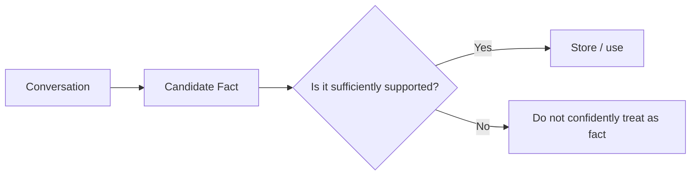
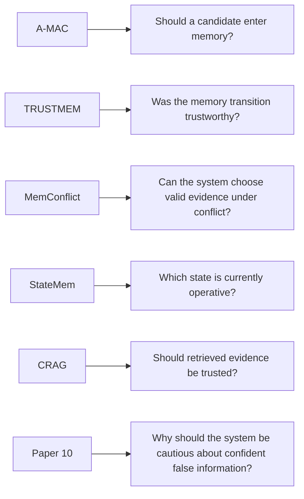

# Paper 10 — Concise Study Guide
## *Why Language Models Hallucinate*

**Authors:** Adam Tauman Kalai, Ofir Nachum, Santosh S. Vempala, Edwin Zhang  
**Date:** 4 September 2025  
**Paper:** arXiv:2509.04664v1

> **Scope:** This guide includes only the parts of the paper that are directly useful for our persistent-memory project. It explains the paper simply and does not add outside material.

---

# 1. Why this paper matters to our project

This paper is **not a memory architecture paper**.

Its relevance is the question:

> **Why can an LLM produce confident false information, even when it should say that it does not know?**

That matters for our project because persistent memory can turn an LLM mistake into **stored information that may be reused later**.

The paper's main argument is that hallucinations are partly explained by how models are **trained and evaluated**:

```text
Training
   ↓
Model learns to generate plausible responses

Evaluation
   ↓
Correct answer = reward
Uncertainty / IDK = often no reward

   ↓
Model has an incentive to guess
```

The authors argue that this creates pressure toward **guessing instead of acknowledging uncertainty**.

**Paper:** Abstract + Introduction, pp. 1–4. fileciteturn28file0L12-L25

---

# 2. The key idea: hallucination is connected to classification error

The paper introduces an **Is-It-Valid (IIV)** binary classification problem.

Very simply:

```text
Candidate response
       ↓
Is it valid?
   ┌───┴───┐
  YES      NO
```

The authors use this connection to analyze why generative models can produce errors.

Their theoretical relationship is:

`generative error rate ≳ 2 × IIV misclassification rate`

This is a theoretical result under the paper's stated assumptions.

### Why this is useful for us

The paper's important practical message is:

> **A system must distinguish “plausible” from “valid,” not merely generate plausible-looking text.**

**Paper:** pp. 2–3, §3.1. fileciteturn28file0L78-L82 fileciteturn28file0L183-L205

---

# 3. Why training data quality matters

The paper says training corpora can contain:

- errors
- half-truths
- arbitrary facts that are difficult to learn from limited examples

It then makes a stronger point:

> Even with **error-free training data**, the statistical objective used in pretraining can still produce some errors.

With realistic noisy data, the paper says higher error rates may be expected.

This means hallucination is not explained only by:

```text
"the training data contained a wrong fact"
```

The paper argues that the training objective itself contributes to error.

**Paper:** pp. 2, 5–6. fileciteturn28file0L53-L64 fileciteturn28file0L288-L318

---

# 4. Three useful error factors from the paper

The paper discusses several statistical causes.

For our project, remember these three:

## A. Arbitrary facts

Some facts have no useful pattern that a model can learn.

The paper uses birthdays as an example.

If a fact appears rarely in training, the model may have insufficient evidence to reproduce it correctly.

The paper derives a lower-bound involving the **singleton rate**: the fraction of prompts that appear exactly once in the training data.

### Project relevance

A model's confidence should not automatically be treated as evidence that a stored fact is correct.

---

## B. Poor models

Errors can also happen because the model:

- cannot represent the required concept well, or
- is not sufficiently fitted to it

The paper uses letter-counting as an example.

---

## C. Garbage in, garbage out

If training data contains factual errors, models can reproduce those errors.

The paper explicitly identifies this as a factor under **GIGO**.

**Paper:** §3.3–3.4, pp. 9–12. fileciteturn28file0L472-L489 fileciteturn28file0L610-L635

---

# 5. Distribution shift

The paper also points to **distribution shift**.

In simple language:

```text
Training examples
       ↓
Model learns patterns

New question is very different
       ↓
Model may perform poorly
```

The paper describes out-of-distribution prompts as another source of error.

### Project relevance

A memory system that works well on one type of conversation should not automatically be assumed to behave correctly on every domain or interaction pattern.

**Paper:** §3.4, p. 12. fileciteturn28file0L613-L625

---

# 6. The most important section for our project: uncertainty

The paper argues that many existing evaluations use **binary grading**:

```text
Correct → 1
Wrong   → 0
```

An uncertain response such as:

```text
"I don't know"
```

usually receives zero.

The paper's argument is that this creates the wrong incentive.

Consider:

```text
Model A:
"I don't know."

Model B:
"The answer is X."
```

If X has only a 40% chance of being correct:

Under strict 0/1 scoring:

```text
A → 0
B → expected score 0.40
```

So guessing is favored.

The authors formalize this result as **Observation 1**: under binary grading, the optimal response is not to abstain.

**Paper:** §4.1, pp. 12–14. fileciteturn28file0L636-L676

---

# 7. What the authors propose: explicit confidence targets

The paper proposes modifying evaluation instructions.

Instead of:

```text
Answer the question.
```

the evaluation can specify a confidence target.

Conceptually:

```text
Only answer when your confidence > threshold
```

The paper gives examples such as:

- 0.5
- 0.75
- 0.9

and assigns stronger penalties to incorrect answers at higher confidence targets.

The goal is to reward **appropriate uncertainty** instead of always rewarding a guess.

The paper calls this **behavioral calibration**:

> The model should provide an answer only when it is sufficiently confident for the specified threshold.

**Paper:** §4.2, pp. 13–15. fileciteturn28file0L677-L729 fileciteturn28file0L741-L746

---

# 8. Why this matters for memory

The paper's main focus is model hallucination, but the idea maps directly to a memory pipeline:



The paper does not propose this exact memory gate.

The project-level connection is:

> **An LLM-generated statement should not automatically become trusted persistent knowledge merely because it sounds plausible.**

That distinction is consistent with the paper's discussion of valid vs erroneous responses, uncertainty, and overconfident guessing.

**Paper:** pp. 1–4, 12–15. fileciteturn28file0L12-L25 fileciteturn28file0L644-L676

---

# 9. RAG and search do not completely solve hallucination

This is especially relevant because we are studying retrieval-based memory.

The paper explicitly says:

> **Search and reasoning are not panaceas.**

Its argument is:

```text
Retrieve information
       ↓
Model still has to decide what to say
       ↓
Binary evaluation may still reward guessing
```

The paper also notes that search may not help with certain errors, such as its letter-counting example.

So retrieval can help ground generation, but it does not eliminate the underlying issue automatically.

**Paper:** §5, p. 15. fileciteturn28file0L762-L768

---

# 10. Important limitation: this is not a memory paper

The paper itself is mainly about **language-model hallucination mechanisms and evaluation incentives**.

It does **not** provide:

- a persistent memory architecture
- a memory database design
- a memory admission algorithm
- a memory conflict-resolution system
- a memory retrieval benchmark

Therefore, do not use this paper to justify a complete memory architecture.

Use it to support a narrower architectural concern:

> **Persistent memory needs safeguards against unsupported or uncertain information becoming trusted knowledge.**

---

# 11. How this connects to our previous papers



Paper 10 therefore strengthens the **reliability rationale** behind the other memory papers, rather than providing another memory architecture.

---

# 12. Paper 10 — 7 things to remember

1. **Hallucination can arise from statistical learning pressures, not only bad data.**
2. **Plausible output is not the same as valid output.**
3. **Rare/arbitrary facts are particularly difficult to learn.**
4. **Distribution shift can increase errors.**
5. **Binary evaluation can reward guessing instead of uncertainty.**
6. **Explicit confidence targets can encourage more appropriate abstention.**
7. **For our project, LLM-generated candidate memories should not automatically be treated as trusted facts.**

---

# 13. PPT structure

## Slide 1 — Problem
**Why do LLMs confidently produce false information?**

## Slide 2 — Core idea

```text
Plausible ≠ Valid
```

## Slide 3 — Causes

**Arbitrary facts | Poor model | GIGO | Distribution shift**

## Slide 4 — Evaluation problem

```text
0/1 grading
    ↓
Guessing is rewarded
    ↓
Uncertainty is penalized
```

## Slide 5 — Proposed evaluation change

**Explicit confidence targets → behavioral calibration**

## Slide 6 — Relevance to our project

**Candidate memory should be treated according to evidence/support, not merely plausibility.**

---

# Reading priority

### Must read
**§1 Introduction**  
**§3.1 IIV reduction**  
**§3.3 Error factors**  
**§3.4 Additional factors**  
**§4.1 How evaluations reinforce hallucination**  
**§4.2 Explicit confidence targets**

### Read briefly
**§5 Discussion and limitations**

### Skip initially
Most of the mathematical proofs and detailed theoretical derivations.

---

# Source map

| Topic | Pages |
|---|---:|
| Motivation | 1–4 |
| IIV / validity classification | 2–8 |
| Arbitrary facts | 9–10 |
| Poor models | 10–11 |
| Distribution shift + GIGO | 12 |
| Evaluation incentives | 12–14 |
| Confidence targets | 13–15 |
| Limitations / RAG | 15–16 |
| Conclusion | 16 |
