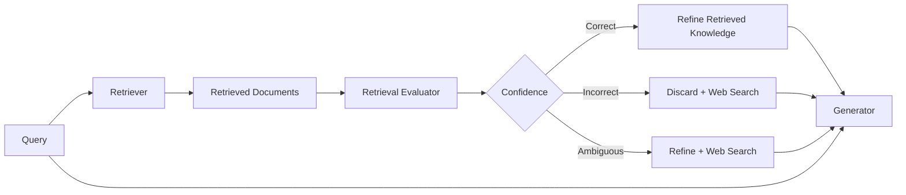
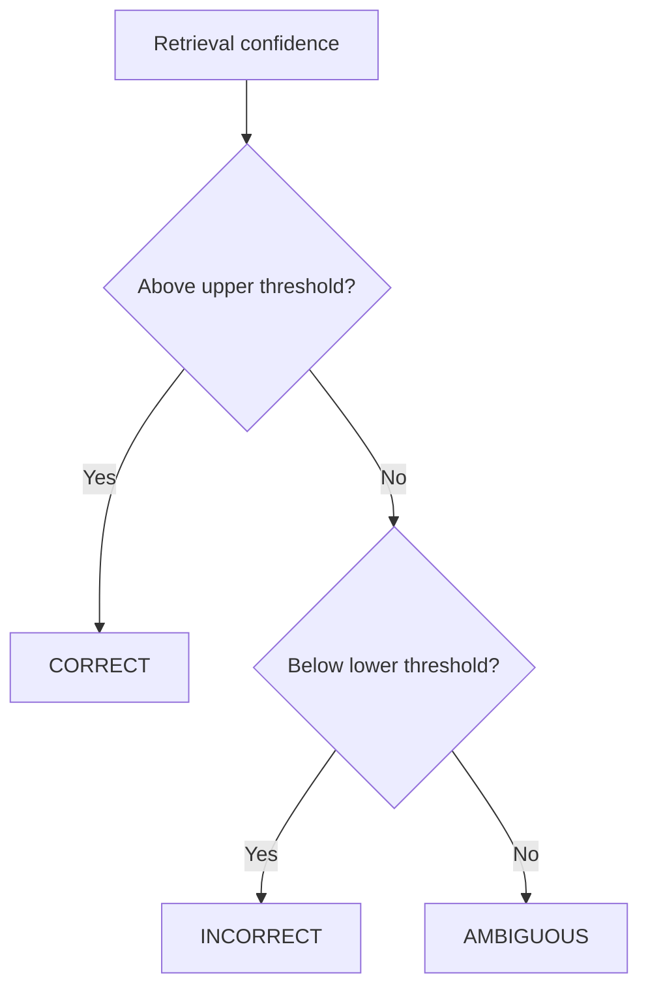
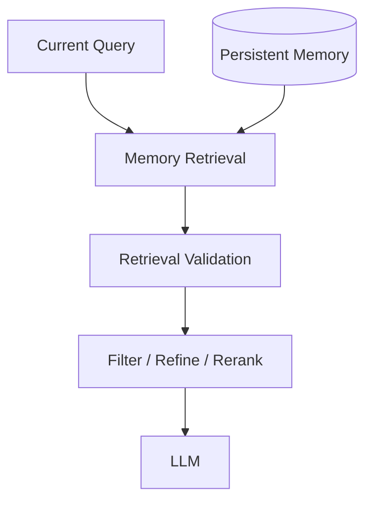
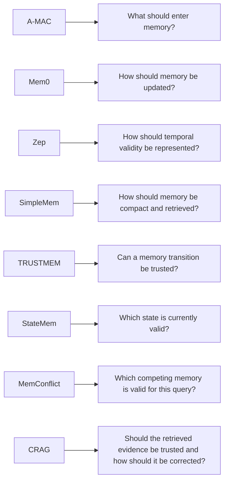

# Paper 9 — Concise Study Guide
## *Corrective Retrieval Augmented Generation (CRAG)*

**Authors:** Shi-Qi Yan, Jia-Chen Gu, Yun Zhu, Zhen-Hua Ling  
**Paper:** arXiv:2401.15884v3 — 7 Oct 2024

> **Scope:** This guide contains only the parts of CRAG that are useful for our memory/retrieval architecture. It explains the paper simply without adding outside material.

---

# 1. First: what is CRAG actually solving?

CRAG is **not a long-term memory architecture**.

It solves a **retrieval-quality problem**:

> What should an RAG system do when the retrieved documents are irrelevant, incomplete, or noisy?

The paper argues that standard RAG often assumes the retriever is correct:

```text
Query
  ↓
Retriever
  ↓
Retrieved documents
  ↓
Generator
```

If retrieval is wrong:

```text
Wrong documents
      ↓
Generator sees misleading information
      ↓
Possible factual error / hallucination
```

CRAG adds a **retrieval evaluator** before generation.

**Paper:** pp. 1–3

---

# 2. The main CRAG architecture



The system has four important stages:

**Evaluate → Decide → Correct/Refine → Generate**

The paper makes the correction decision **before the generator uses the retrieved knowledge**.

**Paper:** §4.1, p. 3 and Figure 2, p. 4

---

# 3. The Retrieval Evaluator

The evaluator checks the relevance of each retrieved document to the query.

The paper uses a **T5-large model** that is fine-tuned for this task.

For each retrieved document:

```text
(query, document)
       ↓
retrieval evaluator
       ↓
relevance score
```

The evaluator is deliberately much smaller than the large generator models used in the experiments.

The paper reports the evaluator as a **0.77B-parameter** model.

### Why this matters

The paper does not assume that the generator itself should decide whether retrieval is good.

It adds a separate component whose job is specifically:

> **Judge the quality of retrieved knowledge.**

**Paper:** §4.2, p. 4

---

# 4. Confidence and the three actions

After individual document scores are produced, CRAG calculates an overall confidence judgment.

There are three possible states:

```text
CORRECT
INCORRECT
AMBIGUOUS
```

The paper uses an upper and lower threshold.



The three actions are important because the authors found that simply making a binary decision was too sensitive to evaluator errors.

The **Ambiguous** action provides an intermediate response instead of forcing a hard switch.

**Paper:** §4.3, pp. 4–6

---

# 5. Action 1 — CORRECT

If at least one retrieved document has sufficiently high confidence:

```text
CORRECT
   ↓
Use retrieved documents
   ↓
But refine them first
```

Why refine?

Even a relevant document may contain a lot of information that is unrelated to the current query.

So CRAG does not simply pass the complete document to the generator.

**Paper:** §4.3–4.4, pp. 5–6

---

# 6. Knowledge Refinement

This is a very useful idea for our project.

CRAG uses:

**Decompose → Filter → Recompose**


### Step 1 — Decompose

A document is split into smaller pieces called **knowledge strips**.

A very short document may remain one strip.

---

### Step 2 — Filter

The same retrieval evaluator scores each strip for relevance.

Irrelevant strips are removed.

---

### Step 3 — Recompose

The relevant strips are concatenated in their original order.

The resulting text is called **internal knowledge**.

### Core idea

```text
Relevant document
≠
Every sentence inside the document is relevant
```

So CRAG improves knowledge **utilization**, not only document retrieval.

**Paper:** §4.4, p. 6

---

# 7. Action 2 — INCORRECT

If all retrieved documents have confidence below the lower threshold:

```text
INCORRECT
   ↓
Discard retrieved knowledge
   ↓
Do not remain stuck with bad retrieval
   ↓
Search the web
```

The paper's reasoning is:

If the system recognizes that its current retrieved evidence is unreliable, continuing to use it can encourage fabricated answers.

Therefore, CRAG uses **web search as a corrective source**.

**Paper:** §4.3, p. 5 and §4.5, p. 6

---

# 8. Web Search

The query is rewritten into a keyword-oriented search query.

Example from the paper's Figure 2:

```text
Original question
        ↓
Query rewriting
        ↓
"Death of a Batman; screenwriter; Wikipedia"
        ↓
Web search
        ↓
External knowledge
```

CRAG then:

1. searches the web
2. obtains URLs
3. retrieves page content
4. applies the same knowledge-refinement process
5. keeps the relevant web knowledge

The paper notes that web search can introduce unreliable information, so it prefers authoritative/regulated pages such as Wikipedia in this implementation.

**Paper:** §4.5, p. 6

---

# 9. Action 3 — AMBIGUOUS

This is the middle case.

The evaluator is not sufficiently confident that retrieval is either clearly good or clearly bad.

So CRAG combines both sources:

```text
AMBIGUOUS
   ↓
Retrieved knowledge
      +
External web knowledge
   ↓
Generator
```

This is important because the paper found that a hard Correct/Incorrect switch made the system too dependent on evaluator accuracy.

**Paper:** §4.3, pp. 5–6

---

# 10. Complete CRAG inference logic

The paper's Algorithm 1 can be simplified to:

```text
Input:
    query + retrieved documents

1. Score each retrieved document.
2. Convert scores into:
       CORRECT / INCORRECT / AMBIGUOUS

3. CORRECT:
       refine retrieved knowledge

4. INCORRECT:
       discard retrieved knowledge
       rewrite query
       web search
       refine web results

5. AMBIGUOUS:
       refine retrieved knowledge
       +
       web search + refinement

6. Generate final response
```

The important architectural principle is:

> **Evaluate retrieval before trusting retrieval.**

**Paper:** Algorithm 1, p. 5

---

# 11. Experimental setup

CRAG is evaluated on four datasets:

| Dataset | Task |
|---|---|
| **PopQA** | Short-form question answering |
| **Biography** | Long-form generation |
| **PubHealth** | True/false questions |
| **Arc-Challenge** | Multiple-choice questions |

The paper uses **accuracy** for PopQA, PubHealth, and Arc-Challenge, and **FactScore** for Biography.

The same retrieval results from Contriever are used in the main comparison so that the difference comes from how CRAG processes the retrieval results.

**Paper:** §5.1–5.2, pp. 6–7

---

# 12. Main results

For **SelfRAG-LLaMA2-7B**:

| Method | PopQA | Biography | PubHealth | Arc-Challenge |
|---|---:|---:|---:|---:|
| RAG | 52.8 | 59.2 | 39.0 | 53.2 |
| CRAG | **59.8** | **74.1** | **75.6** | **68.6** |

For **LLaMA2-hf-7B**:

| Method | PopQA | Biography | PubHealth | Arc-Challenge |
|---|---:|---:|---:|---:|
| RAG | 50.5 | 44.9 | 48.9 | 43.4 |
| CRAG | **54.9** | **47.7** | **59.5** | **53.7** |

These are the paper's reported experimental results.

The authors conclude that CRAG improves both standard RAG and Self-RAG in their evaluated setups.

**Paper:** §5.3, pp. 7–8

---

# 13. Ablation: do all three actions matter?

Yes, in the paper's experiment.

Removing any one of:

- **Correct**
- **Incorrect**
- **Ambiguous**

caused a drop in PopQA accuracy.

For example with LLaMA2-hf-7B:

```text
CRAG            54.9
without Correct 53.2
without Incorrect 54.4
without Ambiguous 54.0
```

The authors use this to support keeping all three retrieval actions.

**Paper:** §5.4, p. 8

---

# 14. Ablation: does knowledge refinement matter?

The paper removes each of:

**document refinement + query rewriting + external-knowledge selection**

For LLaMA2-hf-7B:

```text
CRAG                     54.9
without refinement       49.8
without rewriting        51.7
without selection        50.9
```

So the reported performance decreases when any of these knowledge-utilization operations is removed.

The important architectural lesson is:

> **Retrieval correction and knowledge cleanup are separate operations.**

**Paper:** §5.4, pp. 8–9

---

# 15. The evaluator itself matters

The paper compares its T5-based retrieval evaluator with ChatGPT for evaluating retrieval quality on PopQA.

Reported accuracy:

| Evaluator | Accuracy |
|---|---:|
| **T5-based evaluator** | **84.3** |
| ChatGPT | 58.0 |
| ChatGPT-CoT | 62.4 |
| ChatGPT few-shot | 64.7 |

The paper therefore argues that a dedicated lightweight evaluator can be effective for this specific retrieval-evaluation task.

**Paper:** §5.5, p. 9

---

# 16. CRAG improves robustness when retrieval quality falls

The authors deliberately remove some correct retrieval results to simulate a weaker retriever.

They observe:

```text
Retrieval quality ↓
        ↓
Generation quality ↓
```

for both Self-RAG and Self-CRAG.

But the performance of **Self-CRAG decreases more gradually**.

The paper interprets this as improved robustness to imperfect retrieval.

**Paper:** §5.6, p. 9

---

# 17. Computational cost

The paper measures the extra computation introduced by CRAG.

Reported average execution time:

| Method | Time / instance |
|---|---:|
| RAG | 0.363 s |
| **CRAG** | **0.512 s** |
| Self-RAG | 0.741 s |
| Self-CRAG | 0.908 s |

The paper presents CRAG as a relatively lightweight addition compared with the more involved Self-RAG approach.

Important limitation:

> The reported FLOPs concern the **generation phase**; retrieval/data-processing costs are not included in that table.

**Paper:** §5.8, p. 10

---

# 18. What CRAG gives our project

CRAG is useful mainly for the **retrieval-validation layer**.

Our memory pipeline can conceptually contain:



CRAG gives us a concrete research idea for `V`:

> **Do not assume retrieved memory is reliable just because it was retrieved.**

This connects strongly with the problems identified in our previous papers.

---

# 19. How Paper 9 connects to the papers we already read



CRAG therefore adds a **retrieval-time validation/correction** concept rather than another memory-storage structure.

---

# 20. What this paper does NOT give us

CRAG is not evidence that our final system should use:

- web search
- a T5 evaluator
- the paper's exact thresholds
- the paper's exact Correct/Incorrect/Ambiguous policy

The paper's experiments are on **RAG-based question-answering/generation**, not persistent developer memory.

For our project, the transferable idea is the **architecture principle**:

```text
Retrieve
   ↓
Evaluate retrieved evidence
   ↓
Use / filter / correct
   ↓
Generate
```

not the exact implementation.

---

# 21. Paper 9 — 8 things to remember

1. **RAG can fail when retrieval is wrong.**
2. **CRAG evaluates retrieved evidence before generation.**
3. **It uses three states: Correct, Incorrect, Ambiguous.**
4. **Relevant documents are still refined internally.**
5. **Incorrect retrieval can trigger an external search.**
6. **Ambiguous retrieval combines internal and external knowledge.**
7. **A separate retrieval evaluator can be used instead of relying entirely on the generator.**
8. **For our project, CRAG mainly suggests a retrieval-validation layer.**

---

# 22. PPT structure

## Slide 1 — Problem
**What happens when RAG retrieval is wrong?**

## Slide 2 — CRAG architecture

```text
Query
 ↓
Retrieve
 ↓
Evaluate
 ↓
Correct / Incorrect / Ambiguous
 ↓
Refine / Search / Combine
 ↓
Generate
```

## Slide 3 — Retrieval evaluator
Query + document → relevance score.

## Slide 4 — Three corrective actions

**Correct | Incorrect | Ambiguous**

## Slide 5 — Knowledge refinement

**Decompose → Filter → Recompose**

## Slide 6 — Results
Accuracy improvements + evaluator result + robustness.

## Slide 7 — Relevance to our project

**Validate retrieved memory before giving it to the LLM.**

---

# Reading priority

### Must read
**§4.1 Overview**  
**§4.2 Retrieval Evaluator**  
**§4.3 Action Trigger**  
**§4.4 Knowledge Refinement**  
**§5.3 Results**  
**§5.4 Ablation**

### Read briefly
**§4.5 Web Search**  
**§5.5–5.8**

### Skip initially
Most of **§2 Related Work**, detailed dataset descriptions, and appendices.

---

# Source map

| Topic | Paper pages |
|---|---:|
| Problem / motivation | 1–3 |
| CRAG architecture | 3–5 |
| Retrieval evaluator | 4 |
| Three actions | 5–6 |
| Knowledge refinement | 6 |
| Web search | 6 |
| Main experiments | 6–8 |
| Ablations | 8–9 |
| Evaluator analysis | 9 |
| Robustness | 9 |
| Computation | 10 |
| Conclusion / limitation | 10 |
