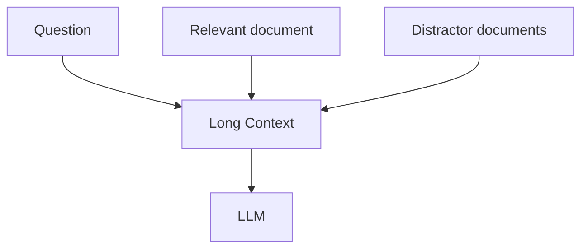

# Part B — Paper 10
## *Lost in the Middle: How Language Models Use Long Contexts*

**Authors:** Nelson F. Liu, Kevin Lin, John Hewitt, Ashwin Paranjape, Michele Bevilacqua, Fabio Petroni, Percy Liang  
**Paper:** arXiv:2307.03172v3 — 20 Nov 2023

> **Why this paper matters:** This paper does not propose a persistent-memory system. Its value for our project is showing that **putting relevant memories into a long context does not guarantee that the LLM will use them correctly**.

---

# 1. The core finding

The paper tests where the relevant information is placed inside a long input context.


The surprising result:

```text
Relevant information at START
        ↓
better performance

Relevant information in MIDDLE
        ↓
much worse performance

Relevant information at END
        ↓
better performance
```

This creates a **U-shaped performance curve**.

The paper calls the two ends:

- **Primacy bias** — better use of information near the beginning
- **Recency bias** — better use of information near the end

**Paper:** Abstract, Figure 1, pp. 1–2. fileciteturn57file0L8-L25 fileciteturn57file0L51-L58

---

# 2. The first experiment: multi-document QA

The setup is deliberately controlled:

```text
1 relevant document
+
k − 1 distractor documents
```

The researchers change only:

**A. number of documents → context length**

**B. position of the relevant document**



The goal is to isolate whether the model can **find and use relevant information inside the context**.

They use **2,655 NaturalQuestions-Open queries** and Wikipedia passages.

**Paper:** §2.1, pp. 3–4. fileciteturn57file0L168-L222

---

# 3. The important result

The paper evaluates contexts containing **10, 20, and 30 documents**.

Performance drops substantially when the answer-containing document is moved toward the middle.

For GPT-3.5-Turbo, the paper reports that in the 20- and 30-document settings, the worst-case performance can fall **below its closed-book accuracy of 56.1%**.

So more context can actually make the answer worse.

**Paper:** §2.3, p. 5. fileciteturn57file0L350-L388

---

# 4. Longer context ≠ better context use

The paper compares normal and extended-context versions of models.

A key observation is:

> **An extended context window does not automatically make a model better at using information inside that window.**

For example, GPT-3.5-Turbo and its 16K version show nearly overlapping position-performance trends when both can fit the context.

So:

```text
Context capacity ↑
≠
Context usage ability ↑
```

**Paper:** §2.3, pp. 5–6. fileciteturn57file0L389-L397

---

# 5. The second experiment: pure retrieval

The authors remove natural-language complexity and create a synthetic task:

```text
JSON:
key1 → value1
key2 → value2
...
keyN → valueN

Query:
keyX

Expected:
valueX
```

Only one key-value pair is relevant.

They test:

- **75 pairs (~4K tokens)**
- **140 pairs (~8K tokens)**
- **300 pairs (~16K tokens)**

Even though this task requires almost no semantic reasoning, several models still show the same U-shaped behavior.

This demonstrates that the problem is not only “understanding a long document.”

It can appear even in **basic retrieval from long input**.

**Paper:** §3.1–3.2, pp. 6–7. fileciteturn57file0L417-L465

---

# 6. Why this matters for our memory retrieval

Suppose our memory system retrieves:

```text
Memory 1
Memory 2
Memory 3
...
Memory 20
```

and puts them all into the LLM prompt.

The paper tells us:

> **Correct retrieval is not sufficient.**

Even if the correct memory is present, its location inside the prompt can affect whether the model uses it.

This is directly relevant to:

- retrieval top-k
- memory ordering
- prompt construction
- reranking

---

# 7. Query-aware contextualization

The authors test placing the query both **before and after** the context.

```text
Query
 ↓
Documents
 ↓
Query
```

This gives decoder-only models access to the query while processing the documents.

### Important result

For the synthetic key-value task:

**near-perfect performance** is achieved.

For multi-document QA:

**the improvement is small** and does not remove the U-shaped pattern.

Therefore, query-aware placement can help certain retrieval tasks, but it is not a general solution to long-context information use.

**Paper:** §4.2, pp. 7–8. fileciteturn57file0L550-L625

---

# 8. More retrieved memories can become noise

The paper's open-domain QA case study compares retriever recall with reader accuracy.

The important pattern is:

```text
Retrieved documents ↑
        ↓
Retriever recall keeps improving

BUT

Reader accuracy
        ↓
saturates much earlier
```

Using more than **20 retrieved documents** gives only about:

- **+1.5%** for GPT-3.5-Turbo
- **+1%** for Claude-1.3

while increasing context length, latency, and cost.

The authors therefore suggest:

**reranking** or **retrieving fewer documents when appropriate**.

**Paper:** §5, pp. 9–10. fileciteturn57file0L693-L747

---

# 9. What this adds to our project

This paper gives a strong reason to avoid:

```text
Retrieve everything relevant
        ↓
Put everything into prompt
```

A better research direction is:


The paper directly supports investigating:

**controlled top-k + reranking + careful memory ordering**

rather than assuming that a larger retrieved context is automatically better.

---

# 10. Connection to our earlier papers

```text
LOCOMO
→ Long conversations are difficult.

MemConflict
→ Competing memories must be correctly selected.

CRAG / SELF-RAG
→ Retrieved evidence should be evaluated.

Ragas
→ Retrieved context quality should be measured separately.

Paper 10
→ Even correct retrieved evidence can be underused
  when buried inside a long context.
```

So this paper mainly strengthens our **retrieval + context-assembly design**.

---

# 11. What this paper does NOT prove

Do not conclude that:

- top-k = 5 is universally optimal
- information should always be placed at the beginning
- reranking alone solves long-context problems
- all newer LLMs behave exactly the same way

The paper evaluates specific models and controlled tasks.

---

# 12. 6 things to remember

1. **LLMs can struggle to use information in the middle of long contexts.**
2. **Relevant information at the beginning/end is often easier to use.**
3. **A larger context window does not guarantee better information use.**
4. **The same positional problem appears even in simple key-value retrieval.**
5. **More retrieved context can add noise without improving answers much.**
6. **For our project, retrieval should be followed by selection/reranking and controlled context assembly.**

---

# PPT — 5 slides

## Slide 1
**Problem: Can LLMs actually use long contexts?**

## Slide 2
**U-shaped performance**
```text
START ↑
       \
        MIDDLE ↓
                 /
               END ↑
```

## Slide 3
**Key-value experiment**
**75 / 140 / 300 pairs**

## Slide 4
**More retrieval ≠ better answers**
Retriever recall keeps rising, reader accuracy saturates.

## Slide 5
**Project relevance**
**Retrieve → Rerank → Small context → LLM**

---

# Read these sections

**Must read:** §1 Introduction, §2.3 Results and Discussion, §3.2 Results and Discussion, §5 Open-Domain QA.

**Skim:** §4.1 Model Architecture, §4.2 Query-aware Contextualization.

**Skip initially:** Most Related Work and detailed model descriptions.
