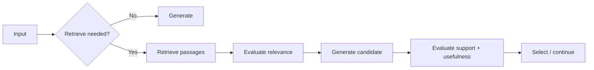
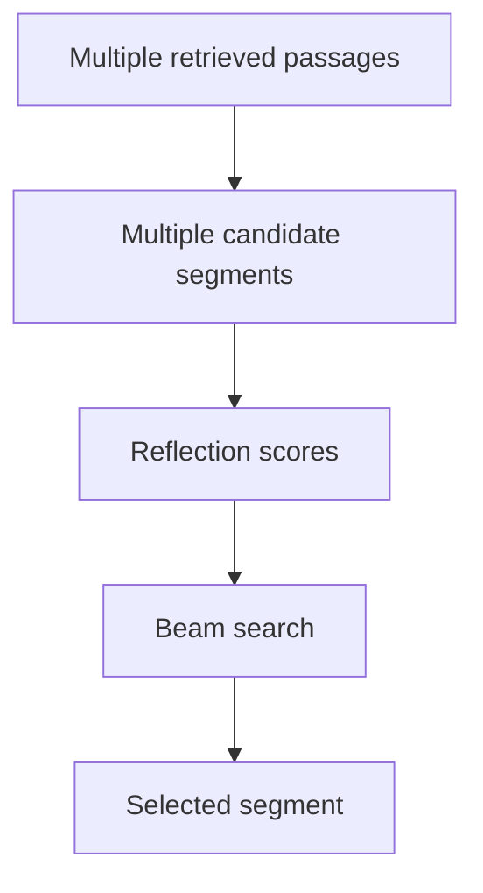

# Part B — Paper 8
## *SELF-RAG: Learning to Retrieve, Generate, and Critique through Self-Reflection*

**Authors:** Akari Asai, Zeqiu Wu, Yizhong Wang, Avirup Sil, Hannaneh Hajishirzi  
**Paper:** arXiv:2310.11511v1 — 17 Oct 2023

> **Why this paper matters:** SELF-RAG is not a persistent-memory architecture. Its useful contribution for our project is the idea of making the agent **decide when retrieval is needed, evaluate retrieved evidence, and critique its own generated output**.

---

# 1. The problem

Standard RAG usually does:

```text
Query
 ↓
Retrieve fixed K passages
 ↓
Give all K to LLM
 ↓
Generate
```

The paper identifies two problems:

**Unnecessary retrieval**

Some questions do not need external information at all.

**Irrelevant retrieval**

Some retrieved passages are unrelated or only partially useful.

There is also another problem:

> The LLM is not explicitly trained to check whether its generated answer is actually supported by the retrieved passages.

SELF-RAG addresses all three through **on-demand retrieval + self-reflection**.

---

# 2. Core architecture



Unlike standard RAG, the model can decide **at inference time** whether retrieval is useful.

The model also produces special **reflection tokens** that control this process.

---

# 3. The four reflection signals

SELF-RAG uses four reflection-token groups.

| Signal | Question |
|---|---|
| **Retrieve** | Should the model retrieve external passages? |
| **ISREL** | Is this retrieved passage relevant? |
| **ISSUP** | Is the generated text supported by the passage? |
| **ISUSE** | Is the generated response useful for the task? |

These signals are generated as part of the model's output vocabulary.

```text
Query
 ↓
Retrieve
 ↓
Passage
 ↓
ISREL
 ↓
Generation
 ↓
ISSUP
 ↓
ISUSE
```

The paper treats these as **reflection tokens**, allowing the model to both generate text and evaluate parts of its own process.

---

# 4. Adaptive retrieval — most relevant part

SELF-RAG does **not** force retrieval on every input.

The model predicts:

```text
Retrieve = Yes / No
```

If retrieval is not useful:

```text
Query
 ↓
Generate directly
```

If retrieval is useful:

```text
Query
 ↓
Retrieve
 ↓
Evaluate passages
 ↓
Generate
```

The paper also allows a **retrieval threshold** at inference time.

If the normalized probability of `Retrieve = Yes` exceeds the threshold, retrieval is triggered.

So retrieval frequency can be adjusted without retraining.

---

# 5. Retrieved passages are evaluated before being trusted

When multiple passages are retrieved, SELF-RAG processes them in parallel.

For every passage:

```text
Query + passage
       ↓
ISREL
       ↓
Relevant / Irrelevant
```

The model then generates a response segment conditioned on the passage and evaluates:

```text
ISSUP
→ Fully supported
→ Partially supported
→ No support
```

This is important:

> **Relevance and support are different checks.**

A passage may be relevant to the query while still not supporting the generated claim.

---

# 6. Critique-guided selection

Suppose the retriever returns:

```text
Passage 1 → relevant
Passage 2 → irrelevant
Passage 3 → partially useful
```

SELF-RAG generates candidate answer segments using the passages and then scores them using:

```text
Generation probability
+
ISREL
+
ISSUP
+
ISUSE
```

The paper uses **segment-level beam search**.

So the system can prefer a response that is:

- well-supported
- relevant
- useful

rather than simply using the highest-probability generated text.



---

# 7. Soft vs hard control

SELF-RAG supports two ways of using reflection scores.

### Soft control

Reflection probabilities are included in the candidate score.

Example:

```text
Higher ISSUP
→ prefer better-supported generation
```

The weights can be changed at inference time.

### Hard control

A candidate can be explicitly filtered out when it produces an undesirable reflection token.

Example:

```text
ISSUP = No support
      ↓
Reject candidate
```

This allows the same trained model to be configured for different priorities.

---

# 8. Training idea

The model is trained to generate both:

```text
normal text
+
reflection tokens
```

The authors first use a **critic model** to create reflection-token annotations offline.

Then the final generator is trained on this augmented dataset with a standard language-model objective.


At inference time, the generator produces the reflection tokens itself, so a separate critic is not required.

The paper says this avoids the need to host the critic during inference.

---

# 9. Main results

SELF-RAG is evaluated on six tasks:

- PopQA
- TriviaQA
- PubHealth
- ARC-Challenge
- Biography generation
- ALCE-ASQA

Reported results for **SELF-RAG 7B**:

```text
PopQA accuracy          = 54.9
TriviaQA accuracy       = 66.4
PubHealth accuracy      = 72.4
ARC-Challenge accuracy  = 67.3
Biography FactScore     = 81.2
ASQA citation precision = 66.9
ASQA citation recall    = 67.8
```

For **SELF-RAG 13B**:

```text
PopQA = 55.8
TriviaQA = 69.3
PubHealth = 74.5
ARC = 73.1
Biography FactScore = 80.2
ASQA citation precision = 70.3
ASQA citation recall = 71.3
```

These are the paper's reported values.

---

# 10. Ablation — remember the pattern

The paper compares several reduced versions.

For PopQA:

```text
SELF-RAG (50k)   = 45.5
No Retriever     = 43.6
No Critic        = 42.6
No Retrieval     = 24.7
Retrieve Top-1   = 41.8
Remove ISSUP     = 44.1
```

The authors conclude that the components are complementary.

In particular:

**Always using one retrieved passage** performs worse than SELF-RAG's selective retrieval and critique.

Removing **ISSUP** also hurts the ASQA result in the reported ablation.

---

# 11. Retrieval frequency is a tunable trade-off

The paper varies the retrieval threshold.

```text
Higher threshold
→ retrieval happens less often

Lower threshold
→ retrieval happens more often
```

The effect on accuracy is task-dependent.

For example, the paper reports that reducing retrieval causes a **smaller performance decline on PubHealth** than on PopQA.

So the correct retrieval frequency depends on the task.

---

# 12. What this paper gives our project

The most useful idea is a **retrieval self-check layer**:


For our memory system, the same pattern could conceptually become:

```text
Query
 ↓
Retrieve memories
 ↓
Check whether retrieved memory is relevant
 ↓
Generate answer
 ↓
Check whether answer is actually supported by memory
```

This is a project-level adaptation of SELF-RAG; the paper itself evaluates document retrieval rather than persistent agent memory.

---

# 13. Connection to Paper 9 — CRAG

The two papers are related but different.

### CRAG

```text
Retriever
 ↓
External evaluator
 ↓
Correct / Incorrect / Ambiguous
 ↓
Refine / Search
```

### SELF-RAG

```text
Model
 ↓
Decide whether to retrieve
 ↓
Evaluate passages
 ↓
Generate
 ↓
Self-critique
 ↓
Select
```

The important distinction is:

**CRAG adds an external retrieval evaluator.**

**SELF-RAG trains the generator itself to perform retrieval decisions and critique.**

---

# 14. What this paper does NOT prove

Do not conclude that:

- self-reflection is always better than an external evaluator
- retrieval should always be adaptive
- reflection tokens are necessary for persistent memory
- the exact threshold values should be copied into our system
- SELF-RAG is a long-term memory architecture

For our project, its strongest reusable concept is:

> **Do not blindly trust retrieved evidence or blindly retrieve on every query.**

---

# 15. 6 things to remember

1. **Standard RAG retrieves a fixed number of passages regardless of necessity.**
2. **SELF-RAG decides when retrieval is useful.**
3. **Retrieved passages are evaluated for relevance.**
4. **Generated text is checked for support and usefulness.**
5. **Reflection scores can guide candidate selection.**
6. **For our project, SELF-RAG suggests retrieval validation + answer grounding checks.**

---

# PPT — 5 slides

## Slide 1 — Problem
**Fixed retrieval can introduce unnecessary or irrelevant context.**

## Slide 2 — SELF-RAG architecture

```text
Decide → Retrieve → Evaluate → Generate → Critique
```

## Slide 3 — Reflection tokens

**Retrieve | ISREL | ISSUP | ISUSE**

## Slide 4 — Results + ablation
Show main 7B results and the `No Retrieval / Retrieve Top-1 / Remove ISSUP` ablations.

## Slide 5 — Project relevance
**Adaptive retrieval + retrieved-memory validation + answer-support checking**

---

# Read these sections

**Must read:** §1 Introduction, §3.1 Problem Formalization, §3.3 SELF-RAG Inference, §5.1 Main Results.

**Skim:** §3.2 Training, §5.2 Analysis.

**Skip initially:** Most Related Work and detailed dataset descriptions.
