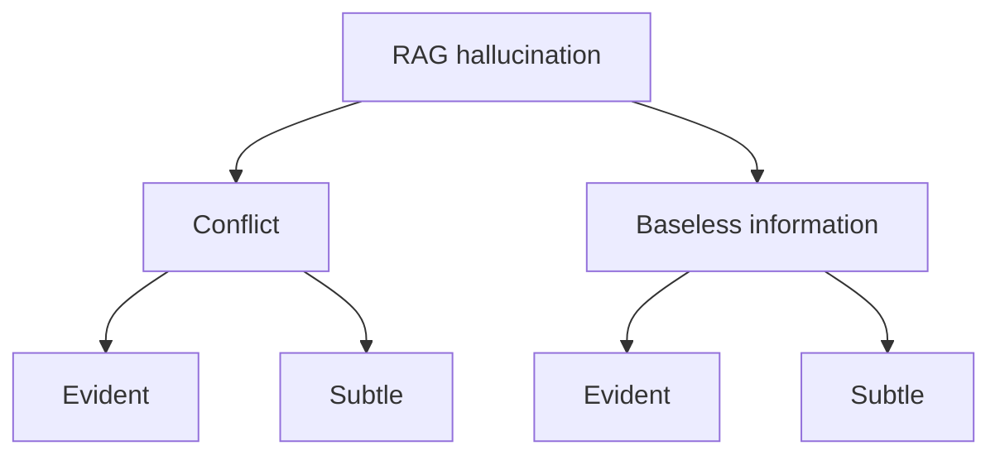
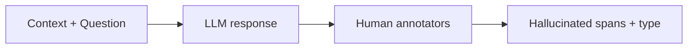
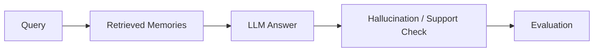

# Part B — Paper 9
## *RAGTruth: A Hallucination Corpus for Developing Trustworthy Retrieval-Augmented Language Models*

**Authors:** Cheng Niu, Yuanhao Wu, Juno Zhu, Siliang Xu, Kashun Shum, Randy Zhong, Juntong Song, Tong Zhang  
**Paper:** arXiv:2401.00396v2 — 17 May 2024

> **Why this paper matters:** RAGTruth is mainly a **dataset and evaluation paper**. For our project, its value is understanding **what hallucination looks like when an LLM is given retrieved evidence, how to label it, and how to evaluate a detector.**

---

# 1. Core problem

RAG is supposed to ground an LLM in retrieved information, but the paper shows that the model can still generate:

```text
Retrieved evidence
      ↓
LLM
      ↓
Unsupported or contradictory statement
```

Example from **page 1**:

The reference says the best 3D ultrasound pictures are between **24–30 weeks**, while the generated answer says **20–32 weeks**. The paper labels that span an **Evident Conflict**.

So:

> **Having retrieved evidence does not guarantee that the answer follows that evidence.** fileciteturn53file0L17-L31

---

# 2. RAGTruth's hallucination taxonomy

This is the most important concept from the paper.



### Evident Conflict
Generated content **directly contradicts** the reference.

Examples include:

- wrong number
- wrong name
- explicit factual contradiction

### Subtle Conflict
The generated content changes the intended meaning without an obvious direct contradiction.

### Evident Baseless Information
The generated content introduces information **not supported by the reference**.

### Subtle Baseless Information
The model adds inferred, subjective, or otherwise unverifiable information that is not explicitly supported.

**Paper:** §3.1, p. 3. fileciteturn53file0L177-L202

---

# 3. How RAGTruth is built

The dataset uses three RAG tasks:

```text
Question Answering
Data-to-text Writing
News Summarization
```

Six LLMs generate responses from the provided context:

- GPT-3.5-turbo
- GPT-4
- Mistral-7B-Instruct
- Llama-2-7B-chat
- Llama-2-13B-chat
- Llama-2-70B-chat

Each response is then manually annotated.



Each response is independently labeled by **two annotators**. The paper reports:

- **91.8% response-level agreement**
- **78.8% span-level agreement**

A third review is used when the annotations differ substantially.

**Paper:** §3.2–3.3, pp. 3–4. fileciteturn53file0L203-L226 fileciteturn53file0L249-L276

---

# 4. Size + what the dataset measures

RAGTruth contains:

**2,965 instances**

with **17,790 generated responses**.

Breakdown:

| Task | Instances | Responses |
|---|---:|---:|
| QA | 989 | 5,934 |
| Data-to-text | 1,033 | 6,198 |
| Summarization | 943 | 5,658 |

Overall:

**43.1% of responses contain annotated hallucination spans.**

The paper therefore provides both:

**response-level labels**

and

**span-level labels**

rather than just saying “this answer is hallucinated.”

**Paper:** §4.1, Table 2, p. 6. fileciteturn53file0L325-L335 fileciteturn53file0L375-L382

---

# 5. One important finding: hallucinations are often unsupported additions

The paper's Figure 2 on **page 5** shows that **baseless information is more common than direct conflicts**, particularly for question answering.

The paper also finds:

```text
Longer generated response
        ↓
More hallucinated spans on average
```

This trend is visible in Table 4.

It also observes that hallucinations tend to appear toward the **end of responses** for QA and news summarization, as shown in the page-5 heatmap.

**Paper:** §4.2, pp. 5–6. fileciteturn53file0L336-L372 fileciteturn53file0L406-L419

---

# 6. How hallucination detection is evaluated

The paper compares four detection approaches:

```text
1. Prompt-based LLM detection
2. SelfCheckGPT
3. LM-vs-LM cross-examination
4. Fine-tuned Llama-2-13B
```

Two evaluation levels are used.

### Response level

Question:

> **Does this response contain hallucination?**

Metrics:

**Precision / Recall / F1**

### Span level

Question:

> **Which exact characters/spans are hallucinated?**

The detected span is compared with the human-labeled span using character-level overlap.

The paper emphasizes that span-level detection is harder than response-level detection.

**Paper:** §5.1–5.3, pp. 6–7. fileciteturn53file0L430-L485

---

# 7. Main detector result

Overall response-level F1:

| Detector | Overall F1 |
|---|---:|
| GPT-3.5 prompt | 52.9 |
| GPT-4 prompt | 63.4 |
| SelfCheckGPT | 58.8 |
| **Fine-tuned Llama-2-13B** | **78.7** |

At span level:

| Detector | Overall F1 |
|---|---:|
| GPT-3.5 prompt | 12.8 |
| GPT-4 prompt | 28.3 |
| **Fine-tuned Llama-2-13B** | **52.7** |

So the paper shows that:

> A detector trained specifically on RAGTruth can outperform the tested prompt-based detection approaches, but **span-level detection remains difficult**.

**Paper:** Tables 5–6, p. 7. fileciteturn53file0L445-L458 fileciteturn53file0L486-L508

---

# 8. Can the detector actually reduce hallucination?

Yes, in the paper's experiment.

The authors generate two candidate responses and use the detector to select between them.

For **GPT-3.5/GPT-4 group**:

```text
Random selection                     → 9.8% hallucination
Choose fewer detected spans         → 5.6%
Choose zero detected spans           → 4.8%
```

The paper reports corresponding reductions of:

**42.9%** and **51.0%** relative to random selection.

For the Llama-2/Mistral group, the reported reductions are **21.6%** and **63.2%**.

The experiment therefore demonstrates a simple principle:

```text
Generate candidates
      ↓
Detect hallucination
      ↓
Prefer the safer candidate
```

**Paper:** §6.3, Table 7, p. 8. fileciteturn53file0L567-L591

---

# 9. What this gives our project

RAGTruth gives us a **testing/evaluation model** for our memory system:



Useful ideas:

### Detect exact bad claims
Do not evaluate only “answer correct/incorrect.” Locate the unsupported portion.

### Separate contradiction from unsupported addition
A memory/answer may be:

**contradictory** or simply **unsupported**.

Those are different failure modes.

### Evaluate retrieval-grounded generation
Even with good retrieved evidence, the LLM can introduce unsupported content.

### Use a detector as a guard
The paper shows one way to use hallucination detection **after generation to select a safer answer**.

---

# 10. Important limitation for our project

RAGTruth is a **RAG-generation benchmark**, not a persistent-memory benchmark.

It does not directly evaluate:

- memory admission
- memory updating
- memory versioning
- long-term conflict resolution
- persistent memory retrieval

Also, the paper notes that there may be practical hallucination situations not covered by this dataset.

**Paper:** §8, p. 9. fileciteturn53file0L614-L619

---

# 11. Connection to our previous papers

```text
TRUSTMEM
→ Are memory transitions trustworthy?

HaluMem
→ Where does memory hallucination occur?

CRAG
→ Should retrieved evidence be trusted?

SELF-RAG
→ Can the model decide, retrieve, and critique?

RAGTruth
→ How can we label and measure hallucination precisely?
```

So Paper 9 is primarily useful for our **evaluation + verification layer**.

---

# 12. 6 things to remember

1. **RAG can still generate unsupported or contradictory claims.**
2. **Hallucination can be classified into evident/subtle conflict and evident/subtle baseless information.**
3. **RAGTruth labels hallucination at both response and exact-span levels.**
4. **Response-level detection is much easier than precise span-level detection.**
5. **A detector trained on RAGTruth improved detection in the paper's experiments.**
6. **For our project, separate evaluation of contradiction and unsupported memory-grounded claims is useful.**

---

# PPT — 5 slides

## Slide 1 — Problem
**Why can an LLM hallucinate even when RAG provides evidence?**

## Slide 2 — Hallucination taxonomy

**Evident Conflict | Subtle Conflict | Evident Baseless | Subtle Baseless**

## Slide 3 — RAGTruth
**2,965 instances → 17,790 responses → human span annotations**

## Slide 4 — Detection
**Response-level vs span-level + detector results**

## Slide 5 — Project relevance
**Fine-grained hallucination detection / verification after memory-grounded generation**

---

# Read these sections

**Must read:** §1 Introduction, §3.1 Hallucination Taxonomy, §3.3 Human Annotation, §4.2 Hallucination Statistics, §5.3 Evaluation Metrics, §6.1–6.3 Results.

**Skip:** Most Related Work and appendix prompts.
