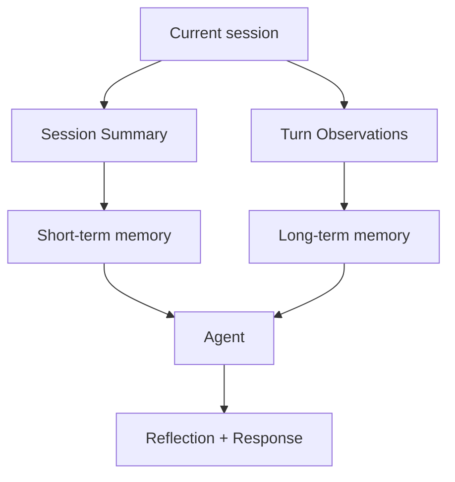
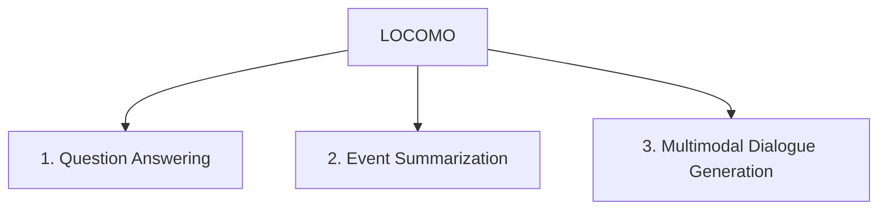
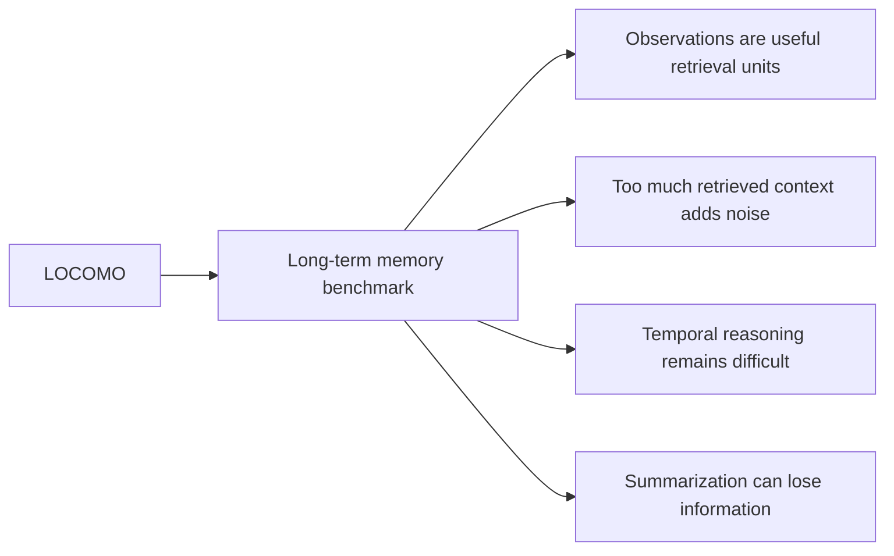

# Paper 11 — Concise Study Guide
## *Evaluating Very Long-Term Conversational Memory of LLM Agents*

**Authors:** Adyasha Maharana, Dong-Ho Lee, Sergey Tulyakov, Mohit Bansal, Francesco Barbieri, Yuwei Fang  
**Venue:** ACL 2024  
**Paper:** arXiv:2402.17753

> **Scope:** Only the paper content directly useful for our persistent-memory project is included. Explanations are simplified from the paper itself; no outside material is added.

---

# 1. What problem does this paper address?

Earlier long-term dialogue evaluations mostly covered only a few sessions.

This paper asks:

> **Can an LLM agent remember and use information across very long, multi-session conversations?**

The authors create **LOCOMO**, a dataset and benchmark specifically for this problem.

```text
Many sessions
      ↓
Important facts/events spread across time
      ↓
Current query
      ↓
Can the agent find + understand + use the old information?
```

The paper also separates three abilities:

**Recall → Understand temporal/causal relations → Use recalled information correctly**

**Paper:** pp. 1–3. fileciteturn30file0L6-L24

---

# 2. LOCOMO — the important part of this paper

LOCOMO contains **50 very long conversations**.

Average statistics:

- **304.9 turns**
- **19.3 sessions**
- **9,209 tokens**
- conversations span **a few months**
- some conversations extend to **35 sessions**

The table on page 2 compares LOCOMO with earlier dialogue datasets and shows that it is substantially longer.

The conversations are created with an LLM-based pipeline and then **human-verified and edited** for long-range consistency and grounding.

**Paper:** p. 2. fileciteturn30file0L50-L89

---

# 3. How the paper generates long-term conversations

The authors build each virtual speaker with:


## Persona

Each speaker receives a persona containing information such as:

- objectives
- past experiences
- habits
- relationships
- personal details

## Temporal event graph

The speaker also gets an event graph.

Each event has:

**event + date + causal links**

The paper creates up to **25 events** over **6–12 months**.

This graph is used to make later conversations consistent with earlier life events.

**Paper:** §3.1–3.2, pp. 4–5. fileciteturn30file0L203-L236

---

# 4. The memory architecture used to create LOCOMO

This is useful because it shows one concrete long-term memory design.



After each session:

### Short-term memory
The agent creates a **session summary**.

The next summary is based on:

**current session + previous summary**

### Long-term memory
Each individual dialogue turn is converted into an **observation** and stored in long-term memory.

### At the next session
The agent uses:

- latest summary
- retrieved observations
- current conversation
- persona
- relevant intervening events

**Paper:** §3.3, pp. 4–5. fileciteturn30file0L237-L274

---

# 5. Why this architecture matters to us

This paper demonstrates an important separation:

```text
Recent context
    +
Compressed session summary
    +
Retrievable long-term observations
```

So long-term memory does not have to mean:

> “Put the entire old conversation into the prompt.”

Instead:

```text
Conversation
   ↓
Observation extraction
   ↓
Persistent memory

Conversation
   ↓
Session summary
   ↓
Short-term context
```

This connects directly with the architecture questions we have been studying.

---

# 6. LOCOMO evaluation — what abilities are tested?

The QA task has **five categories**:

| Category | What it tests |
|---|---|
| **Single-hop** | One session contains the needed information |
| **Multi-hop** | Information must be combined across sessions |
| **Temporal** | Time-related information must be understood |
| **Open-domain** | Dialogue information + outside/common knowledge |
| **Adversarial** | Detect that the question is unanswerable instead of giving a wrong answer |

The page-2 benchmark diagram visually shows these categories and the other two evaluation tasks.

**Paper:** §4.1, p. 5. fileciteturn30file0L305-L345

---

# 7. The three tasks in the benchmark



## 7.1 Question answering

Tests whether the agent can recall and use old information.

---

## 7.2 Event summarization

The model must summarize events over a requested time period.

This specifically tests:

**temporal relationships + causal relationships**

The authors use **FactScore precision/recall/F1**, because lexical overlap alone is not enough to judge factual event summaries.

---

## 7.3 Multimodal dialogue generation

Tests whether the agent can keep the conversation consistent with the longer narrative and persona, while also handling images.

### For our project

**QA + event summarization** are the most relevant. The multimodal task is not central to our architecture.

**Paper:** §§4.1–4.3, pp. 5–6. fileciteturn30file0L316-L345 fileciteturn30file0L348-L390

---

# 8. Main result: long conversations are difficult

Human QA performance:

**87.9 overall F1**

Best limited-context model in Table 2:

**GPT-4-turbo: 32.1**

Long-context GPT-3.5 reaches:

**37.8** at 16K context.

So the paper shows a large gap between model performance and human performance on these very long dialogues.

**Paper:** Table 2, p. 7. fileciteturn30file0L429-L443

---

# 9. Temporal reasoning is especially difficult

In the paper's results, temporal QA remains low across the evaluated models.

For example:

```text
GPT-4-turbo, 4K:
Temporal F1 = 10.4

GPT-3.5, 16K:
Temporal F1 = 20.3
```

The authors therefore identify **time reasoning** as one of the hardest parts of long-term dialogue memory.

This is highly relevant to our project because several later papers also investigate temporal memory.

**Paper:** Table 2 + §6.1, pp. 7–8. fileciteturn30file0L433-L441 fileciteturn30file0L483-L510

---

# 10. Long context does not automatically solve memory

The paper finds that simply increasing the context window helps, but does not solve the problem.

Even the 16K model:

- improves as more context is available
- still performs poorly on some categories
- performs particularly badly on adversarial questions

At 16K:

**Adversarial F1 = 2.1**

The authors interpret this as evidence that long-context models can be misled when given very long conversations.

**Paper:** §6.1, p. 7. fileciteturn30file0L483-L503

---

# 11. RAG finding — very useful for our project

The authors compare RAG using three kinds of retrieval units:

```text
Conversation logs
Observations
Session summaries
```

The strongest overall result in Table 3 is:

**Observation, top-5 retrieval → 41.4 overall F1**

compared with:

**No RAG → 22.4 overall F1**

The paper describes about a **5% improvement with GPT-3.5 when using the top 5 relevant observations instead of pure conversation logs** in its discussion.

The important point is not the exact number alone.

It is:

> **Retrieving structured observations can be more useful than sending raw conversation history.**

**Paper:** Table 3 + §6.1, pp. 7–8. fileciteturn30file0L444-L503

---

# 12. More retrieval is not always better

For observation-based RAG:

```text
Top-5  → 41.4 overall F1
Top-10 → 38.8
Top-25 → 38.0
Top-50 → 37.8
```

So increasing the number of retrieved observations eventually hurts performance.

The paper attributes this to a **signal-to-noise problem**:

```text
Relevant memory
      +
More irrelevant memory
      ↓
Harder for the model to use the context correctly
```

This is one of the strongest findings for our retrieval design.

**Paper:** Table 3 + §6.1, p. 7. fileciteturn30file0L463-L503

---

# 13. Summary-based RAG has a limitation

Session summaries have high retrieval recall in the experiment, but they do not produce a corresponding performance improvement.

The authors suggest the likely reason is:

> **Information is lost when dialogue is converted into summaries.**

So:

```text
Summary
→ compact
→ easier to retrieve

but

Summary
→ may lose exact details
```

This connects directly with the compression trade-offs we saw in SimpleMem.

**Paper:** §6.1, p. 7. fileciteturn30file0L493-L503

---

# 14. Event summarization results

The paper also evaluates the ability to recover temporal/causal event structure.

The best result in Table 4 is **GPT-3.5-turbo with incremental summarization**, with:

**FactScore F1 = 45.9**

The authors identify recurring errors:

1. Missing information because temporal/causal links are not connected.
2. Hallucinated details.
3. Misunderstanding dialogue cues such as humor/sarcasm.
4. Incorrect speaker attribution.
5. Treating insignificant dialogue as important.

For our project, the most relevant are:

**missing information + temporal/causal errors + hallucinations + speaker attribution.**

**Paper:** §6.2, p. 8. fileciteturn30file0L520-L562

---

# 15. What this paper gives our project

## 1. Do not use full conversation history as the only memory

The paper shows value in converting turns into **retrievable observations**.

## 2. Memory should distinguish short-term and long-term information

A session summary can handle recent/compressed context, while observations provide persistent retrieval units.

## 3. Retrieval quantity needs control

More retrieved memories can reduce performance.

## 4. Raw summaries can lose information

Compression improves size but can remove details needed for later reasoning.

## 5. Temporal reasoning deserves explicit attention

Long-term memory is not only about remembering a fact; it also requires understanding **when events happened and how they relate over time**.

---

# 16. How this connects to our research map



This paper is therefore primarily useful for our:

**memory representation + retrieval strategy + evaluation design**

rather than for a complete memory architecture.

---

# 17. What this paper does NOT prove

Do not conclude that:

- observations are always better than every other memory representation
- top-5 is the universally correct retrieval depth
- summaries are always inferior
- RAG alone solves long-term memory
- LOCOMO fully represents all real-world conversations

The authors explicitly note dataset limitations because the conversations are generated primarily through an LLM-based pipeline and then human-edited.

**Paper:** §8, pp. 9–10. fileciteturn30file0L576-L621

---

# 18. Paper 11 — 8 things to remember

1. **LOCOMO was created to evaluate very long-term conversational memory.**
2. **It contains about 300 turns and ~19 sessions per conversation on average.**
3. **The paper uses observations as persistent memory units.**
4. **It separates short-term session summaries from long-term observations.**
5. **Temporal reasoning is one of the hardest tested abilities.**
6. **Longer context helps but does not solve long-term memory.**
7. **Top-5 observation retrieval outperformed larger retrieval depths in the reported RAG experiment.**
8. **Retrieving the right amount of information matters because extra context can add noise.**

---

# 19. PPT structure

## Slide 1 — Problem
**Can LLM agents remember information across very long conversations?**

## Slide 2 — LOCOMO
Show:
**50 conversations → ~300 turns → ~19 sessions → up to 35 sessions**

## Slide 3 — Memory architecture

```text
Session → Summary → Short-term
Turn    → Observation → Long-term
```

## Slide 4 — Evaluation
**Single-hop | Multi-hop | Temporal | Open-domain | Adversarial**

## Slide 5 — Main findings
- Long context helps
- Temporal reasoning remains difficult
- Long context can still be misled

## Slide 6 — RAG finding
**Observations > raw dialogue logs in the reported setup**

## Slide 7 — Retrieval depth
**More context ≠ better context**

## Slide 8 — Relevance to our project
**Observation-based memory + controlled retrieval + temporal evaluation**

---

# Reading priority

### Must read
**§1 Introduction**  
**§3.3 Virtual Agent Architecture**  
**§4.1 Question Answering**  
**§6.1 Question Answering Results**

### Read briefly
**§4.2 Event Summarization**  
**§6.2 Event Summarization Results**

### Skip initially
Multimodal generation details, image-sharing implementation, most related work, and appendices.

---

# Source map

| Topic | Pages |
|---|---:|
| Motivation | 1–3 |
| LOCOMO construction | 4–5 |
| Memory architecture | 4–5 |
| QA benchmark | 5 |
| Event summarization | 6 |
| QA results | 7–8 |
| Event results | 8 |
| Limitations | 9–10 |
