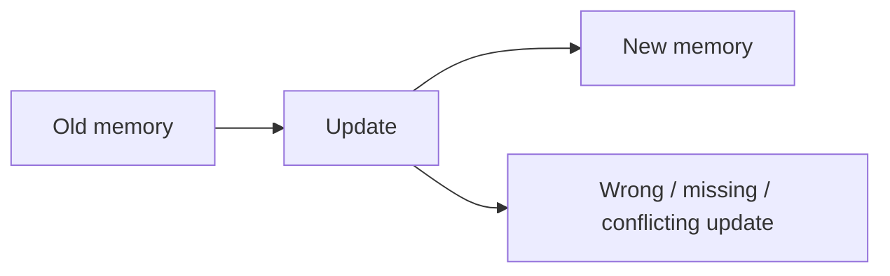
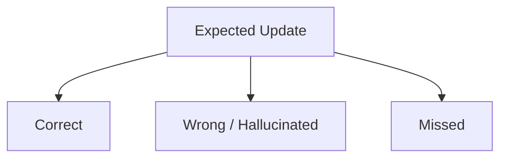
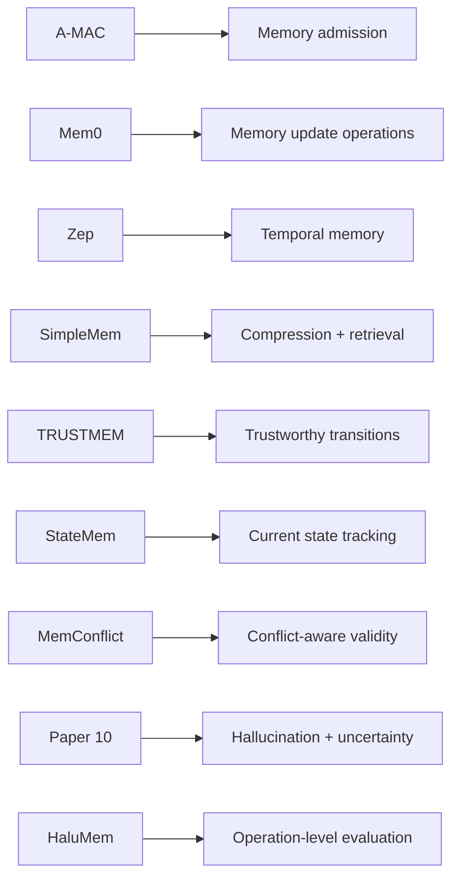

# Paper 12 — Concise Study Guide
## *HaluMem: Evaluating Hallucinations in Memory Systems of Agents*

**Authors:** Ding Chen, Simin Niu, Kehang Li, Peng Liu, Xiangping Zheng, Bo Tang, Xinchi Li, Feiyu Xiong, Zhiyu Li  
**Date:** 6 January 2026  
**Paper:** arXiv:2511.03506v3

> **Scope:** Only the parts directly useful for our persistent-memory project are included. The explanations are simplified from the paper itself.

---

# 1. What problem does HaluMem solve?

The paper focuses on a very specific problem:

> **Memory systems can hallucinate during memory extraction and updating, and those errors can later affect question answering.**

Examples shown in Figure 1 include:

```text
User says: "I now like parrots."
Memory system stores: "User dislikes parrots."
```

and:

```text
User says: "Friends are Linda and Joseph."
Memory system stores: "Friends are Linda and Mark."
```

and an update example where the user changes a state from **Good → Poor**, but the memory system incorrectly keeps the old state.

The authors argue that evaluating only the final answer cannot tell us **where the memory error was introduced**.

**Paper:** pp. 1–3. fileciteturn33file0L17-L34

---

# 2. The central idea: evaluate memory operations separately

Most earlier evaluations are end-to-end:


If the final answer is wrong, we cannot know whether the cause was:

```text
Extraction?
Updating?
Retrieval?
Generation?
```

HaluMem instead evaluates the memory pipeline at **operation level**.


The benchmark directly evaluates:

**Extraction + Updating + Question Answering**

The paper treats these as separate stages so errors can be localized.

**Paper:** pp. 2–3, §3. fileciteturn33file0L104-L144 fileciteturn33file0L300-L364

---

# 3. What counts as a memory hallucination?

The paper describes memory hallucinations as errors that occur while:

- storing information
- updating information
- retrieving information

Examples include:

```text
Fabricated memory
Incorrect memory
Outdated memory
Unresolved conflict
Incorrect retrieval
Missing memory
```

The paper distinguishes this from **generation hallucination**, which happens when the final language-model output contains false or unsupported information.

The important relationship is:

```text
Memory hallucination
       ↓
Bad memory enters / remains in store
       ↓
Bad memory is retrieved
       ↓
Generation can also become wrong
```

So the memory layer itself can be an **upstream source** of later hallucinations.

**Paper:** pp. 4–5. fileciteturn33file0L229-L271

---

# 4. The three tasks in HaluMem

## 4.1 Memory Extraction

Question:

> **Did the system correctly extract the important information from the dialogue?**

The paper checks both:

### Completeness
Did the system miss information that should have been stored?

### Correctness
Did the system invent or distort information while extracting it?

```text
Dialogue
   ↓
Expected memory points
   ↕ compare
Extracted memory points
```

**Paper:** §5.1, p. 9. fileciteturn33file0L611-L675

---

## 4.2 Memory Updating

Question:

> **When information changes, did the system update memory correctly?**

The benchmark represents updates as:

```text
old memory → new memory
```

The paper identifies three important update failures:

- incorrect modification
- missing new information
- version conflict / contradiction



**Paper:** §5.2, p. 10. fileciteturn33file0L677-L708

---

## 4.3 Memory Question Answering

This is the end-to-end task.

The system:

```text
Retrieve memories
     ↓
Give retrieved memories + query to AI
     ↓
Generate answer
```

The benchmark then checks whether the answer is:

- correct
- hallucinated
- omitted because necessary memory was missing

**Paper:** §5.3, p. 10. fileciteturn33file0L709-L733

---

# 5. The most useful metrics

## Memory Extraction

### Memory Recall
How much of the memory that **should** have been extracted was actually extracted?

```text
Correct extracted memories
--------------------------
Memories that should be extracted
```

### Weighted Memory Recall
Same idea, but important memories receive higher weights.

### Memory Accuracy
How accurate are the memories that were extracted?

### Target Memory Precision
How often does the extracted memory match the intended target memory?

### False Memory Resistance (FMR)
How well does the system resist **distractor information** that should not become memory?

This is very important for our project.

```text
Distractor appears
      ↓
Should NOT enter memory
      ↓
FMR measures whether system ignored it
```

### Memory Extraction F1
Combines extraction recall and target precision.

**Paper:** p. 9. fileciteturn33file0L629-L675

---

# 6. Update metrics

For memory updating, the paper measures:

### Updating Accuracy
How many required updates were correctly performed?

### Updating Hallucination Rate
How many updates were incorrect or hallucinated?

### Updating Omission Rate
How many updates that should have happened were missed?



This gives us a useful distinction:

**bad update ≠ missed update**

They are different failure modes and should be measured separately.

**Paper:** p. 10. fileciteturn33file0L687-L708

---

# 7. QA metrics

For final memory QA, HaluMem measures:

- **QA Accuracy**
- **QA Hallucination Rate**
- **QA Omission Rate**

The important idea is that a wrong answer can have different causes:

```text
Wrong answer
   ├── memory was wrong
   ├── memory update was wrong
   ├── required memory was missing
   └── answer generation was wrong
```

HaluMem's operation-level design is intended to make these stages separately inspectable.

**Paper:** p. 10. fileciteturn33file0L709-L733

---

# 8. How HaluMem is constructed

The dataset is **user-centric** and follows a six-stage construction pipeline.


The persona contains three major information groups:

```text
Core Profile
Dynamic State
Preferences
```

Dynamic information can evolve over time.

Examples from the construction:

```text
Unemployed → Employed
Illness → Recovery
Dislike → Like
```

This creates controlled memory changes that can later be tested.

**Paper:** §§4.1–4.3, pp. 6–8. fileciteturn33file0L365-L494

---

# 9. Distractors are deliberately added

HaluMem also injects **distractor memories**.

These are false but plausible pieces of information that the AI may mention while the user does not confirm them.

The goal is to test whether the memory system incorrectly stores them.

```text
AI mentions false detail
          ↓
User does not confirm it
          ↓
Should not become memory
```

This directly motivates the paper's **False Memory Resistance** metric.

**Paper:** p. 8–9. fileciteturn33file0L504-L519 fileciteturn33file0L662-L669

---

# 10. Scale of HaluMem

The paper reports two datasets:

### HaluMem-Medium

- **20 users**
- **30,073 dialogue rounds**
- ~**160K tokens** average context
- **14,948 memory points**
- **3,467 QA pairs**

### HaluMem-Long

Extends each user's context to approximately:

**1 million tokens**

with additional irrelevant dialogues.

The paper's abstract summarizes the broader benchmark as roughly:

**15K memory points + 3.5K questions**

and contexts extending beyond **1M tokens**.

**Paper:** pp. 1, 8. fileciteturn33file0L24-L34 fileciteturn33file0L527-L531

---

# 11. Main experimental finding

The paper evaluates:

- Mem0
- Mem0-Graph
- Memobase
- MemOS
- Supermemory
- Zep

The major result is:

> **Most systems perform worse on HaluMem-Long than on HaluMem-Medium.**

The paper interprets this as evidence that very long contexts make it harder to distinguish useful information from irrelevant information.

**Paper:** p. 11. fileciteturn33file0L761-L797

---

# 12. Extraction is a major bottleneck

One of the strongest findings:

> Except for MemOS, the evaluated systems have memory recall below 60% on the extraction task.

So many important memory points are simply **never extracted**.

At the same time, the paper reports that all systems have memory accuracy below 62%, indicating a substantial amount of hallucinated content among extracted memories.

This creates a fundamental trade-off:

```text
Extract more
    ↓
Better coverage
    +
More irrelevant / hallucinated memories

Extract less
    ↓
Cleaner memory
    +
Important information may be missed
```

The paper therefore calls for better balance between:

**coverage + accuracy + interference resistance**

**Paper:** p. 11. fileciteturn33file0L787-L797

---

# 13. Updating is another major bottleneck

The paper reports that:

- most systems perform poorly on updating
- performance drops further on HaluMem-Long
- many systems have **omission rates above 50%**

The paper's explanation is important:

```text
Bad extraction
      ↓
Old related memory is missing
      ↓
Update cannot be processed correctly
      ↓
Update omission
```

So **extraction quality and update quality are tightly connected**.

Also, a low update hallucination rate does not automatically mean strong reliability, because very few memories may actually reach the update stage.

**Paper:** p. 11. fileciteturn33file0L798-L805

---

# 14. QA depends heavily on upstream memory quality

The paper reports that systems performing better at memory extraction and updating also tend to perform better on memory QA.

This leads to a key architectural point:


So improving only the retrieval layer may not solve the whole problem.

If the persistent store already contains incomplete or incorrect information, retrieval can only work with what exists.

The paper reports that all systems still show substantial hallucination and omission in QA, especially under extended context and interference.

**Paper:** pp. 11–13. fileciteturn33file0L806-L833

---

# 15. Memory types also matter

The paper separately analyzes:

- **Event memory**
- **Persona memory**
- **Relationship memory**

It finds that persona information is generally somewhat easier to extract than event dynamics and relationship changes.

The paper notes that **event dynamics and relationship changes remain challenging**.

For our project, this reinforces that:

> **“A memory item” is not necessarily the same type of information in every case.**

Different memory types may require different handling.

**Paper:** pp. 12–13. fileciteturn33file0L870-L883

---

# 16. Efficiency finding

The paper measures the time spent on:

**dialogue addition + memory retrieval**

The strongest general observation is:

> **Dialogue addition takes substantially more time than memory retrieval.**

So the **write stage** is the primary computational bottleneck in their evaluation.

This is important because our architecture should not focus only on fast retrieval.

```text
Interaction
   ↓
Extraction / Update  ← expensive
   ↓
Storage
   ↓
Retrieval            ← comparatively cheaper in their analysis
```

**Paper:** pp. 13. fileciteturn33file0L895-L922

---

# 17. What Paper 12 adds to our project

This paper gives us a very useful **evaluation architecture**.

Instead of measuring only:

```text
Question → Answer → Accuracy
```

we can think about:

```text
Conversation
    ↓
Memory Extraction
    ↓
Memory Updating
    ↓
Memory Retrieval
    ↓
Answer
```

and measure failures at each stage.

The paper specifically gives us these questions:

### Extraction
**Did we remember the right information?**

### Updating
**Did we correctly change old information?**

### Retrieval / QA
**Did we retrieve and use the right information?**

### Reliability
**Did we resist fabricated/distractor information?**

---

# 18. How Paper 12 connects to our previous papers



The major addition is:

> **We should evaluate the memory pipeline itself, not only the final answer.**

---

# 19. Paper 12 — 8 things to remember

1. **Memory systems can hallucinate before the final answer is generated.**
2. **Extraction, updating, and QA should be evaluated separately.**
3. **Extraction can fail through omission, fabrication, or irrelevant memory creation.**
4. **Updating can fail through wrong changes, missed changes, or version conflicts.**
5. **Distractors are useful for testing whether false information enters memory.**
6. **HaluMem shows that very long contexts make memory problems worse for many systems.**
7. **Extraction quality strongly affects later updating and QA.**
8. **The write stage can be a major computational bottleneck.**

---

# 20. PPT structure

## Slide 1 — Problem

**Where do hallucinations originate inside a memory system?**

## Slide 2 — Operation-level evaluation

```text
Extraction → Updating → Retrieval/QA
```

## Slide 3 — Memory hallucination types

**Fabrication | Error | Conflict | Omission**

## Slide 4 — HaluMem benchmark

**Medium + Long**

## Slide 5 — Metrics

**Recall | Accuracy | FMR | Update Accuracy | Update Hallucination | QA Accuracy**

## Slide 6 — Main findings

**Extraction + Updating are major bottlenecks**

## Slide 7 — Relevance

**Evaluate every important memory operation, not only final answers.**

---

# Reading priority

### Must read
**§1 Introduction**  
**§3 Problem Definition**  
**§5.1 Memory Extraction**  
**§5.2 Memory Updating**  
**§5.3 Memory Question Answering**  
**§6.2 Overall Evaluation**

### Read briefly
**§4 Dataset Construction** — focus on distractors and evolving states  
**§6.2.2–6.2.4** — memory types, question types, efficiency

### Skip initially
Most detailed prompt templates and appendices.

---

# Source map

| Topic | Pages |
|---|---:|
| Problem | 1–3 |
| Operation-level formulation | 5–6 |
| Dataset construction | 6–8 |
| Extraction metrics | 9 |
| Updating metrics | 10 |
| QA metrics | 10 |
| Main results | 11 |
| Memory-type analysis | 12–13 |
| Efficiency | 13 |
| Conclusion | 14 |
