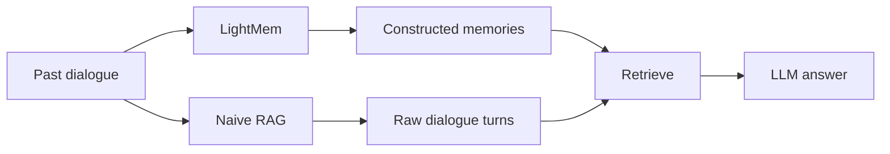
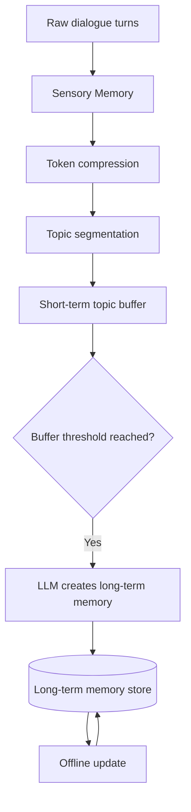
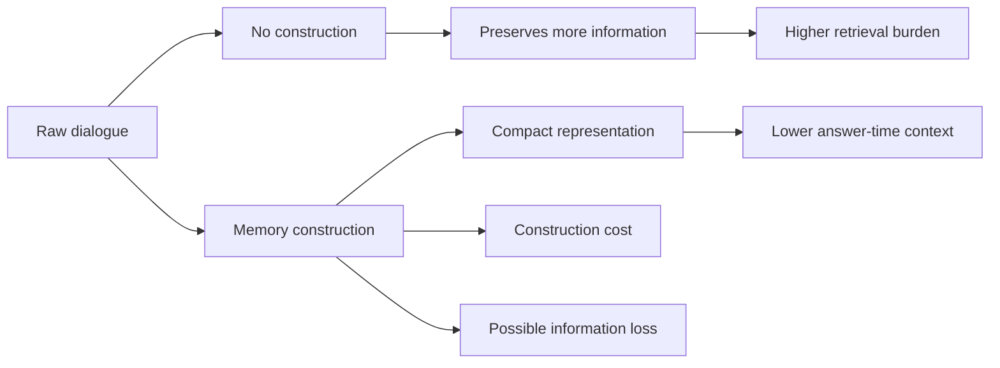
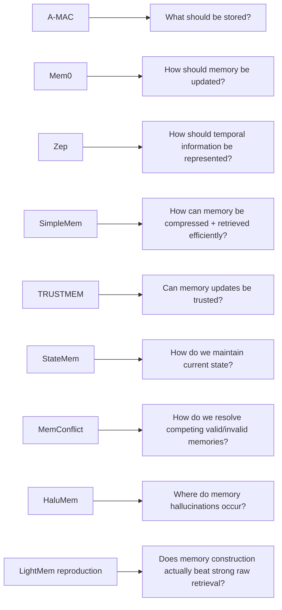

# Paper 13 — Concise Study Guide
## *Reproducing LightMem: Naive RAG Is Just as Good for Memory Management*

**Authors:** Yongjie Zhou, Shuai Wang, Bevan Koopman, Guido Zuccon  
**Institution:** University of Queensland / CSIRO / Google  
**Paper:** arXiv:2607.29104v1 — 31 July 2026

> **Scope:** Only the parts directly useful for our persistent-memory project are included. This is a reproduction/evaluation paper, not a new memory architecture proposal.

---

# 1. What question is this paper asking?

The paper re-examines **LightMem**, a long-term memory system that converts past dialogue into compact memory entries.

The central comparison is:



The paper asks:

1. Can the authors reproduce LightMem?
2. How much does the **retriever** affect LightMem?
3. Is constructing memory actually better than retrieving raw dialogue directly?

The paper's main conclusion is:

> **Memory construction is not automatically better than raw-turn retrieval. Its usefulness depends on the retriever and the available answering-token budget.**

**Paper:** pp. 1–2. fileciteturn35file0L20-L43

---

# 2. Why this matters for our project

Earlier papers often assume:

```text
Better memory representation
        ↓
Better retrieval
        ↓
Better answer
```

This paper tests that assumption directly.

It separates two possible sources of improvement:

```text
Memory construction
        vs.
Retriever quality
```

That is important for our architecture because a complex memory-writing pipeline has its own cost and can potentially lose information.

**Paper:** pp. 1–2.

---

# 3. How LightMem works

The reproduced LightMem pipeline has three main memory stages:



### Step 1 — Token compression

LightMem first compresses each dialogue turn using **LLMLingua-2**.

If the original turn has `N` tokens:

`Ncomp ≈ rN`

where `r` is the compression rate.

Smaller `r` = more aggressive compression.

---

### Step 2 — Topic grouping

Compressed turns are grouped by topic.

Each topic has a short-term buffer.

When the buffer reaches threshold `th`, memory construction is triggered.

---

### Step 3 — Long-term memory construction

An LLM summarizes the grouped turns into a long-term memory entry.

Several related turns are processed together instead of generating a memory after every individual interaction.

---

### Step 4 — Offline update

Related long-term entries are later revised/consolidated offline.

**Paper:** §§2.1, 3.1, pp. 2–3. fileciteturn35file0L134-L154 fileciteturn35file0L171-L195

---

# 4. LightMem retrieval

At answering time:

```text
Question
   ↓
Encode question + memory entries
   ↓
Similarity ranking
   ↓
Top-k memories
   ↓
LLM answer
```

The original LightMem setup uses **all-MiniLM-L6-v2** as the dense retriever.

The important point in this reproduction paper is that the authors later **change only the retriever** while keeping the LightMem memory store fixed.

**Paper:** p. 3 and §5. fileciteturn35file0L196-L214

---

# 5. The key methodological idea: separate the stages

The authors compare:

### LightMem

```text
Raw dialogue
   ↓
Memory construction
   ↓
Constructed memory
   ↓
Retriever
   ↓
Answer
```

### Naive RAG

```text
Raw dialogue
   ↓
Retriever
   ↓
Answer
```

They then use **oracle conditions** to answer another question:

> Did memory construction itself remove information before retrieval?

This is a very useful research method:

```text
Normal result
→ construction + retrieval + generation

Oracle result
→ largely removes retrieval error
→ reveals information loss in construction
```

**Paper:** §§3.3, 6.1. fileciteturn35file0L203-L214 fileciteturn35file0L566-L586

---

# 6. RQ1 — Can LightMem be reproduced?

The paper reproduces three LightMem configurations:

```text
(r = 0.4, th = 768)
(r = 0.6, th = 768)
(r = 0.8, th = 1024)
```

They recover the same **trend** reported by the original LightMem study:

```text
Higher r / larger configuration
        ↓
Higher reported accuracy
```

In their reproduction:

| Method | Accuracy |
|---|---:|
| Full-context | 60.8% |
| Naive RAG | 67.3% |
| LightMem (0.4, 768) | 57.0% |
| LightMem (0.6, 768) | 68.2% |
| LightMem (0.8, 1024) | 70.7% |

So their reproduction supports the configuration trend, but **does not reproduce the original absolute numbers exactly**.

**Paper:** §4, p. 4–6. fileciteturn35file0L274-L304 fileciteturn35file0L360-L406

---

# 7. Construction cost

The reproduction confirms that LightMem has substantial upfront construction cost.

Their reproduced construction cost is approximately:

**72.68k–119.88k tokens**  
and  
**64.69–117.62 LLM calls per ingested sample**

At answer time, LightMem uses only:

**0.66–0.72k tokens/question**

compared with:

**1.03k** for Naive RAG  
**18.84k** for full-context.

So the trade-off is:

```text
LightMem:
High upfront construction cost
          ↓
Smaller answer-time context
```

The paper explicitly says the upfront cost must be considered when judging the method.

**Paper:** §4.2, p. 6. fileciteturn35file0L379-L406

---

# 8. RQ2 — Retriever choice matters a lot

This is one of the strongest findings.

The authors freeze the LightMem memory store and change only the retriever.

Across 11 retrievers:

```text
Recall@10:
0.390 → 0.587

Answer accuracy:
58.1% → 75.5%
```

Same memory store. Same answer model.

Therefore:

> **Retriever choice alone can produce a very large change in performance.**

The best reported retriever in this experiment was **Qwen3-Embedding-4B**:

- Recall@10 = **0.587**
- Answer accuracy = **75.5%**

The paper's Figure 3 visually shows a strong relationship between retrieval recall and answer accuracy for the tested retrievers.

**Paper:** §5.2, pp. 6–7. fileciteturn35file0L434-L462

---

# 9. The important retrieval insight

Retriever differences are especially large when evidence is:

- distributed across multiple sessions
- expressed indirectly
- related to user preferences

This suggests the memory system cannot be evaluated independently of the retriever.

So:

```text
Memory representation
        ×
Retriever
        ↓
Actual performance
```

not:

```text
Memory representation
        ↓
fixed performance
```

The paper also finds **no consistent advantage from adding BM25 to dense retrieval** in its fixed-LightMem-store experiments.

**Paper:** §5.2, pp. 6–7. fileciteturn35file0L449-L470

---

# 10. RQ3 — Is memory construction actually worth it?

This is the paper's most important question for architecture design.

They compare LightMem with Naive RAG under:

1. **same retriever + same retrieval depth**
2. **same approximate answering-token budget**

---

# 11. Result at matched retrieval depth

When both systems retrieve the same number of items:

> **Naive RAG generally performs better.**

Why?

Because a raw dialogue turn can contain information that a constructed memory entry has removed.

The paper finds that the advantage of LightMem is therefore **not universal**.

**Paper:** §6.2, p. 8. fileciteturn35file0L587-L609

---

# 12. Result at matched token budget

This changes the picture.

At approximately **330 tokens/question**:

- LightMem performs better for **8 of 11 retrievers**
- average advantage = **5.5 accuracy points**

At approximately **500 tokens**:

- average advantage falls to **2.2 points**

At approximately **935 tokens**:

- LightMem becomes a small disadvantage

So:

```text
Very tight context budget
→ compact memories can help

More available context
→ raw dialogue becomes increasingly competitive
```

This is one of the central findings of the paper.

**Paper:** §6.2, p. 8. fileciteturn35file0L610-L625

---

# 13. Oracle result — memory construction loses information

This is perhaps the most important result for our architecture.

With retrieval error removed:

| Oracle setup | Accuracy |
|---|---:|
| Naive RAG + gold raw turns | **89.0%** |
| LightMem + corresponding constructed memories | **77.7%** |

Difference:

**11.3 percentage points**

Because both use gold evidence conditions, the paper interprets this gap as evidence that **memory construction discards some answer-relevant information**.

So compression is not free.

```text
Raw dialogue
   ↓
Construction / compression
   ↓
Smaller memory
   ↓
Some useful information may disappear
```

**Paper:** §6.2, p. 8. fileciteturn35file0L598-L636

---

# 14. The real trade-off

The paper's findings can be summarized as:



So the paper does **not** conclude:

> “Memory construction is useless.”

Instead, it concludes that its value depends on:

**retriever quality + context/token budget + information preserved during construction**

**Paper:** §7, p. 9. fileciteturn35file0L693-L710

---

# 15. What this paper gives our project

## 1. Do not evaluate memory construction alone

Always consider:

**construction × retrieval × answer generation**

---

## 2. Preserve a faithful source when practical

The authors' final discussion explicitly recommends viewing constructed memories as a **compact auxiliary representation**, not necessarily a complete replacement for the raw interaction history.

---

## 3. Retrieval deserves major attention

A better memory representation is not enough if retrieval is weak.

---

## 4. Compression creates a trade-off

```text
Less context
+
lower answer-time cost
-
possible information loss
```

---

## 5. Use oracle-style evaluation

When testing our system, separating:

**memory construction failure**  
from  
**retrieval failure**

will help us know which component actually needs improvement.

---

# 16. Connection to our previous papers



This paper adds an important caution:

> **Do not assume that a more sophisticated memory-construction pipeline automatically gives better answers.**

---

# 17. Paper 13 — 8 things to remember

1. **LightMem converts raw dialogue into compact constructed memories.**
2. **This construction has substantial upfront LLM cost.**
3. **Retriever choice can change LightMem performance dramatically.**
4. **At matched retrieval depth, Naive RAG generally performs better in this study.**
5. **LightMem helps mainly when the answer-time token budget is tight.**
6. **Oracle evaluation shows that construction removes some answer-relevant information.**
7. **Memory construction and retrieval must be evaluated together.**
8. **Keeping raw interaction data as a faithful source can be valuable.**

---

# 18. PPT structure

## Slide 1 — Research question

**Is constructed memory actually better than retrieving raw dialogue?**

## Slide 2 — LightMem

```text
Compression → Topic grouping → Memory construction → Offline update
```

## Slide 3 — Experimental design

**LightMem vs Naive RAG**

with matched:

**retriever + depth + token budget + oracle**

## Slide 4 — Retriever sensitivity

**58.1% → 75.5%** answer accuracy with the memory store fixed.

## Slide 5 — Matched depth

**Naive RAG generally better**

## Slide 6 — Matched budget

**LightMem helps mainly at tight token budgets**

## Slide 7 — Oracle

**89.0% raw turns vs 77.7% constructed memory**

## Slide 8 — Architecture lesson

**Compression is a trade-off, not an automatic improvement.**

---

# Reading priority

### Must read
**§1 Introduction**  
**§3.1 Memory Construction**  
**§3.2 Retrieval**  
**§5.2 Retriever Results**  
**§6.2 Memory Construction Worth Its Cost**

### Read briefly
§4.2 reproduction details

### Skip initially
Most of the detailed retriever descriptions and implementation-specific appendix material.

---

# Source map

| Topic | Pages |
|---|---:|
| Motivation / RQs | 1–2 |
| LightMem architecture | 2–3 |
| Reproduction | 4–6 |
| Retriever sensitivity | 6–7 |
| Matched-depth comparison | 8 |
| Matched-budget comparison | 8 |
| Oracle information loss | 8–9 |
| Final discussion | 9 |
