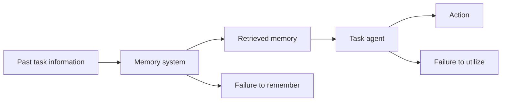

# Part B — Paper 12
## *MEMORYARENA: Benchmarking Agent Memory in Interdependent Multi-Session Agentic Tasks*

**Authors:** Zexue He, Yu Wang, Churan Zhi, Yuanzhe Hu, Tzu-Ping Chen, Lang Yin, Ze Chen, Tong Arthur Wu, Siru Ouyang, Zihan Wang, Jiaxin Pei, Julian McAuley, Yejin Choi, Alex Pentland  
**Venue:** ICML 2026  
**Paper:** arXiv:2602.16313v2 — 17 Sep 2026

> **Why this paper matters:** MEMORYARENA changes the evaluation target from **“Can the agent remember?”** to **“Can the agent use memory to make correct decisions across dependent tasks?”**

---

# 1. The core problem

Most memory benchmarks test:

```text
Conversation history
      ↓
Question
      ↓
Recall
```

Agent benchmarks usually test:

```text
Task
 ↓
Actions
 ↓
Environment
```

MEMORYARENA combines them:


Later tasks **depend on information learned in earlier tasks**.

So memory is not being tested as a passive archive. It is being tested as part of the agent's **decision-making loop**.

**Paper:** pp. 1–2. fileciteturn59file0L5-L24

---

# 2. Why this is different from LongMemEval / LoCoMo

Those benchmarks mainly ask:

> **Can the system retrieve the correct information?**

MEMORYARENA asks:

> **Can the system retain information, reuse it, and act correctly because of it?**

The paper's key criticism is that strong performance on recall benchmarks does not necessarily translate into strong performance in multi-session agentic tasks.

Its benchmark contains:

- **701 tasks**
- **57 average action steps per task**
- **4 main environments**

The task designs force later subtasks to depend on earlier information.

**Paper:** pp. 2, 4. fileciteturn59file0L99-L103 fileciteturn59file0L128-L140

---

# 3. The four main environments

```text
1. Bundled Web Shopping
2. Group Travel Planning
3. Progressive Web Search
4. Formal Reasoning
```

### Bundled Web Shopping
Earlier purchases matter for later compatible purchases.

Example:

```text
Buy camera body
      ↓
Remember exact model
      ↓
Choose compatible lens
      ↓
Choose compatible accessories
```

### Group Travel
A base travel plan is created first. Later participants add preferences that depend on earlier choices.

### Progressive Web Search
Each new subtask adds another search constraint.

```text
Constraint 1
   ↓
Constraint 2
   ↓
Constraint 3
   ↓
Final result
```

### Formal Reasoning
Later questions depend on earlier lemmas, definitions, and intermediate results.

**Paper:** §§3.1, pp. 3–5. fileciteturn59file0L223-L239 fileciteturn59file0L426-L451 fileciteturn59file0L458-L489

---

# 4. The most important architecture: Memory-Agent-Environment Loop

The paper formalizes the loop as:

```text
Retrieve memory
      ↓
Choose action
      ↓
Environment feedback
      ↓
Update memory
      ↓
Next session
      ↓
Retrieve memory again
```

At each action step:

`memory = RETRIEVE(M, current task, current history)`

and the agent's action is conditioned on that retrieved memory.

After a subtask finishes:

`M ← UPDATE(M, observations + actions)`

The updated memory is carried into the next subtask.

**This is the central architectural model of the paper.**

**Paper:** §3.2, pp. 5–6. fileciteturn59file0L521-L577

---

# 5. What the benchmark is really testing

The key requirement is:

```text
Earlier task
   ↓
Experience / result
   ↓
Memory
   ↓
Later task depends on it
   ↓
Correct action
```

This can involve:

- exact values
- preferences
- compatibility constraints
- intermediate results
- previous decisions
- accumulated search information

Therefore, a memory can be **correctly retrieved** but still fail if the agent cannot use it appropriately.

---

# 6. Main metrics

MEMORYARENA uses:

### Task Success Rate (SR)

Percentage of tasks fully solved.

### Task Progress Score (PS)

Fraction of subtasks completed correctly.

```text
PS =
passed subtasks
----------------
total subtasks
```

### Soft Progress Score (sPS)

Measures partial satisfaction of constraints within subtasks.

This is especially useful when a task is complex and no system fully solves it.

**Paper:** §4.2, pp. 7–8. fileciteturn59file0L710-L780

---

# 7. Main result — memory does not automatically improve agents

The paper reports **low success rates across methods**, with substantial performance decay as subtasks become more interdependent.

Figure 3 shows a consistent pattern:

```text
Subtask depth ↑
      ↓
Success rate ↓
```

So agents struggle to maintain useful information across many dependent sessions.

The paper describes this as a failure to sustain execution when dependencies span more sessions.

**Paper:** Figure 3 + §4.4, pp. 6, 8. fileciteturn59file0L637-L639 fileciteturn59file0L837-L855

---

# 8. External memory is NOT always better than long context

This is one of the most important findings.

The paper finds that adding external memory or RAG does **not consistently outperform** a strong long-context agent.

It gives two reasons:

### Representation mismatch

```text
Long-context agent
→ sees coherent raw history

External-memory agent
→ sees compressed / segmented / reordered memory
```

The representation may therefore be harder for the task agent to reason over.

### Training mismatch

The external memory system and task agent are not jointly optimized.

So the task agent may:

- form poor retrieval queries
- misinterpret retrieved information
- fail to integrate the memory into its reasoning

**Paper:** §4.3, pp. 8–9. fileciteturn59file0L817-L826

---

# 9. When external memory DOES help

The paper finds consistent gains for:

### Progressive Web Search

Some subtask traces become **>120K tokens**.

### Formal Reasoning

The tasks require long chains of domain-specific reasoning.

In these cases:

```text
Raw context becomes too long
        ↓
Attention saturation / accumulated errors
        ↓
Selective external memory helps
```

The paper observes that retrieval-based systems can sometimes degrade more slowly than heavier memory-consolidation systems when exact earlier information must be reused.

**Paper:** §4.3–4.4, p. 8. fileciteturn59file0L827-L855

---

# 10. The critical distinction: “remember” vs “use”

MEMORYARENA identifies two separate bottlenecks:



## Memory-side problem

The memory system may fail to preserve or update the **task-relevant state**.

## Agent-side problem

The task agent may retrieve the information but fail to:

- query effectively
- interpret it
- integrate it into the current decision

This is a very important result for our final architecture.

**Paper:** §4.6, pp. 9–10. fileciteturn59file0L920-L941

---

# 11. The POMDP interpretation

The paper views MEMORYARENA as a **partially observable decision problem**.

The agent does not directly see the entire underlying task state.

Instead:

```text
Current observation
+
Environment feedback
+
Memory of past sessions
        ↓
Estimate current state
        ↓
Choose action
```

The paper suggests that external memory can act as a mechanism for approximating the hidden task state.

This is useful conceptually because it reframes memory as:

> **state estimation for long-horizon decision making**

rather than only document storage.

**Paper:** §4.6, p. 9. fileciteturn59file0L909-L932

---

# 12. What this paper adds to our project

This paper gives us a major **evaluation perspective**:

Our system should eventually be tested not only with:

```text
"Did it retrieve the right memory?"
```

but also with:

```text
"Did the retrieved memory lead to the correct next action?"
```

So a more complete evaluation is:


That lets us evaluate whether memory actually improves **agent behavior**.

---

# 13. Connection to our previous papers

```text
LongMemEval
→ Can memory retrieve + reason across long chat history?

MemConflict
→ Can conflicting memories be selected correctly?

HaluMem
→ Where do memory errors enter?

MOSAIC / TOKI
→ How should memory writes remain consistent?

MEMORYARENA
→ Does all of that actually help the agent perform
  dependent real tasks?
```

This makes MEMORYARENA especially useful for the **final system evaluation stage**.

---

# 14. Important limitation

The paper itself notes that the benchmark can be expanded further.

It reports:

**4,850 subtasks**

but expert-heavy math/physics task creation can require **8–10 hours per task** from senior PhD annotators.

The paper also says that finer-grained analysis of individual memory operations across systems remains future work.

**Paper:** p. 10. fileciteturn59file0L964-L971

---

# 15. 6 things to remember

1. **Memory should be evaluated inside an agent–environment loop, not only through QA.**
2. **MEMORYARENA makes later subtasks depend on information from earlier sessions.**
3. **Success decreases as cross-session dependency depth increases.**
4. **External memory is not automatically better than a strong long-context agent.**
5. **Memory quality and the agent's ability to use memory are separate bottlenecks.**
6. **The benchmark treats memory as part of maintaining the agent's hidden task state.**

---

# PPT — 5 slides

## Slide 1 — Problem
**Does good memory actually improve agent decisions?**

## Slide 2 — Memory-Agent-Environment Loop

```text
Retrieve → Act → Feedback → Update → Next Session
```

## Slide 3 — Four environments

**Shopping | Travel | Web Search | Formal Reasoning**

## Slide 4 — Main findings

**Dependency depth ↑ → success ↓**

**External memory ≠ automatically better**

## Slide 5 — Project relevance

**Evaluate memory by downstream task performance, not retrieval/QA alone.**

---

# Read these sections

**Must read:** §1 Introduction, §3.2 Memory-Agent-Environment Loop, §4.2 Metrics, §4.3 Main Results, §4.4 Interdependent Subtasks, §4.6 POMDP Testbed.

**Skim:** Task-construction details in §3.1.

**Skip initially:** Most Related Work and appendix implementation details.
