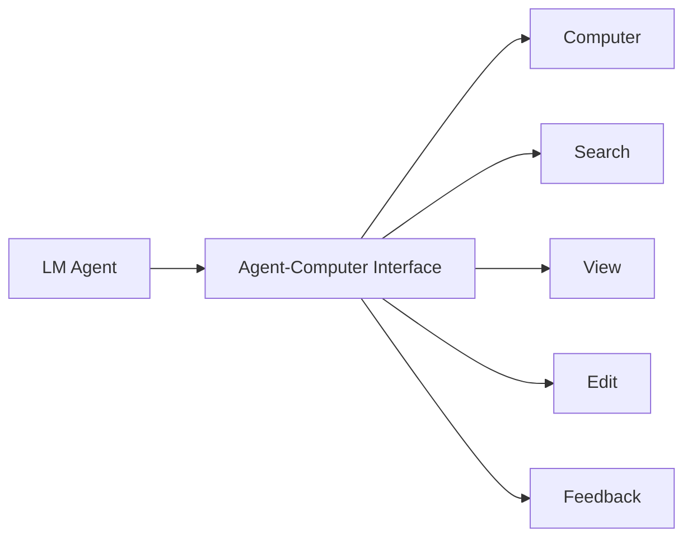
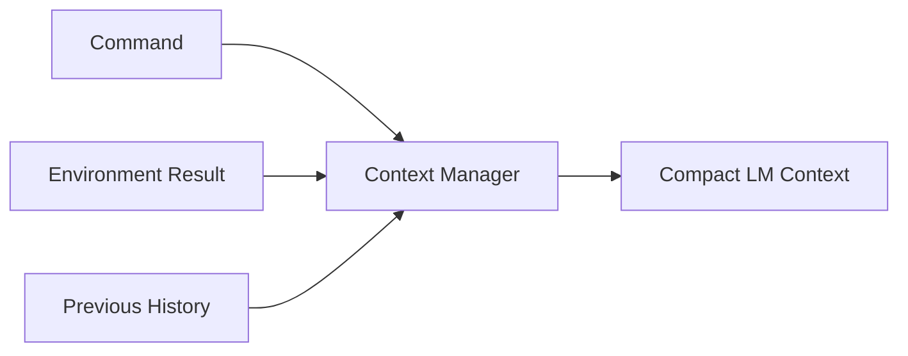
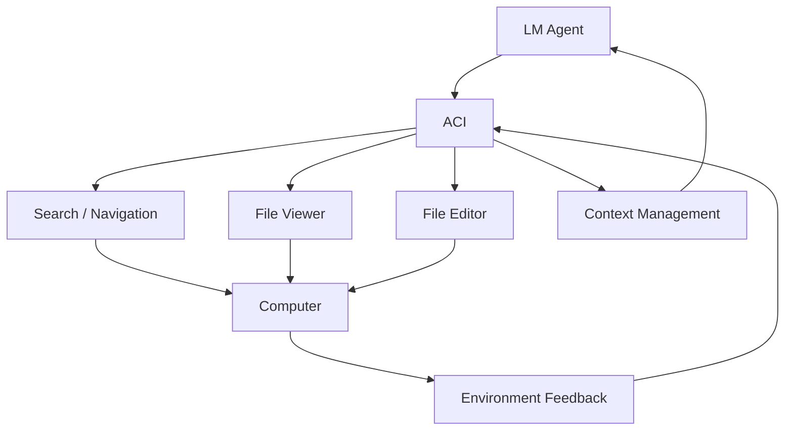
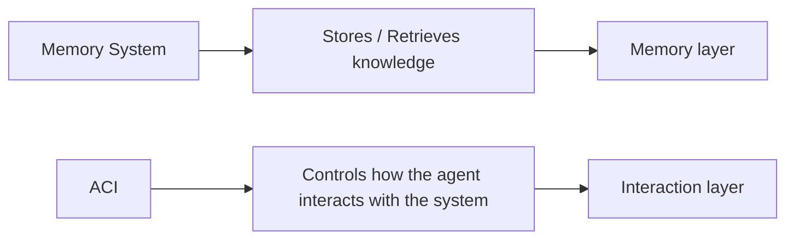

# Paper 14 — Concise Study Guide
## *SWE-agent: Agent-Computer Interfaces Enable Automated Software Engineering*

**Authors:** John Yang, Carlos E. Jimenez, Alexander Wettig, Kilian Lieret, Shunyu Yao, Karthik Narasimhan, Ofir Press  
**Venue:** NeurIPS 2024  
**Paper:** arXiv:2405.15793v3

> **Important:** This is **not a memory-system paper**. For our project, only the parts about **agent ↔ external system interfaces and context management** are directly useful.

---

# 1. What problem does the paper solve?

The paper asks:

> **How should an interface be designed specifically for an LLM agent?**

The authors argue that a normal human interface or raw Linux shell is not necessarily a good interface for an LLM.



The interface is called an **Agent-Computer Interface (ACI)**.

Its purpose is to make computer interaction easier and more reliable for the agent.

**Paper:** pp. 1–2. fileciteturn36file0L56-L68

---

# 2. Why is an ACI needed?

The authors found that agents using a raw Linux shell can struggle with:

- editing small file sections
- interpreting large search outputs
- recovering from invalid edits
- dealing with unnecessary context

The ACI therefore acts as an **abstraction layer** between the agent and the computer.

The paper's important point:

> **The interface itself can change agent behavior and performance, even when the underlying language model is unchanged.**

**Paper:** pp. 1–3. fileciteturn36file0L56-L81

---

# 3. Four design principles — the most important part

The paper identifies four principles.

## 1. Actions should be simple

Avoid exposing complicated commands with many options.

Instead:

```text
Few options
+
Clear purpose
+
Concise documentation
```

The authors say this reduces the need for demonstrations or fine-tuning.

---

## 2. Actions should be compact and efficient

A useful high-level operation should ideally be done in **one action**.

Bad:

```text
find → open → edit preparation → edit → verify
```

Better:

```text
One action that performs the important operation
```

The paper calls this reducing unnecessary action composition.

---

## 3. Feedback should be informative but concise

The agent needs to know:

- what happened
- what changed
- current environment state

but does not need unnecessary output.

```text
Too little feedback → uncertainty
Too much feedback → context waste
```

---

## 4. Guardrails should prevent error propagation

When an agent makes an error, the interface should help it detect and recover quickly.

The paper's example is **editing with automatic linting**.

If an edit introduces a major syntax error:

```text
Edit
 ↓
Lint
 ↓
Error
 ↓
Reject edit
 ↓
Tell agent what went wrong
```

The invalid modification is not applied.

**Paper:** pp. 3–4. fileciteturn36file0L112-L147

---

# 4. Context management — directly useful to us

The paper says the ACI should manage:

**commands + environment feedback + previous history**

before sending information to the LM.



The paper specifically manages history to:

- keep useful information
- remove unnecessary information
- avoid showing outdated file information
- fit more interaction steps into the context

**Paper:** p. 3–4. fileciteturn36file0L114-L126

---

# 5. What context reduction does SWE-agent use?

The paper describes several concrete mechanisms.

### Error-history reduction

After a malformed action is corrected, older repeated error messages are removed except for the first.

### Observation compression

Older observations are collapsed to **one line**.

The paper keeps the most recent observations detailed while compressing older ones.

The main experiment uses:

**Last 5 observations**

as the detailed history.

The paper says this helps reduce unnecessary context and avoids showing stale file information.

**Paper:** p. 4. fileciteturn36file0L266-L278

---

# 6. Search interface — important design lesson

The paper compares different search interfaces.

### Iterative search

The agent receives one result at a time and can repeatedly call:

```text
next → next → next → ...
```

Problem:

The agent may inspect every result, even when most are irrelevant.

This can consume:

- cost budget
- context window
- interaction steps

### Summarized search

The interface presents the results together in a compact form and tells the agent to retry when the search is too broad.

The paper's experiment found:

```text
Summarized search → 18.0% resolved
Iterative search  → 12.0% resolved
```

on the evaluated SWE-bench Lite setting.

**Paper:** pp. 5–7. fileciteturn36file0L389-L397

---

# 7. File viewer — information amount matters

SWE-agent's file viewer does not simply dump an entire file.

It shows a bounded window.

The tested options were:

```text
30 lines
100 lines
Entire file
```

Results:

| Viewer | SWE-bench Lite |
|---|---:|
| 30 lines | 14.3% |
| **100 lines** | **18.0%** |
| Entire file | 12.7% |

The paper therefore shows that both:

**too little context**

and

**too much context**

can hurt performance.

**Paper:** pp. 6–7. fileciteturn36file0L369-L384

---

# 8. Editing interface — one structured operation

The SWE-agent editor replaces cumbersome shell-based editing with a single structured command:

```text
edit(
    start_line,
    end_line,
    replacement
)
```

After the edit:

```text
Edit
 ↓
Updated file shown immediately
 ↓
Lint result
 ↓
Agent can continue / retry
```

This gives the agent:

- precise edit location
- immediate feedback
- fewer actions
- automatic error detection

The paper says this compact editing interface is important to performance.

**Paper:** pp. 4, 6–7. fileciteturn36file0L247-L265

---

# 9. Guardrails — a concrete result

The paper compares:

```text
Edit with linting
vs
Edit without linting
vs
No edit interface
```

Results on SWE-bench Lite:

```text
With linting     = 18.0%
Without linting  = 15.0%
No edit          = 10.3%
```

The authors use this to show that **preventing invalid state changes can improve recovery and performance**.

**Paper:** pp. 6–7. fileciteturn36file0L369-L388 fileciteturn36file0L661-L666

---

# 10. Main system architecture

The paper's ACI can be viewed as:



The agent repeatedly performs:

```text
Think
 ↓
Action
 ↓
Environment
 ↓
Feedback
 ↓
Next action
```

This is the paper's interactive agent setup.

**Paper:** pp. 3–4. fileciteturn36file0L148-L160

---

# 11. Main performance result

On the full SWE-bench test set:

**SWE-agent + GPT-4 Turbo: 12.47% resolved**

On SWE-bench Lite:

**18.00% resolved**

The paper also reports:

**87.7% Python pass@1 on HumanEvalFix**

The important point for this paper is not the exact benchmark number.

It is that **interface design produced a substantial performance difference without changing the underlying LM weights**.

**Paper:** pp. 1, 5–6. fileciteturn36file0L14-L22 fileciteturn36file0L313-L318

---

# 12. What this paper gives our project

This paper is **peripheral to memory architecture**, but it provides one useful idea:

> **The interface through which an agent accesses an external system should be designed around the agent's limitations.**

For our project, this suggests that an external memory service should not expose an unnecessarily complicated API/tool surface.

Conceptually:

```text
Agent
  ↓
Simple memory interface
  ↓
Memory service
  ↓
Search / write / update / retrieve
  ↓
Compact structured feedback
  ↓
Agent
```

### The directly reusable principles

**Simple actions**  
The agent should not need many low-level calls for one memory operation.

**Compact feedback**  
Returned memories should contain useful information without unnecessary context.

**Controlled context**  
Do not return the entire memory store or excessive history.

**Guardrails**  
Invalid memory operations should be detected before they propagate.

> These are project-design implications from the paper's ACI findings, not claims that SWE-agent itself proposes a memory-service architecture.

---

# 13. How this connects to our research



Our memory research has mainly focused on:

**what memory stores**

**how memory changes**

**how memory is retrieved**

This paper adds:

**how the agent should interact with the external system**

That may become relevant when we finalize the interface/protocol layer.

---

# 14. What this paper does NOT establish

Do not use this paper as evidence that:

- a particular memory API is optimal
- an MCP interface should have a specific design
- memory services should copy SWE-agent commands
- concise feedback always improves every agent task

The experiments are on **software-engineering agents interacting with computers**, not persistent-memory systems.

---

# 15. Paper 14 — 7 things to remember

1. **An LM benefits from an interface designed specifically for LM behavior.**
2. **Actions should be simple and compact.**
3. **Feedback should be informative but concise.**
4. **Context/history should be actively managed.**
5. **Too little or too much returned information can both hurt performance.**
6. **Guardrails can prevent errors from propagating.**
7. **The interface layer itself can materially affect agent performance.**

---

# 16. PPT structure

## Slide 1 — Problem

**Why is a normal computer interface not enough for an LM agent?**

## Slide 2 — ACI

```text
LM Agent ↔ ACI ↔ Computer
```

## Slide 3 — Four design principles

**Simple | Compact | Concise feedback | Guardrails**

## Slide 4 — Context management

**Keep useful information → compress old information → remove stale details**

## Slide 5 — Search / editing results

Show the summarized search and linting ablations.

## Slide 6 — Relevance to our project

**Design the external memory interface for the agent, not only for humans.**

---

# Reading priority

### Must read
**§1 Introduction**  
**§2 The Agent-Computer Interface**  
**§3 SWE-agent: Designing an ACI**  
**§5.1 ACI Design Analysis**

### Read briefly
**§5.2 Agent Behavior**

### Skip initially
Most of **Related Work**, benchmark background, and the large appendix.

---

# Source map

| Topic | Pages |
|---|---:|
| Motivation | 1–3 |
| ACI principles | 3 |
| SWE-agent components | 3–4 |
| Context management | 4 |
| Experiments | 5–6 |
| Search / editing ablations | 6–7 |
| Agent behavior | 7–8 |
| Discussion | 9 |
