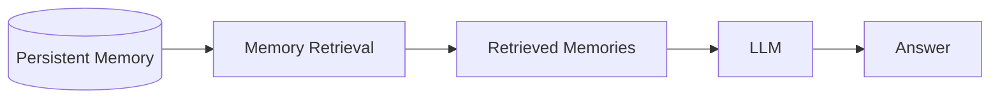
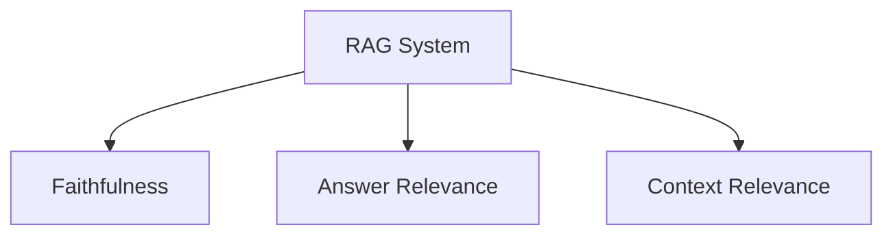
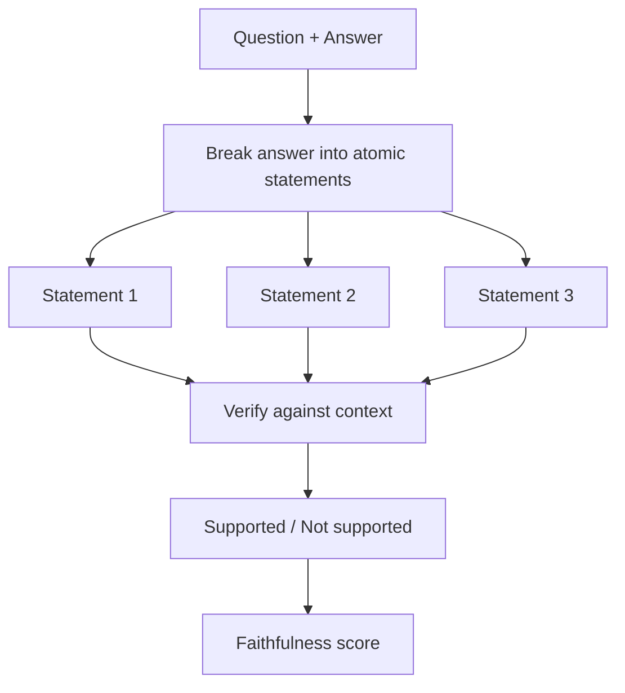
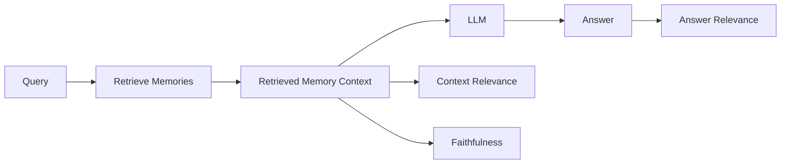
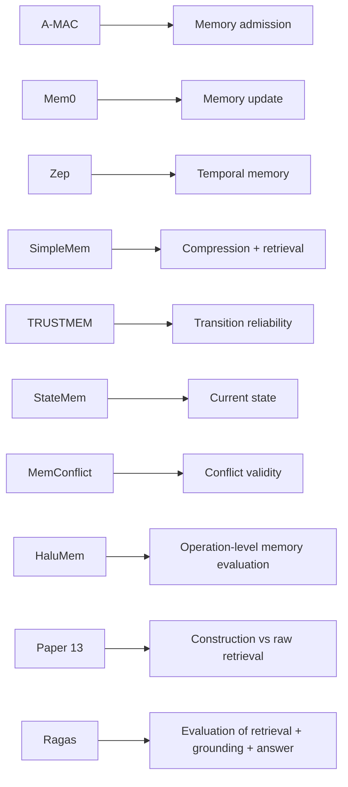

# Paper 15 — Concise Study Guide
## *Ragas: Automated Evaluation of Retrieval Augmented Generation*

**Authors:** Shahul Es, Jithin James, Luis Espinosa-Anke, Steven Schockaert  
**Paper:** arXiv:2309.15217v2 — 28 Apr 2025

> **Scope:** This paper is mainly about **evaluating RAG systems**, not building long-term memory. For our project, the important part is how to separately evaluate **retrieved context, generated answers, and grounding quality**.

---

# 1. What problem does Ragas solve?

A RAG system has two broad stages:


A final answer can be wrong for different reasons:

- retrieval found bad context
- retrieval found too much irrelevant context
- the LLM failed to use the context correctly
- the generated answer is not grounded in the retrieved evidence

So **final answer quality alone cannot tell us which component failed**.

The paper introduces **Ragas (Retrieval Augmented Generation Assessment)** as a framework for **reference-free evaluation**.

The framework evaluates three dimensions:

**Faithfulness + Answer Relevance + Context Relevance**

**Paper:** Abstract + §1, pp. 1–3. fileciteturn38file0L11-L31

---

# 2. Why this is useful for our memory project

Our system will also have a pipeline similar to:



Suppose the answer is wrong.

We need to know:

```text
Did we retrieve the wrong memory?
        OR
Did we retrieve too much irrelevant memory?
        OR
Did the LLM fail to use the retrieved memory?
```

Ragas gives us a way to think about these as **separate evaluation dimensions**.

The paper itself is about RAG, so this mapping to our memory system is a project-level application of its evaluation framework.

---

# 3. The three core Ragas metrics



## 3.1 Faithfulness

Question:

> **Can the answer's claims be inferred from the retrieved context?**

Example:

```text
Context:
"Christopher Nolan directed Oppenheimer."

Answer:
"Christopher Nolan directed Oppenheimer."
→ Faithful

Answer:
"James Cameron directed Oppenheimer."
→ Not faithful
```

The paper first breaks the answer into smaller **statements**.

Then an LLM checks whether each statement is supported by the retrieved context.

The score is:

`Faithfulness = supported statements / total statements`

So the metric evaluates **grounding in the supplied context**, not whether the answer is true according to the outside world.

**Paper:** §3, pp. 3–4. fileciteturn38file0L183-L225

---

# 4. Answer Relevance

Question:

> **Does the answer actually address the user's question?**

The paper explicitly says this metric does **not** evaluate factuality.

It focuses on whether the response:

- answers the question
- is incomplete
- contains redundant information

The method is unusual:


The LLM generates possible questions that the answer could respond to.

Then the paper compares those generated questions with the original question using cosine similarity between embeddings.

So:

**Faithfulness = grounded in context**

**Answer Relevance = addresses the question**

They are different properties.

**Paper:** §3, pp. 3–4. fileciteturn38file0L226-L246

---

# 5. Context Relevance

Question:

> **Did the retriever return mostly information that is actually useful for the question?**

The paper asks an LLM to identify the sentences in the retrieved context that are crucial for answering the question.

Then:

`Context Relevance = relevant sentences / total context sentences`

So:

```text
Retrieved context
   ↓
How much of it is actually useful?
```

This directly measures **retrieval noise**.

Example:

```text
Retrieved:
1. Relevant fact
2. Relevant fact
3. Unrelated detail
4. Unrelated detail

Context relevance
→ lower than if all 4 were useful
```

**Paper:** §3, pp. 3–4. fileciteturn38file0L247-L264

---

# 6. The important distinction

These three metrics answer three different questions:

| Metric | Main question |
|---|---|
| **Faithfulness** | Did the answer stay supported by the retrieved context? |
| **Answer Relevance** | Did the answer address the user's question? |
| **Context Relevance** | Was the retrieved context focused and useful? |

Think:

```text
RETRIEVAL                     GENERATION

Context Relevance  ────────→  Faithfulness
       ↑                            ↑
"Did we retrieve              "Did the answer
 useful context?"              stay grounded?"

                 Answer Relevance
                        ↓
               "Did we answer the
                  actual question?"
```

This separation is the main thing to take from Paper 15.

---

# 7. Why context length matters

The paper explicitly connects context relevance to **context cost**.

Long retrieved passages:

- cost more tokens
- may contain irrelevant information
- can make it harder for the LLM to use the important information

Therefore:

> **Retrieving more context is not automatically better.**

This aligns with the paper's definition of Context Relevance: the goal is to keep the retrieved context focused.

**Paper:** §3, p. 3. fileciteturn38file0L161-L175

---

# 8. How Ragas evaluates faithfulness — understand the mechanism

The paper uses an LLM in two steps.



For example:

```text
Answer:
"X happened in 2023 because Y caused it."

↓ split

1. X happened in 2023.
2. Y caused X.

↓ verify separately
```

This makes a long answer easier to evaluate at the **claim level**.

**Paper:** §3, pp. 3–4. fileciteturn38file0L183-L225

---

# 9. WikiEval — why was it created?

The authors needed a dataset containing human judgments of:

- faithfulness
- answer relevance
- context relevance

They created **WikiEval**.

It contains questions based on **50 Wikipedia pages** covering recent events.

Two annotators judged the examples.

Reported agreement:

- **~95%** for faithfulness
- **~95%** for context relevance
- **~90%** for answer relevance

Disagreements were resolved through discussion.

**Paper:** §4, pp. 4–5. fileciteturn38file0L266-L317

---

# 10. Main validation result

The authors compare:

**Ragas metrics**  
vs.  
**GPT Score**  
vs.  
**GPT Ranking**

Agreement with human judgments:

| Metric family | Faithfulness | Answer Relevance | Context Relevance |
|---|---:|---:|---:|
| **Ragas** | **0.95** | **0.78** | **0.70** |
| GPT Score | 0.72 | 0.52 | 0.63 |
| GPT Ranking | 0.54 | 0.40 | 0.52 |

These values are the paper's reported **pairwise agreement accuracy** with human annotators on WikiEval.

The strongest agreement is for **faithfulness**.

The paper says **context relevance is the hardest dimension** to evaluate, especially for longer contexts.

**Paper:** §5, p. 5. fileciteturn38file0L338-L400

---

# 11. What this means for our evaluation design

This paper gives us a useful evaluation decomposition:



For our project, we can ask separately:

### Retrieval
**Was the retrieved memory set focused and useful?**

### Grounding
**Did the answer actually use/support itself from the retrieved memory?**

### Answer
**Did the final answer address the query?**

This does not mean we must adopt the exact Ragas formulas. The paper provides them as a framework for RAG evaluation.

---

# 12. Very important limitation of Faithfulness

The paper defines faithfulness as:

> Can the answer's claims be inferred from the retrieved context?

That means a response can be:

```text
Faithful = Yes
Factually correct = Unknown
```

if the supplied context itself contains incorrect information.

So Faithfulness measures **answer-to-context consistency**, not absolute truth.

This distinction is directly stated by the paper's definition of faithfulness.

**Paper:** §3, p. 3. fileciteturn38file0L183-L185

---

# 13. What this paper does NOT solve

Ragas does not provide:

- a persistent memory architecture
- memory admission
- memory updating
- temporal conflict handling
- memory versioning
- a guarantee that the retrieved context is factually true

Its purpose is **evaluation**.

So use Paper 15 to design **how we measure our system**, not to justify how the memory itself should be stored.

---

# 14. How Paper 15 connects to our previous papers



Paper 15 therefore complements the previous papers rather than proposing another memory mechanism.

---

# 15. Paper 15 — 8 things to remember

1. **Ragas is an evaluation framework, not a memory architecture.**
2. **Final answer accuracy alone hides where the system failed.**
3. **Faithfulness measures answer grounding in retrieved context.**
4. **Answer Relevance measures whether the answer addresses the query.**
5. **Context Relevance measures how focused the retrieved context is.**
6. **More retrieved context is not automatically better.**
7. **Faithfulness is context-grounding, not absolute truth.**
8. **For our project, Ragas gives us a useful template for evaluating retrieval and answer grounding separately.**

---

# 16. PPT structure

## Slide 1 — Problem

**How do we evaluate a RAG/memory system beyond final answer accuracy?**

## Slide 2 — Ragas framework

```text
Retrieved Context
       ↓
Context Relevance

Context + Answer
       ↓
Faithfulness

Question + Answer
       ↓
Answer Relevance
```

## Slide 3 — Faithfulness

**Answer → atomic claims → verify against context**

## Slide 4 — Context Relevance

**Retrieved context → relevant sentences / total sentences**

## Slide 5 — Answer Relevance

**Answer → generated questions → similarity with original query**

## Slide 6 — WikiEval results

**Ragas vs GPT Score vs GPT Ranking**

## Slide 7 — Relevance to our project

**Evaluate retrieval quality and answer grounding separately.**

---

# Reading priority

### Must read
**§1 Introduction**  
**§3 Evaluation Strategies**  
**§4 WikiEval**  
**§5 Experiments**

### Read briefly
§6 Conclusion

### Skip initially
Most of §2 Related Work and Appendix examples.

---

# Source map

| Topic | Pages |
|---|---:|
| Motivation | 1–2 |
| Three metrics | 3–4 |
| Faithfulness | 3–4 |
| Answer Relevance | 3–4 |
| Context Relevance | 4 |
| WikiEval | 4–5 |
| Main experiment | 5 |
| Conclusion | 5 |
