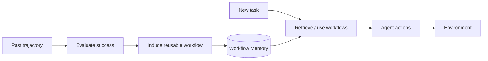
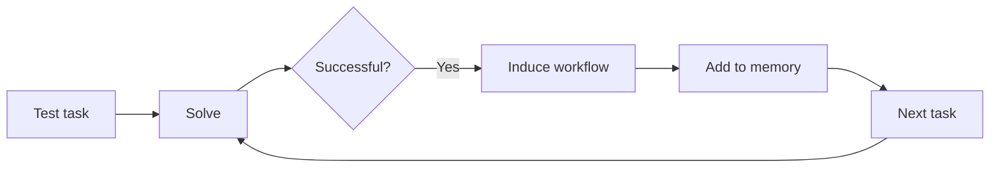
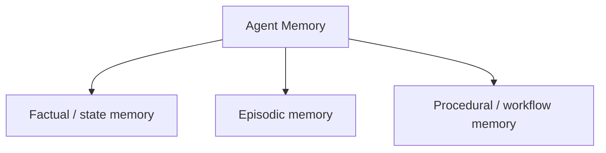

# Part B — Paper 14
## *Agent Workflow Memory*

**Authors:** Zora Zhiruo Wang, Jiayuan Mao, Daniel Fried, Graham Neubig  
**Paper:** arXiv:2409.07429v1 — 11 Sep 2024

> **Why this paper matters:** AWM is not a factual-memory architecture. It studies a different kind of memory: **reusable procedures/workflows learned from successful past agent trajectories**. For our project, its main value is the idea of storing **what to do**, not only **what is true**.

---

# 1. The problem

Long-horizon agents may solve a task once, but fail to reuse what they learned on later tasks.

The paper's observation:

```text
Past successful trajectory
        ↓
Normally forgotten
        ↓
Future similar task
        ↓
Agent solves from scratch
```

AWM instead extracts **reusable sub-routines** from successful trajectories and puts them into agent memory.

The paper's Figure 1 shows this idea: as examples accumulate, the agent learns small workflows and uses them to solve increasingly complex tasks.

**Paper:** pp. 1–2. fileciteturn64file0L55-L71

---

# 2. What is a workflow?

A workflow is not just a stored example.

It contains:

```text
Workflow description
+
Series of executable steps
```

Each step contains:

```text
1. Environment-state description
2. Agent reasoning
3. Action
```

Example:

```text
Goal:
Find an order by ID

Step 1:
State: Orders page
Reason: Need to inspect orders
Action: click("Orders")

Step 2:
State: Order list shown
Reason: Need target order
Action: search / scroll

...
```

The important design choice is **abstraction**.

Instead of storing:

```text
"Find dry cat food"
```

AWM extracts:

```text
"Search for {product-name}"
```

So one workflow can be reused across many tasks.

**Paper:** §2.2–2.3, pp. 2–3. fileciteturn64file0L128-L187 fileciteturn64file0L206-L216

---

# 3. AWM's core pipeline



The central cycle is:

**Solve → evaluate → extract workflow → store → reuse**

This is different from ordinary episodic memory:

```text
Episodic memory
→ "what happened"

AWM
→ "how to perform a reusable sub-task"
```

---

# 4. Offline vs online AWM

AWM supports two modes.

## Offline

High-quality examples are available before testing.

```text
Training examples
      ↓
Workflow induction
      ↓
Workflow memory
      ↓
Test-time use
```

The same induced workflow set is used during test inference.

---

## Online

No extra annotated examples are required.



The online system uses an evaluator to decide whether a completed trajectory was successful. Only successful trajectories are transformed into workflows.

**Paper:** §2.3, pp. 3–4. fileciteturn64file0L252-L269 fileciteturn64file0L284-L327

---

# 5. The key idea for our project: procedural memory

Most of our papers deal with:

```text
Facts
Preferences
Events
States
Relationships
```

AWM introduces:

```text
Reusable procedures
```

So a more complete memory architecture could theoretically have:



For an agent that repeatedly performs software-development tasks, for example, procedural memory could represent a reusable sequence such as:

```text
Inspect issue
→ Locate relevant file
→ Search related implementation
→ Edit
→ Run tests
→ Verify result
```

> This software-development example is only an architectural analogy. AWM itself is evaluated on web navigation.

---

# 6. Reuse + composition

One of AWM's most interesting findings is that workflows can become **building blocks** for larger workflows.

The paper's Figure 6 shows:

```text
"Find a place by its name"
          ↓
reused as a sub-routine
          ↓
"Get the zip code of a place"
```

So memory grows compositionally:

```text
Small workflow
      ↓
Reuse
      ↓
Larger workflow
      ↓
Reuse
      ↓
More complex workflow
```

The paper describes this as learning increasingly complex workflows over time.

**Paper:** pp. 5–6. fileciteturn64file0L440-L475

---

# 7. Why abstract workflows beat concrete examples

AWM compares reusable workflows with storing complete past trajectories.

The paper argues that concrete examples can include irrelevant example-specific information.

For instance:

```text
Concrete:
"Buy dry cat food from Amazon..."

Abstract:
"Search for {product-name}..."
```

The abstract workflow is more reusable because the task-specific value is separated from the general procedure.

In the Mind2Web experiment, the authors report that compared with retrieving concrete examples, AWM improves element accuracy and step success, and they attribute this partly to the abstract, reusable workflow representation.

**Paper:** p. 7. fileciteturn64file0L521-L530

---

# 8. Main results — only remember the pattern

### WebArena

AWM:

**35.5% task success**

BrowserGym baseline:

**23.5%**

AWM also uses about:

**5.9 steps/task**

versus:

**7.9 steps/task**

for the BrowserGym accessibility-tree baseline.

The paper reports that AWM improves across all five website splits.

**Paper:** Table 1, p. 5. fileciteturn64file0L350-L374

---

# 9. Cross-task generalization

The paper tests whether workflows learned from previous tasks are useful on different task templates.

On the WebArena cross-template subset:

```text
AWM = 33.2
BrowserGymax-tree = 20.5
```

The paper interprets this as evidence that induced workflows can generalize across different tasks rather than only memorizing one exact trajectory.

On Mind2Web, online AWM also performs strongly in:

```text
cross-task
cross-website
cross-domain
```

The paper reports larger benefits for online AWM as the train/test domain gap widens.

**Paper:** §§3.1–3.2, pp. 5–8. fileciteturn64file0L400-L417 fileciteturn64file0L537-L570

---

# 10. Important failure mode: following memory too literally

AWM is not perfect.

The paper explicitly observes a problem:

```text
Stored workflow
      ↓
Agent follows it
      ↓
Current environment is different
      ↓
Workflow is no longer appropriate
```

In Mind2Web, the authors say the workflows can guide agents toward actions that are not always relevant to the current state.

So the agent must know **when to diverge from the workflow**.

The paper also demonstrates that workflow actions can fail when the environment changes dynamically between steps.

**Paper:** p. 7 and p. 10. fileciteturn64file0L531-L536 fileciteturn64file0L691-L704

---

# 11. What AWM gives our project

The useful architectural lesson is:

> **Memory can store reusable behavior, not only information.**

That gives us a possible distinction:

```text
Semantic memory
→ "What is true?"

Episodic memory
→ "What happened?"

Procedural memory
→ "How should I do this?"
```

AWM is evidence for the third category in agent workflows.

---

# 12. What this paper does NOT prove

Do not conclude that:

- workflows should replace factual memory
- every past trajectory should become a workflow
- successful trajectories are always reusable
- procedural memory is always better than episodic memory
- workflows should be executed blindly

The paper itself shows that workflows sometimes need to be adapted to the current environment.

---

# 13. 6 things to remember

1. **AWM stores reusable procedures extracted from successful agent trajectories.**
2. **A workflow contains a high-level goal plus executable steps.**
3. **AWM abstracts away example-specific values to improve reuse.**
4. **Online AWM can continually learn workflows from successful tasks.**
5. **Small workflows can become components of larger workflows.**
6. **Procedural memory must remain adaptable because the current environment may differ from the stored workflow.**

---

# PPT — 5 slides

## Slide 1
**Problem: Agents repeat work instead of learning reusable procedures**

## Slide 2
**AWM**

```text
Experience → Evaluate → Workflow → Memory → Reuse
```

## Slide 3
**Workflow representation**

```text
Goal
+
State
+
Reasoning
+
Action sequence
```

## Slide 4
**Compositional learning**

```text
Small workflow
→ larger workflow
→ more complex workflow
```

## Slide 5
**Project relevance**

**Add a procedural/workflow memory layer for reusable agent behavior.**

---

# Read these sections

**Must read:** §2.2 Workflow Representation, §2.3 Inducing and Using Workflows, §3.1 WebArena results.

**Skim:** §3.2 Mind2Web + §4 workflow representation analysis.

**Skip initially:** Most Related Work and appendix case studies.
