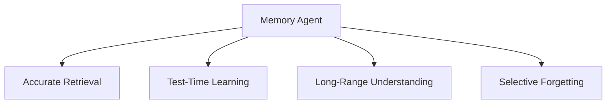

# Part B — Paper 15
## *Evaluating Memory in LLM Agents via Incremental Multi-Turn Interactions*

**Authors:** Yuanzhe Hu, Yu Wang, Julian McAuley  
**Venue:** ICLR 2026  
**Paper:** arXiv:2507.05257v4 — 28 Jun 2026

> **Why this paper matters:** This paper introduces **MemoryAgentBench**, a benchmark designed specifically for memory agents. For our project, the most useful part is its **four memory competencies**, its **incremental evaluation setup**, and its diagnosis of where current memory systems fail.

---

# 1. The core problem

Most agent benchmarks focus on:

```text
Reasoning
Planning
Tool use
Execution
```

But memory involves another set of capabilities:

```text
Store
Update
Retrieve
Learn / forget
```

The paper argues that existing benchmarks do not evaluate these memory behaviors together.

It introduces **MemoryAgentBench** to evaluate memory through **incremental multi-turn interactions**, rather than giving the entire history to the model in one static block.

**Paper:** pp. 1–3. fileciteturn66file0L9-L25

---

# 2. The four competencies — most important

MemoryAgentBench evaluates four complementary abilities:



## 1. Accurate Retrieval (AR)

Can the agent retrieve the **correct information** for a query?

This can include one-hop or multi-hop retrieval.

## 2. Test-Time Learning (TTL)

Can the agent **learn new behavior or skills during deployment** without additional training?

## 3. Long-Range Understanding (LRU)

Can the agent integrate information spread across a very long context, including contexts of **100K+ tokens**?

## 4. Selective Forgetting (SF)

Can the agent **revise, overwrite, or remove outdated information** when newer contradictory information appears?

These are deliberately different abilities. A system can be good at retrieval while still being poor at updating or forgetting.

**Paper:** p. 2, Figure 1. fileciteturn66file0L44-L65

---

# 3. Why incremental input matters

The paper makes an important distinction:

```text
Long-context model:
[entire history] → answer

Memory agent:
chunk 1
  ↓
memory update
  ↓
chunk 2
  ↓
memory update
  ↓
chunk 3
  ↓
...
  ↓
query
```

A memory system is expected to **absorb information incrementally**, abstract it, consolidate it, and potentially learn new rules from accumulated history.

Therefore, a dataset that simply provides the whole context in one block does not fully test memory behavior.

MemoryAgentBench reconstructs long-context datasets into **sequential dialogue chunks** and feeds them to the agent in time order.

**Paper:** pp. 2–3. fileciteturn66file0L66-L101

---

# 4. Benchmark composition

MemoryAgentBench contains:

**2,071 questions**

and covers:

```text
Accurate Retrieval
Test-Time Learning
Long-Range Understanding
Selective Forgetting
```

It combines reconstructed existing datasets with two new datasets:

### EventQA
Tests retrieval + temporal reasoning over events.

### FactConsolidation
Tests whether the agent correctly handles a fact followed later by a contradictory update.

The benchmark evaluates three broad memory-agent types:

```text
Long-Context Agents
RAG Agents
Agentic Memory Agents
```

**Paper:** pp. 3–6. fileciteturn66file0L88-L110 fileciteturn66file0L227-L275

---

# 5. The evaluation protocol

All datasets are converted into:

```text
c1, c2, ..., cn = sequential memory chunks

q1, q2, ..., qm = questions
a1, a2, ..., am = answers
```

Each chunk is presented as a simulated user-assistant interaction with an explicit instruction to memorize the content.


The important point is that the agent must **build memory over time**, rather than receiving a finished knowledge base.

For some datasets, multiple questions are attached to the same long context so that one memory construction process can be queried repeatedly.

**Paper:** §3.3, pp. 7. fileciteturn66file0L298-L324

---

# 6. Accurate Retrieval

The paper uses four tasks:

```text
Single-Hop Document QA
Multi-Hop Document QA
LongMemEval
EventQA
```

The important design lesson is that retrieval is tested at different levels:

```text
Find one relevant fact
        ↓
Combine multiple facts
        ↓
Handle temporal/event relationships
```

This is useful because a memory system can succeed on simple retrieval while failing on multi-hop or temporal retrieval.

**Paper:** §3.1, pp. 5–6. fileciteturn66file0L232-L249

---

# 7. Test-Time Learning

The paper asks whether the agent can learn from examples **during inference**.

Two task groups are used.

### Classification

The agent sees previous labeled examples and must use them to classify later inputs.

Datasets include:

**BANKING77, CLINC150, NLU, TREC-Coarse, TREC-Fine**

### Recommendation

The agent receives a long sequence of movie-related dialogue and later must recommend movies based on the accumulated information.

This tests whether memory is useful for **learning a pattern from prior interactions**, not simply retrieving one old sentence.

**Paper:** §3.1, pp. 6. fileciteturn66file0L250-L258

---

# 8. Selective Forgetting — especially important for us

This is the benchmark's most directly relevant update test.

MemoryAgentBench creates paired facts:

```text
Old fact
   ↓
New contradictory version
```

The new fact appears **later**.

Example conceptually:

```text
Fact 1: A = X

later...

Fact 2: A = Y
```

The agent is instructed to prioritize the newer fact.

The benchmark creates both:

**single-hop** questions  
and  
**multi-hop** questions

and tests context lengths of:

```text
6K
32K
64K
262K tokens
```

This specifically tests whether the final memory state remains consistent after updates.

**Paper:** §3.1, pp. 6. fileciteturn66file0L266-L275

---

# 9. Main result — the big picture

The paper's Table 3 shows a clear division.

### RAG methods

Generally perform well on:

**Accurate Retrieval**

because they are designed to retrieve a small relevant snippet.

### Long-context models

Generally perform better on:

**Test-Time Learning + Long-Range Understanding**

because these tasks require integrating broader context rather than retrieving one small passage.

### Selective Forgetting

This is difficult for **almost all tested approaches**.

The paper reports that:

> Multi-hop selective forgetting remains particularly weak, with the best methods reaching only **28% accuracy**.

This is one of the most important findings for our project.

**Paper:** §4.2, p. 8. fileciteturn66file0L337-L384

---

# 10. The benchmark also shows a long-context problem

For **FactConsolidation**, even stronger models degrade sharply as context becomes longer.

Example from Table 5:

```text
GPT-4o
FactCon-SH:
6K  → 92.0
32K → 88.0

FactCon-MH:
6K  → 28.0
32K → 10.0
```

For **o4-mini**:

```text
FactCon-SH:
6K  → 100.0
32K → 61.0

FactCon-MH:
6K  → 80.0
32K → 14.0
```

The paper interprets this as evidence that the task is solvable at shorter context lengths, but current memory agents struggle with **long-range reasoning over accumulated history**.

**Paper:** p. 10. fileciteturn66file0L482-L502

---

# 11. Chunk size — an important retrieval finding

The paper tests chunk sizes:

```text
512
1024
2048
4096
```

For **Accurate Retrieval**, smaller chunks can improve performance because the retrieved unit becomes more focused.

But for **Long-Range Understanding**, changing chunk size can hurt because these tasks need a coherent view across a large context.

So:

```text
Smaller chunks
→ better local retrieval

But

Smaller chunks
→ weaker global coherence
```

This is another example of a real memory-system trade-off.

**Paper:** §4.3.1, p. 9. fileciteturn66file0L436-L444

---

# 12. Retrieval top-k — another trade-off

The paper varies:

```text
k = 2
k = 5
k = 10
```

In the tested retrieval tasks, increasing `k` generally improves performance.

But the paper points out that:

```text
4096-token chunks × 10 retrieved chunks
≈ 40K tokens
```

So increasing retrieval depth also increases the amount of information the model must process.

They therefore do not treat arbitrarily large `k` as free.

**Paper:** §4.3.2, p. 9. fileciteturn66file0L445-L453

---

# 13. The most useful conceptual distinction

MemoryAgentBench exposes **four different failure types**:

```text
Did we retrieve the information?
        ↓
Did we learn the new pattern?
        ↓
Can we integrate far-apart information?
        ↓
Can we remove / overwrite obsolete information?
```

This is much broader than measuring only:

```text
Memory → QA accuracy
```

For our project, this suggests that the final evaluation should contain **separate tests for retrieval, learning, long-range reasoning, and updates/forgetting**.

---

# 14. Connection to our previous papers

```text
LongMemEval
→ long-term conversational recall

HaluMem
→ extraction / update / QA hallucinations

MemConflict
→ conflicting memory retrieval

TOKI / MOSAIC
→ write-time correctness + conflict handling

SELF-RAG / Ragas
→ retrieval / grounding evaluation

MemoryAgentBench
→ unified evaluation across:
   retrieval + learning + long-range understanding
   + selective forgetting
```

This paper is therefore particularly useful for the **evaluation design of our final system**.

---

# 15. What this paper does NOT prove

Do not conclude that:

- long-context agents are always better than memory systems
- RAG is always better for retrieval
- any single chunk size is universally optimal
- selective forgetting is solved by “latest fact wins”
- the benchmark fully represents real-world memory use

The authors themselves state that only a subset of memory agents was evaluated because of budget constraints, and they identify further evaluation coverage as future work.

**Paper:** p. 10. fileciteturn66file0L503-L512

---

# 16. 6 things to remember

1. **MemoryAgentBench evaluates memory incrementally, not just with static long contexts.**
2. **Its four competencies are Accurate Retrieval, Test-Time Learning, Long-Range Understanding, and Selective Forgetting.**
3. **Selective forgetting is still a major weakness across current systems.**
4. **RAG is strong at focused retrieval, while long-context models help more on broad integration tasks.**
5. **Chunk size creates a local-retrieval vs global-coherence trade-off.**
6. **A serious memory evaluation should test more than final QA accuracy.**

---

# PPT — 5 slides

## Slide 1 — Problem

**Current agent benchmarks under-evaluate memory.**

## Slide 2 — Four competencies

```text
AR | TTL | LRU | SF
```

## Slide 3 — Incremental evaluation

```text
Chunk → Memory Update → Chunk → Memory Update → Query
```

## Slide 4 — Main findings

**RAG → retrieval**  
**Long context → learning/global understanding**  
**Selective forgetting → difficult**

## Slide 5 — Project relevance

**Evaluate the complete memory lifecycle, not just retrieval accuracy.**

---

# Read these sections

**Must read:** §1 Introduction, §3.1 Dataset Preparation, §3.2 Memory Agent Types, §3.3 Dataset/Agent Formulation, §4.2 Overall Comparison.

**Skim:** §4.3.1 Chunk Size, §4.3.2 Top-k, §4.3.4 FactConsolidation.

**Skip initially:** Most Related Work and appendices.
